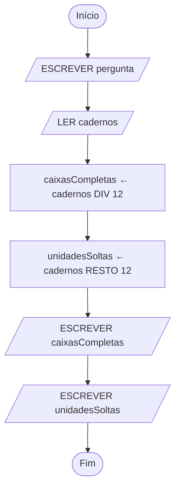

# Pseudocódigo e fluxogramas

UC: UC00245

Blocos: ALG02

Requisitos: UC00245-R02, UC00245-R03, UC00245-R04, UC00245-K03, UC00245-K04, UC00245-K05, UC00245-K06, UC00245-A05, UC00245-A06, UC00245-C01, UC00245-C02, UC00245-P02

| Identificação | Valor |
| --- | --- |
| Material | M-ALG02, segundo bloco de Desenvolver algoritmos |
| Fundamento curricular | Unidade de competência UC00245, bloco ALG02 |
| Duração | 180 minutos dos 300 do bloco; os outros 120 estão na [ficha de exercícios](02-pseudocodigo-e-fluxogramas-exercicios.md) |
| Evidência a guardar | Pseudocódigo, fluxograma desenhado na aplicação e trace de três entradas |

## Objetivos

No final deste bloco, serás capaz de:

- escrever um algoritmo em pseudocódigo, com variáveis, tipos, leitura e escrita;
- desenhar o mesmo algoritmo em fluxograma, numa aplicação de desenho;
- distinguir dar um valor a uma variável de perguntar se dois valores são iguais;
- seguir a execução passo a passo numa tabela e prever o resultado antes de o calcular.

## Pré-requisitos e preparação

Vens do [bloco anterior](01-do-problema-ao-algoritmo.md). Deves conseguir separar entradas, saídas, restrições e condições, decompor um problema em subproblemas e escrever passos sem ambiguidades. Traz a ficha de análise que guardaste: vais reutilizá-la.

Material: papel quadriculado, e uma aplicação de desenho de diagramas no computador. Serve qualquer uma; se não tiveres preferência, usa a que o professor indicar. Saber usar a aplicação faz parte do que se avalia nesta unidade.

## Como está organizado o tempo

Este bloco tem **5 horas**, ou seja 300 minutos. Como no anterior, não corresponde a uma aula.

| Parte | Onde está | Tempo |
| --- | --- | ---: |
| Teoria | Neste guia | 30 min |
| Exemplo explicado | Neste guia | 30 min |
| Prática guiada | Neste guia | 60 min |
| Prática autónoma | Na ficha | 90 min |
| Desafio opcional | Na ficha | 30 min |
| Consolidação | Neste guia | 60 min |

## Teoria — 30 min

### Porquê uma notação

No bloco anterior escreveste algoritmos em português, em passos numerados. Funcionou, mas viste o problema: o português deixa passar ambiguidades sem dar sinal. "Esperar um pouco" parece uma instrução e não é.

Existem duas formas próprias de escrever algoritmos, e vais aprender as duas porque servem para coisas diferentes:

- **pseudocódigo** — texto com um conjunto fixo de palavras e regras. É preciso, escreve-se depressa e parece-se com o código que vais escrever no próximo período;
- **fluxograma** — um desenho com figuras e setas. Mostra o caminho de um relance, e é o que costuma ser usado para explicar um processo a quem não programa.

O mesmo algoritmo pode ser escrito das duas maneiras. Se as duas versões não disserem exatamente a mesma coisa, uma delas está errada.

### Variáveis

Uma **variável** é um espaço com um nome, onde se guarda um valor que pode mudar ao longo da execução.

No bloco anterior chamaste-lhe estado: "a última senha chamada é 14". Agora esse estado passa a ter nome próprio — `ultimaChamada` — e podes referir-te a ele em qualquer passo.

Escolhe nomes que digam o que lá está. `caixasNecessarias` é um bom nome; `x`, `aux` e `numero2` não são. Ninguém se lembra ao que é que o `x` correspondia, nem tu daqui a uma semana.

Uma **constante** é um valor com nome que **não** muda durante a execução: o número de unidades que vêm numa caixa, o IVA, o número máximo de senhas por dia. Escrevem-se em maiúsculas, para se distinguirem à vista.

### Tipos de dados

Cada variável guarda um valor de um determinado **tipo**, e o tipo determina o que se pode fazer com ela.

| Tipo | Guarda | Exemplos |
| --- | --- | --- |
| inteiro | números sem parte decimal | `12`, `0`, `-3` |
| real | números com parte decimal | `1.5`, `0.75` |
| texto | sequências de caracteres | `"Ana"`, `"caderno"` |
| lógico | apenas verdadeiro ou falso | `verdadeiro`, `falso` |

A confusão mais comum, e a que te vai morder mais vezes, é entre o número `12` e o texto `"12"`. Parecem iguais no papel e não são: com o número podes fazer contas, com o texto não. Somar `"12"` com `"3"` não dá 15 — dá, na melhor das hipóteses, `"123"`.

Escolher o tipo é uma decisão com consequências. Número de caixas é **inteiro**, porque não existem 2,5 caixas. Peso de uma encomenda é **real**. Nome de um cliente é **texto**. Se um aluno passou ou não passou é **lógico**.

### Dar um valor não é perguntar se é igual

Esta é a distinção mais importante do bloco, e a que mais vezes se troca.

**Dar um valor** a uma variável chama-se **atribuição**, e escreve-se com uma seta:

```text
caixas ← 5
```

Lê-se "caixas recebe 5". É uma ordem: a partir deste momento, `caixas` vale 5, aconteça o que acontecer antes.

**Perguntar se dois valores são iguais** é uma comparação, dá verdadeiro ou falso, e é assunto do próximo bloco. Para já fica só o aviso: uma seta manda, um sinal de igual pergunta. Não são a mesma coisa e não se escrevem da mesma maneira.

Repara nesta sequência, que só faz sentido com atribuição:

```text
total ← 10
total ← total + 5
```

Como pergunta, a segunda linha seria absurda: nenhum número é igual a ele próprio mais cinco. Como ordem, é perfeitamente clara — vai buscar o valor que `total` tem agora, soma-lhe 5, e guarda o resultado outra vez em `total`. No fim, `total` vale 15.

O lado direito calcula-se primeiro; o lado esquerdo recebe o resultado.

### Ler e escrever

Um algoritmo recebe dados e produz resultados. As entradas e saídas do bloco anterior têm agora instruções próprias:

- `LER variavel` — recebe um valor de fora e guarda-o na variável;
- `ESCREVER algumaCoisa` — mostra um valor a quem está a usar o programa.

### Contas

As operações aritméticas são as que já conheces: `+`, `-`, `*` para multiplicar e `/` para dividir. Somam-se duas particularidades úteis quando se trabalha com quantidades inteiras:

- `DIV` dá o resultado inteiro de uma divisão: `13 DIV 12` é `1`;
- `RESTO` dá o que sobra: `13 RESTO 12` é `1`.

Com caixas de 12 unidades, `DIV` diz quantas caixas completas se conseguem encher e `RESTO` diz quantas unidades ficam de fora. Vais usar as duas já a seguir.

As contas respeitam a ordem habitual: primeiro o que está entre parênteses, depois multiplicações e divisões, e só depois somas e subtrações.

Uma linguagem de programação traz ainda **funções predefinidas** — pedaços de algoritmo já escritos, prontos a usar, para coisas frequentes como arredondar ou calcular uma raiz. Por agora basta saberes que existem e que não vale a pena reescrever o que já vem feito.

### A forma de um algoritmo em pseudocódigo

Um algoritmo em pseudocódigo tem sempre a mesma estrutura:

```text
ALGORITMO NomeDoAlgoritmo
CONSTANTES
    NOME_DA_CONSTANTE ← valor
VARIÁVEIS
    nomeDaVariavel: tipo
INÍCIO
    instruções, uma por linha, pela ordem de execução
FIM
```

Declaram-se primeiro as constantes e as variáveis, com o tipo de cada uma, e só depois se escrevem as instruções. A indentação não é decoração: mostra o que está dentro de quê, e no próximo bloco passa a ser essencial.

### Os símbolos do fluxograma

Um fluxograma usa um conjunto pequeno de figuras. As setas ligam-nas e indicam a ordem.

| Figura | Significado |
| --- | --- |
| Oval | Início e fim do algoritmo |
| Paralelogramo | Entrada ou saída de dados |
| Retângulo | Processamento: uma conta, uma atribuição |
| Losango | Decisão: o caminho divide-se em dois |
| Seta | Sentido do percurso |

Neste bloco vais usar só as quatro primeiras: início, entrada, processamento, saída e fim, em linha reta, sem o algoritmo alguma vez escolher entre caminhos. O losango fica apresentado porque faz parte da simbologia, mas só entra em uso no bloco seguinte, quando aprenderes decisões.

Regras que valem sempre: um fluxograma tem **um** início e pelo menos um fim; todas as figuras estão ligadas por setas; e nenhuma seta fica pendurada sem destino.

## Exemplo explicado — 30 min

### O problema

Uma papelaria vende cadernos que o fornecedor só entrega em caixas de 12 unidades. Dado o número de cadernos que um cliente encomendou, queremos saber quantas caixas completas isso dá e quantas unidades sobram fora das caixas completas.

### Passo 1 — As quatro perguntas

Começa como no bloco anterior, porque a análise não desaparece só porque agora há notação:

| Pergunta | Resposta |
| --- | --- |
| Entradas | Número de cadernos encomendados |
| Saídas | Número de caixas completas e número de unidades soltas |
| Restrições | As caixas têm sempre 12 unidades; o número de cadernos é um inteiro não negativo |
| Condições | Neste problema não há caminhos alternativos: os passos são sempre os mesmos |

### Passo 2 — O pseudocódigo

```text
ALGORITMO CaixasDeCadernos
CONSTANTES
    UNIDADES_POR_CAIXA ← 12
VARIÁVEIS
    cadernos: inteiro
    caixasCompletas: inteiro
    unidadesSoltas: inteiro
INÍCIO
    ESCREVER "Quantos cadernos foram encomendados?"
    LER cadernos
    caixasCompletas ← cadernos DIV UNIDADES_POR_CAIXA
    unidadesSoltas ← cadernos RESTO UNIDADES_POR_CAIXA
    ESCREVER "Caixas completas: ", caixasCompletas
    ESCREVER "Unidades soltas: ", unidadesSoltas
FIM
```

Repara em quatro decisões que foram tomadas aqui:

1. `UNIDADES_POR_CAIXA` é constante porque 12 é uma regra do fornecedor, não um dado que mude de encomenda para encomenda. Se um dia o fornecedor passar a caixas de 24, muda-se numa linha.
2. Os três valores são **inteiros**. Cadernos, caixas e unidades soltas não têm meios.
3. Há um `ESCREVER` **antes** do `LER`, para quem está a usar o programa saber o que lhe está a ser pedido. Um `LER` sozinho deixa a pessoa a olhar para um ecrã em branco.
4. As duas contas usam a constante, e não o número 12 escrito à mão. É a mesma ideia do ponto 1: o valor está num sítio só.

### Passo 3 — O fluxograma

O mesmo algoritmo, desenhado:



Segue o percurso com o dedo: começa no oval, passa pelos dois paralelogramos de entrada e saída, faz as duas contas nos retângulos, mostra os dois resultados e termina. Uma única linha, sem bifurcações — é o que significa uma estrutura **sequencial**.

Compara figura a figura com o pseudocódigo: cada instrução corresponde a uma figura, pela mesma ordem. É assim que se verifica que as duas representações dizem o mesmo.

### Passo 4 — O trace de três entradas

Agora a parte que mais te vai ajudar durante o ano. Um **trace** é uma tabela com uma coluna por variável, onde se segue a execução linha a linha e se escreve o que cada variável vale em cada momento.

Com `cadernos` igual a 30:

| Instrução | cadernos | caixasCompletas | unidadesSoltas | Saída |
| --- | ---: | ---: | ---: | --- |
| Antes de começar | — | — | — | |
| LER cadernos | 30 | — | — | |
| caixasCompletas ← 30 DIV 12 | 30 | 2 | — | |
| unidadesSoltas ← 30 RESTO 12 | 30 | 2 | 6 | |
| ESCREVER | 30 | 2 | 6 | Caixas: 2, soltas: 6 |

Com outras duas entradas, já só com o resultado:

| cadernos | caixasCompletas | unidadesSoltas |
| ---: | ---: | ---: |
| 30 | 2 | 6 |
| 24 | 2 | 0 |
| 5 | 0 | 5 |

As três entradas não foram escolhidas ao acaso: 30 é o caso normal, 24 é um múltiplo exato de 12, e 5 é menor do que uma caixa. Testar só o caso normal esconde metade dos erros.

## Prática guiada — 60 min

Vais trabalhar sobre o problema de material escolar que já conheces.

**1. Completar o pseudocódigo — 15 min.** Uma escola precisa de distribuir cadernos pelos alunos de uma turma, um por aluno, e quer saber quantas caixas tem de encomendar para chegar para todos. Copia e completa:

```text
ALGORITMO CaixasParaTurma
CONSTANTES
    UNIDADES_POR_CAIXA ← 12
VARIÁVEIS
    alunos: ..........
    caixasCompletas: inteiro
    sobra: inteiro
    caixasAEncomendar: inteiro
INÍCIO
    ESCREVER "Quantos alunos tem a turma?"
    LER ..........
    caixasCompletas ← alunos DIV UNIDADES_POR_CAIXA
    sobra ← alunos .......... UNIDADES_POR_CAIXA
    caixasAEncomendar ← ..........
    ESCREVER "Caixas a encomendar: ", caixasAEncomendar
FIM
```

A linha de `caixasAEncomendar` é a que interessa. Pensa: se sobrar alguma unidade, chega encomendar as caixas completas? Escreve por palavras tuas o que tem de acontecer, antes de tentares escrevê-lo em pseudocódigo. Se não conseguires exprimi-lo sem usar a palavra "se", deixa-o em português — decisões são o bloco seguinte.

**2. Prever e fazer o trace — 15 min.** Antes de calcular, escreve quanto achas que vai dar para uma turma de 25 alunos. Só depois faz o trace completo, com uma coluna por variável. Se o resultado não for o que previste, o interessante não é o número certo: é perceberes onde é que o teu raciocínio se desviou.

Repete para 24 alunos e para 12 alunos.

**3. Desenhar o fluxograma — 15 min.** Abre a aplicação de diagramas e desenha o fluxograma do algoritmo que completaste. Usa o oval para início e fim, paralelogramos para o `LER` e os `ESCREVER`, e retângulos para as contas. Guarda o ficheiro — faz parte da evidência deste bloco.

**4. Verificar com um colega — 15 min.** Troca com um colega o pseudocódigo e o fluxograma. Percorre o fluxograma dele figura a figura e confirma que cada uma corresponde a uma instrução do pseudocódigo, pela mesma ordem. Se encontrares uma figura a mais, uma a menos, ou uma seta sem destino, diz-lhe qual.

**Se estiveres com dificuldade.** Volta ao exemplo dos cadernos e muda-lhe só o nome das variáveis, mantendo a estrutura. Quando tiveres isso a funcionar, acrescenta a linha das caixas a encomendar. Uma dificuldade de cada vez.

## Erros comuns

| Sintoma | Como investigar | Como prevenir |
| --- | --- | --- |
| Usar a variável antes de ter valor | Procura o primeiro sítio onde ela aparece: é um `LER` ou uma atribuição? | Toda a variável recebe valor antes de ser usada |
| Guardar um número como texto | Pergunta: preciso de fazer contas com isto? | Escolhe o tipo pelo que vais fazer com o valor, não pelo aspeto |
| Trocar a ordem de duas instruções | Faz o trace: alguma linha usa um valor que ainda não foi calculado? | Escreve as instruções pela ordem em que os valores ficam disponíveis |
| Usar 12 escrito à mão em vez da constante | Procura o mesmo número repetido em sítios diferentes | Dá nome aos valores fixos e usa o nome |
| Fluxograma com seta sem destino | Segue o percurso com o dedo do início até ao fim | Todas as figuras ligadas, um início, pelo menos um fim |
| Fluxograma e pseudocódigo diferentes | Compara figura a figura com instrução a instrução | Escreve um, desenha o outro a seguir, e verifica logo |
| Confundir `DIV` com `/` | Pergunta: o resultado pode ter casas decimais? | `DIV` para quantidades inteiras, `/` quando a parte decimal interessa |

## Consolidação — 60 min

Em pseudocódigo, um algoritmo declara as suas constantes e variáveis com tipo, lê os dados de que precisa, faz contas e escreve resultados. A mesma sequência desenha-se num fluxograma, figura a figura, pela mesma ordem. Uma seta dá um valor a uma variável; um sinal de igual pergunta se dois valores são iguais, e isso vem no bloco seguinte. Um trace com uma coluna por variável mostra a execução por dentro, e é o instrumento que vais usar sempre que alguma coisa não der o que esperavas.

### 1. Explica — 15 min

Explica a um colega, por palavras tuas, a diferença entre `total ← total + 5` e perguntar se `total` é igual a `total + 5`. Depois justifica por que razão o número de caixas é um inteiro e o peso de uma encomenda é um real. Se conseguires explicar as duas coisas sem hesitar, o objetivo do bloco está cumprido.

### 2. Testa o de um colega — 20 min

Pede a um colega o pseudocódigo dele e faz-lhe o trace com uma entrada que ele não tenha testado. Sugestões de entradas que costumam revelar problemas: zero, um número mais pequeno do que uma caixa, e um múltiplo exato de 12. Devolve-lhe a tabela preenchida, não apenas a conclusão.

### 3. Encontra o erro — 15 min

Este algoritmo devia calcular o preço total de uma encomenda de cadernos, sabendo que cada caderno custa 150 cêntimos:

```text
ALGORITMO PrecoDaEncomenda
CONSTANTES
    PRECO_POR_CADERNO ← 150
VARIÁVEIS
    cadernos: inteiro
    total: inteiro
INÍCIO
    total ← cadernos * PRECO_POR_CADERNO
    ESCREVER "Quantos cadernos?"
    LER cadernos
    ESCREVER "Total em cêntimos: ", total
FIM
```

Faz o trace com 4 cadernos e vê o que acontece. Escreve em que instrução está o erro, por que razão ele existe e como o corrigias. A resposta não é "está tudo trocado": identifica a instrução.

### 4. Regista as tuas dificuldades — 10 min

Escreve duas ou três linhas sobre o que te custou mais: escrever o pseudocódigo, desenhar o fluxograma, ou fazer o trace. Guarda-as.

**Evidência a guardar:** o pseudocódigo completado, o ficheiro do fluxograma desenhado na aplicação, os traces das três entradas, o erro que identificaste e as tuas notas de dificuldade.

## A seguir

A [ficha de exercícios](02-pseudocodigo-e-fluxogramas-exercicios.md) ocupa os restantes 120 minutos.

## Referências

Unidade de competência UC00245, *Desenvolver algoritmos*, do referencial de Técnico/a de Informática de Gestão (481RA117), nível 4. A ficha oficial da unidade pode ser consultada no [Catálogo Nacional de Qualificações](https://catalogo.snq.gov.pt/ucDetalhe/355272).
