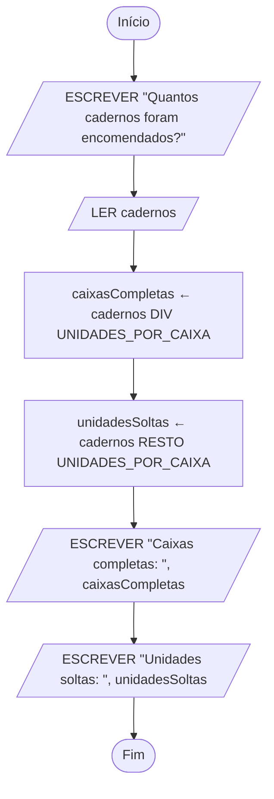

# Pseudocódigo e fluxogramas

UC: UC00245

Blocos: ALG02

Requisitos: UC00245-R02, UC00245-R03, UC00245-R04, UC00245-K03, UC00245-K04, UC00245-K05, UC00245-K06, UC00245-A05, UC00245-A06, UC00245-C01, UC00245-C02, UC00245-P02

| Identificação | Valor |
| --- | --- |
| Material | M-ALG02, segundo bloco de Desenvolver algoritmos |
| Fundamento curricular | Unidade de competência UC00245, bloco ALG02 |
| Duração | 140 minutos dos 300 do bloco; 40 estão no [laboratório](02-pseudocodigo-e-fluxogramas-laboratorio.md) e 120 na [ficha de exercícios](02-pseudocodigo-e-fluxogramas-exercicios.md) |
| Evidência a guardar | Pseudocódigo, fluxograma desenhado na aplicação e trace de três entradas |

## Objetivos

No final deste bloco, serás capaz de:

- explicar o que é uma variável, uma constante e o estado de um algoritmo, e porque é que as variáveis se declaram antes de serem usadas;
- escolher o tipo de dados certo para cada valor (inteiro, real, texto ou lógico) e justificar a escolha pelo que vais fazer com esse valor;
- distinguir dar um valor a uma variável de perguntar se dois valores são iguais;
- usar `LER` e `ESCREVER` para receber dados e mostrar resultados;
- calcular expressões aritméticas respeitando a ordem das operações, e escolher entre a divisão com parte decimal, `/`, e a divisão inteira, com `DIV` e `RESTO`;
- usar as quatro funções predefinidas desta disciplina, `ABS`, `ARREDONDAR`, `TRUNCAR` e `RAIZ`, sem cair nos casos que enganam;
- escrever um algoritmo sequencial completo em pseudocódigo, segundo a convenção desta disciplina, e desenhar o mesmo algoritmo em fluxograma;
- seguir a execução passo a passo numa tabela de trace e prever o resultado antes de o calcular.

## O que precisas de saber antes

Este guia continua o [guia anterior](01-do-problema-ao-algoritmo.md) e usa três coisas que lá aprendeste. Se alguma te parecer estranha, volta a esse guia antes de continuares, porque tudo o que vem a seguir se apoia nelas.

A primeira é a análise do problema. Antes de escrever um único passo, respondes a quatro perguntas: que **entradas** o algoritmo recebe, que **saídas** tem de produzir, que **restrições** valem sempre e que **condições** podem levar a caminhos diferentes. Às quatro respostas, juntas, também se chama o **contrato** do problema: dizem o que entra, o que sai e que regras têm de ser cumpridas, antes de se decidir como se faz. Neste guia continuas a começar sempre por aí.

A segunda é a decomposição: partir o problema em passos mais pequenos, cada um com um objetivo claro, que se possam verificar um a um.

A terceira é a diferença entre ação e estado. Uma ação é uma coisa que se faz; o estado é a fotografia da situação num dado momento. Neste guia, o estado vai ganhar nome e forma precisa, com as variáveis.

Se já escreveste na aula as primeiras instruções em pseudocódigo, este guia arruma-as numa convenção única, que vais usar da mesma maneira em todos os guias de algoritmos, e explica a razão de cada regra. Não precisas de saber nada do guia 03: as decisões aparecem apenas na tabela da convenção, marcadas como matéria dos guias seguintes, para teres a convenção toda num só sítio.

## Material e preparação

Para a teoria, os exemplos e a prática guiada precisas de papel quadriculado e de lápis, porque os fluxogramas desenham-se primeiro à mão. No papel pensas no algoritmo; na aplicação tratas da apresentação. Traz também a ficha de análise que guardaste no bloco anterior.

Para o laboratório precisas de um computador com um browser e ligação à internet. A aplicação de fluxogramas desta disciplina é o diagrams.net, que se usa no browser, em `https://app.diagrams.net`, sem criar conta. O [laboratório deste bloco](02-pseudocodigo-e-fluxogramas-laboratorio.md) ensina-te a usá-la passo a passo. Saber usar uma aplicação de desenho de algoritmos faz parte do que se avalia nesta unidade, e por isso não chega desenhar em papel.

## Como está organizado o tempo

Este bloco tem 5 horas, ou seja 300 minutos. Como no anterior, não corresponde a uma aula: o professor reparte-o pelas sessões que existirem.

O bloco tem três documentos, um para cada uso. Este guia lê-se e estuda-se: tem a teoria, os exemplos explicados, a prática em papel e a consolidação. O laboratório segue-se no computador, passo a passo, com a aplicação aberta ao lado. A ficha de exercícios resolve-se sem ajuda.

| Parte | Onde está | Tempo |
| --- | --- | ---: |
| Teoria | Neste guia | 30 min |
| Exemplo explicado | Neste guia | 30 min |
| Prática guiada em papel | Neste guia | 20 min |
| Prática guiada no computador | No [laboratório](02-pseudocodigo-e-fluxogramas-laboratorio.md) | 40 min |
| Prática autónoma | Na [ficha](02-pseudocodigo-e-fluxogramas-exercicios.md) | 90 min |
| Desafio opcional | Na [ficha](02-pseudocodigo-e-fluxogramas-exercicios.md) | 30 min |
| Consolidação | Neste guia | 60 min |

A teoria deste guia é longa, e 30 minutos de aula não chegam para a ler toda com calma. Na aula, o professor apresenta as ideias principais. Depois, cada secção fica aqui para a releres ao teu ritmo, sempre que te surgir uma dúvida na ficha ou no laboratório.

## Teoria (30 min)

### Uma notação própria para algoritmos

No bloco anterior escreveste algoritmos em português, em passos numerados. Funcionou, mas viste o problema: o português deixa passar ambiguidades sem dar sinal. "Esperar um pouco" parece uma instrução e não é, porque duas pessoas diferentes esperam tempos diferentes e nenhuma delas está a desobedecer.

Uma linguagem de programação, como o Python que vais aprender a seguir, não tem esse problema: cada instrução tem um único significado. Mas tem outro, para quem está a começar. Obriga a respeitar regras de escrita muito rígidas, e um parêntese esquecido impede o programa de funcionar, mesmo que o raciocínio esteja certo. Quem começa por aí gasta a atenção na pontuação e não no problema.

Existem duas formas próprias de escrever algoritmos, a meio caminho entre o português e uma linguagem de programação. Vais aprender as duas, porque servem para coisas diferentes:

- o **pseudocódigo** é texto com um conjunto pequeno e fixo de palavras e de regras. É rigoroso o suficiente para não deixar passar ambiguidades e simples o suficiente para a tua atenção ficar no raciocínio. Escreve-se depressa e parece-se com o código que vais escrever mais tarde;
- o **fluxograma** é um desenho do mesmo algoritmo, com figuras ligadas por setas. Mostra o caminho de um relance, e é o que se costuma usar para explicar um processo a quem não programa, por exemplo a alguém da contabilidade que quer perceber como é calculado um desconto.

O mesmo algoritmo escreve-se das duas maneiras. Se as duas versões não disserem exatamente a mesma coisa, pelo menos uma delas está errada.

### Variáveis e estado

Uma **variável** é um espaço com um nome, onde se guarda um valor que pode mudar enquanto o algoritmo é executado.

A imagem mais usada é a de uma caixa com uma etiqueta. A etiqueta é o nome, e nunca muda. O conteúdo é o valor, e pode ser trocado. Quando se guarda um valor novo na caixa, o antigo sai: uma variável guarda um valor de cada vez, nunca dois, e o valor antigo não fica guardado em lado nenhum.

No dia a dia, o visor de uma balança de loja funciona assim. Há sempre um visor, no mesmo sítio e com a mesma função. O número que lá aparece muda cada vez que se pousa outra coisa no prato, e o número anterior desaparece.

No bloco anterior disseste que o estado de uma fila de atendimento era, por exemplo, "está a ser atendida a senha 14 e há 6 pessoas à espera". Com variáveis, cada parte dessa fotografia passa a ter nome próprio: `senhaAtual` vale 14 e `pessoasAEspera` vale 6. A definição de estado fica assim mais precisa: o **estado** de um algoritmo, num dado momento, é o valor de todas as suas variáveis nesse momento.

Cada instrução que muda o valor de uma variável muda o estado. Se quiseres saber o que um algoritmo está a fazer, não precisas de adivinhar: olhas para o estado antes de uma instrução, olhas para o estado depois, e a diferença é o efeito dessa instrução. É esta a ideia por trás da tabela de trace, que vais aprender no fim da teoria.

Uma variável acabada de criar ainda não tem valor nenhum. É uma caixa etiquetada e vazia. Nas tabelas deste guia, esse estado escreve-se "sem valor". Perguntar o que está dentro de uma caixa vazia não dá nenhuma resposta útil, e por isso usar uma variável antes de ela receber um valor é um erro. É dos mais frequentes, e vais encontrá-lo com números na consolidação.

O nome de uma variável deve dizer o que ela guarda. `caixasCompletas` é um bom nome. `x`, `aux` ou `numero2` não são: daqui a uma semana nem tu te lembras do que lá estava, e quem ler o teu algoritmo tem de adivinhar. Nesta disciplina, os nomes das variáveis seguem estas regras:

- começam por uma letra minúscula;
- não têm espaços. Quando têm várias palavras, juntam-se, e cada palavra a partir da segunda começa por maiúscula, como em `caixasCompletas` ou `precoEmCentimos`. Esta forma de escrever chama-se **camelCase**, porque as maiúsculas no meio lembram as bossas de um camelo;
- não têm acentos nem cedilhas, porque as linguagens de programação nem sempre os aceitam nos nomes, e é melhor habituares-te desde já: escreve-se `preco` e não `preço`, `numeroDeCaixas` e não `númeroDeCaixas`;
- não podem ser uma palavra reservada da convenção, como `LER` ou `FIM`, que já tem outro significado.

### Constantes

Uma **constante** é um valor com nome que não muda durante a execução do algoritmo.

Há valores que fazem parte das regras do problema e não dos dados: uma caixa do fornecedor leva 12 cadernos, um dia tem 24 horas, uma loja distribui no máximo 40 senhas. Podias escrever o número diretamente nas contas, mas dar-lhe um nome traz duas vantagens.

A primeira é que se percebe o que o número significa. `UNIDADES_POR_CAIXA` diz muito mais do que um 12 solto no meio de uma conta, que tanto podia ser o número de meses do ano como a idade de alguém.

A segunda é que, se a regra mudar, muda-se num sítio só. Se o fornecedor passar a entregar caixas de 24, altera-se a linha da constante e o resto do algoritmo fica igual. Sem a constante, terias de andar à procura de todos os 12 espalhados pelo texto, com o risco de esquecer um, ou de mudar um 12 que afinal não era o das caixas.

As constantes escrevem-se em maiúsculas, com as palavras separadas por um traço baixo, como `UNIDADES_POR_CAIXA`. A forma diferente serve para as distinguires das variáveis à primeira vista. Uma constante recebe o seu valor na declaração, no início do algoritmo, e nunca mais. Uma instrução que tente dar-lhe outro valor a meio do algoritmo está errada, porque deixava de ser constante.

As constantes declaram-se sem tipo, porque o tipo vê-se pelo valor: `12` é um inteiro, `0.23` é um real e `"Papelaria"` é um texto.

### Porque se declaram as variáveis

Num algoritmo desta disciplina, antes da primeira instrução, escreves a lista de todas as variáveis que vais usar, cada uma com o seu tipo. A isto chama-se **declarar** as variáveis. Parece burocracia, e não é, por três razões.

A primeira é que declarar te obriga a pensar nos dados antes de pensares nas instruções. Para escreveres a lista, tens de saber que valores o algoritmo recebe, que valores calcula e que valores mostra. É outra vez o contrato a trabalhar: as entradas e as saídas do contrato aparecem quase sempre como variáveis declaradas.

A segunda é que o tipo fica decidido de uma vez. Quem lê `caixasCompletas: inteiro` fica a saber, antes de ler uma única instrução, que ali nunca vai aparecer 2,5 caixas. Se aparecer, há um erro, e sabes onde o procurar.

A terceira é que a declaração ajuda a apanhar erros de escrita. Se declaraste `cadernos` e mais abaixo escreves `caderno`, sem o s, o nome não está na lista, e quem revir o algoritmo dá logo pelo engano. Sem declarações, `caderno` passava por uma variável nova, sem valor, e o erro só se notava no resultado.

Algumas linguagens de programação obrigam a declarar tudo, como o C. Outras não obrigam, como o Python. Em pseudocódigo, nesta disciplina, declara-se sempre, porque a declaração faz parte do raciocínio e não só da escrita.

### Tipos de dados

Cada variável guarda valores de um **tipo**, e o tipo decide que valores são possíveis e o que se pode fazer com eles. Nesta disciplina usam-se quatro tipos:

| Tipo | Guarda | Exemplos | O que se faz com ele |
| --- | --- | --- | --- |
| `inteiro` | números sem parte decimal | `12`, `0`, `-3` | contas, incluindo `DIV` e `RESTO` |
| `real` | números com parte decimal | `1.5`, `0.75`, `-2.25` | contas em que a parte decimal interessa |
| `texto` | sequências de caracteres, entre aspas | `"Ana"`, `"caderno A4"` | mostrar e guardar; não se fazem contas |
| `lógico` | só um de dois valores | `VERDADEIRO`, `FALSO` | guardar a resposta a uma pergunta de sim ou não |

Repara que, no pseudocódigo, a parte decimal de um número se separa com um ponto, `1.5`, tal como nas linguagens de programação. No texto em português continua a escrever-se com vírgula, 1,5. São duas convenções para dois contextos, e não se misturam: dentro do pseudocódigo e das tabelas de trace, que mostram valores do algoritmo, usa-se o ponto; no texto que escreves à volta, a vírgula.

Escolher o tipo é uma decisão com consequências, e decide-se pelo que o valor representa e pelo que vais fazer com ele, não pelo aspeto que tem.

Um número de caixas, de alunos ou de senhas é inteiro, porque não existem 2,5 caixas. Um peso em quilogramas, uma média de notas ou uma temperatura são reais, porque a parte decimal tem significado. O nome de um cliente ou a descrição de um artigo são texto. A resposta a uma pergunta de sim ou não, como "a encomenda já foi paga?", é lógico.

O dinheiro merece uma nota à parte. Um preço como 3,49 euros tem parte decimal, e podia ser um real. Nesta disciplina, e na maior parte dos programas de gestão, prefere-se guardar o dinheiro em cêntimos, como um inteiro: 3,49 euros são 349 cêntimos. A razão vais percebê-la melhor em Python. Os computadores guardam muitos números reais com pequenos erros de aproximação, e num valor em dinheiro um erro de um cêntimo não é aceitável. Com cêntimos inteiros, as somas e as multiplicações dão sempre o valor exato.

Há valores que parecem números e devem ser texto. Um número de telefone, como 912345678, só tem algarismos, mas ninguém soma dois números de telefone nem calcula metade de um. Além disso, um número guardado como número perde os zeros à esquerda e não aceita um sinal de mais no início, e muitos números de telefone escrevem-se com o indicativo do país, como +351. Por isso, um número de telefone é texto. A pergunta que resolve a dúvida é sempre a mesma: vou fazer contas com este valor? Se a resposta for não, é quase sempre texto.

A confusão mais frequente é entre o número `12` e o texto `"12"`. No papel parecem iguais, e não são. Com o número podes fazer contas. O texto é uma sequência de dois caracteres, o 1 e o 2, tal como `"ab"` é uma sequência de duas letras. Juntar o texto `"12"` com o texto `"3"` dá `"123"`, e não 15, porque juntar textos é pô-los um a seguir ao outro. São as aspas que distinguem os dois: com aspas é texto, sem aspas é um número ou o nome de uma variável.

O tipo **lógico** só tem dois valores possíveis, que em pseudocódigo se escrevem `VERDADEIRO` e `FALSO`, em maiúsculas. Serve para guardar respostas a perguntas de sim ou não: `pago ← FALSO` guarda que uma encomenda ainda não foi paga. Neste guia vais usá-lo pouco. No guia seguinte, quando o algoritmo tiver de tomar decisões, passa a ser indispensável.

Quando uma conta mistura um inteiro e um real, o resultado é real: `2 + 0.5` dá `2.5`. E há uma operação que dá sempre um real, mesmo quando os dois números são inteiros: a divisão com `/`. Vais ver porquê na secção das expressões.

### Atribuição: dar um valor não é perguntar se é igual

Esta é a distinção mais importante do bloco, e a que mais vezes se troca no início. É também o checkpoint deste bloco: no fim, tens de a conseguir explicar sem hesitar.

**Atribuir** é dar um valor a uma variável. No pseudocódigo desta disciplina escreve-se com uma seta que aponta para a esquerda:

```text
caixas ← 5
```

Lê-se "caixas recebe 5". É uma ordem, não uma pergunta: a partir deste momento, `caixas` vale 5, seja qual for o valor que tinha antes.

A atribuição executa-se sempre em duas fases, por esta ordem. Primeiro calcula-se o lado direito da seta, usando os valores que as variáveis têm nesse momento. Depois guarda-se o resultado na variável do lado esquerdo, e o valor antigo dessa variável perde-se.

Vê o que isto significa nesta sequência:

```text
total ← 10
total ← total + 5
```

Se lesses a segunda linha como uma pergunta, "total é igual a total mais 5?", a resposta seria sempre não: nenhum número é igual a ele próprio mais cinco. Lida como atribuição, faz todo o sentido. Calcula-se o lado direito com o valor atual de `total`, que é 10, e dá 15. Guarda-se 15 em `total`. No fim, `total` vale 15, e o 10 desapareceu. Esta forma, com a mesma variável dos dois lados da seta, vai ser das mais usadas no guia 04, para contar e para somar.

Há duas consequências da atribuição que apanham muita gente, e vale a pena vê-las com números, numa tabela de trace. A tabela de trace está explicada com calma no fim da teoria. Por agora, lê cada linha como o estado depois da instrução dessa linha.

A primeira consequência é que a atribuição copia um valor, não cria uma ligação. Se já usaste uma folha de cálculo, sabes que uma célula com uma fórmula muda sozinha quando mudas as células de que ela depende. Uma variável não funciona assim. Vê esta sequência:

```text
quantidade ← 4
total ← quantidade * 250
quantidade ← 6
```

| Passo | Instrução executada | quantidade | total | Ecrã |
| ---: | --- | ---: | ---: | --- |
| 0 | antes de começar | sem valor | sem valor | nada |
| 1 | `quantidade ← 4` | 4 | sem valor | nada |
| 2 | `total ← quantidade * 250` | 4 | 1000 | nada |
| 3 | `quantidade ← 6` | 6 | 1000 | nada |

No passo 2 calculou-se `4 * 250`, que dá 1000, e guardou-se 1000 em `total`. No passo 3, `quantidade` passou a 6, mas `total` continua em 1000. A conta foi feita uma vez, no passo 2, com o valor que `quantidade` tinha nesse momento, e não volta a ser feita. Se quiseres o total das 6 unidades, tens de escrever outra vez a atribuição de `total`, depois de mudares a quantidade.

A segunda consequência é que o valor antigo se perde mesmo. Imagina que queres trocar os valores de duas variáveis, `a` com 4 e `b` com 9, e escreves isto:

```text
a ← 4
b ← 9
a ← b
b ← a
```

| Passo | Instrução executada | a | b | Ecrã |
| ---: | --- | ---: | ---: | --- |
| 0 | antes de começar | sem valor | sem valor | nada |
| 1 | `a ← 4` | 4 | sem valor | nada |
| 2 | `b ← 9` | 4 | 9 | nada |
| 3 | `a ← b` | 9 | 9 | nada |
| 4 | `b ← a` | 9 | 9 | nada |

No passo 3, `a` recebe o valor de `b` e passa a valer 9. O 4 perdeu-se. No passo 4, `b` recebe o valor atual de `a`, que já é 9. No fim, as duas valem 9. Quem esperava que os valores trocassem de lugar esqueceu-se de que, depois do passo 3, o 4 já não existe em lado nenhum. Como se faz uma troca que funcione é uma pergunta da ficha. Pensa no que farias com dois copos cheios, um de sumo e outro de água, se quisesses trocar os líquidos de copo.

Do lado esquerdo da seta está sempre uma única variável, porque é lá que o valor vai ser guardado. `10 ← total` não faz sentido: não se pode guardar um valor dentro do número 10. `total + 5 ← total` também não: não se pode guardar um valor dentro de uma conta. A seta aponta sempre para a caixa que recebe o valor.

**Comparar** é outra coisa: é perguntar se dois valores são iguais, ou se um é maior do que o outro. Escreve-se com um sinal de comparação, como `=`, e o resultado não fica guardado em lado nenhum. É uma resposta, `VERDADEIRO` ou `FALSO`, ou seja, um valor do tipo lógico.

```text
caixas = 5
```

Isto lê-se "caixas é igual a 5?". Se `caixas` valer 5, a resposta é `VERDADEIRO`. Se valer 2, a resposta é `FALSO`. Em nenhum dos casos `caixas` muda de valor: perguntar não altera nada. As comparações só são úteis dentro de uma decisão, do tipo "se caixas for igual a 5, faz isto", e as decisões são o assunto do guia 03. Por isso, neste guia não vais escrever comparações. Só precisas de as reconhecer, para nunca as confundires com uma atribuição.

A tabela resume a diferença:

| Aspeto | Atribuição | Comparação |
| --- | --- | --- |
| Escreve-se com | `←` | `=` (e outros sinais, no guia 03) |
| Lê-se | "caixas recebe 5" | "caixas é igual a 5?" |
| É | uma ordem | uma pergunta |
| Muda a variável | sim, guarda um valor novo | não, só a consulta |
| Resultado | a variável fica com o valor novo | `VERDADEIRO` ou `FALSO` |
| Do lado esquerdo | sempre uma única variável | qualquer valor ou conta |

Nesta convenção, o sinal `=` nunca serve para dar um valor. Em matemática escreves x = 3 para dizer que x vale 3, e em algumas linguagens de programação, como o Python, o `=` também dá valores. É por isso que a seta existe aqui: obriga-te a pensar em qual das duas coisas estás a fazer. `total = total + 1` não soma nada a `total`. É uma pergunta, e a resposta é sempre `FALSO`. Quem escreve isto a querer somar 1 fica com um algoritmo que parece certo e não faz o que devia.

### Ler e escrever

Um algoritmo recebe dados e produz resultados. As entradas e as saídas do contrato têm, no pseudocódigo, instruções próprias.

`LER variável` recebe um valor de fora do algoritmo, normalmente escrito por uma pessoa no teclado, e guarda-o na variável indicada. É uma forma de atribuição: o valor que a variável tinha antes perde-se, e passa a ter o valor lido. Nesta disciplina, cada `LER` lê uma única variável. Se o algoritmo precisa de dois valores, escreve dois `LER`, um para cada.

O valor lido tem de ser do tipo da variável: se `cadernos` é inteiro, espera-se que a pessoa escreva um número inteiro. O que fazer quando alguém escreve outra coisa, como "doze" ou -5, é a validação de dados, assunto do guia 03. Por agora, os algoritmos partem do princípio de que quem os usa respeita o contrato.

`ESCREVER` mostra informação a quem está a usar o algoritmo. Pode mostrar texto e valores de variáveis, separados por vírgulas. O que está entre aspas aparece tal e qual. O que está sem aspas é o nome de uma variável, ou uma conta, e o que aparece é o seu valor.

A diferença entre as duas coisas é uma fonte clássica de erros. Se `caixas` valer 2:

| Instrução | O que aparece no ecrã |
| --- | --- |
| `ESCREVER "caixas"` | caixas |
| `ESCREVER caixas` | 2 |
| `ESCREVER "Caixas completas: ", caixas` | Caixas completas: 2 |
| `ESCREVER "Vão ", caixas, " caixas"` | Vão 2 caixas |
| `ESCREVER "Vão", caixas, "caixas"` | Vão2caixas |

Repara nos espaços dentro das aspas nas duas últimas linhas. Sem eles, as palavras e o número aparecem colados. O algoritmo escreve exatamente o que lhe mandas, incluindo os espaços que te esqueceste de pôr, e nada mais.

Antes de cada `LER`, escreve-se quase sempre um `ESCREVER` com uma pergunta, para quem está do outro lado saber o que tem de escrever. Um `LER` sem pergunta deixa a pessoa a olhar para um ecrã parado, sem saber que o algoritmo está à espera dela, nem do quê.

### Expressões aritméticas

Uma **expressão** é uma conta escrita no algoritmo, como `cadernos DIV UNIDADES_POR_CAIXA` ou `artigos * pesoPorArtigo + 200`. É formada por valores, nomes de variáveis e de constantes, e operadores. O lado direito de uma atribuição é sempre uma expressão, mesmo quando é só um número.

Os operadores aritméticos são estes:

| Operador | O que faz | Exemplo | Resultado |
| --- | --- | --- | ---: |
| `+` | soma | `7 + 2` | `9` |
| `-` | subtração | `7 - 2` | `5` |
| `*` | multiplicação | `7 * 2` | `14` |
| `/` | divisão, com parte decimal | `7 / 2` | `3.5` |
| `DIV` | divisão inteira: quantas vezes cabe | `7 DIV 2` | `3` |
| `RESTO` | o que sobra da divisão inteira | `7 RESTO 2` | `1` |

A multiplicação escreve-se com um asterisco porque o "x" é uma letra e podia ser o nome de uma variável.

`DIV` e `RESTO` são as contas de dividir que aprendeste na primária, antes de haver números decimais. Imagina 17 cadernos para arrumar em caixas de 5, sem partir caixas nem cadernos. Enchem-se 3 caixas, que levam 15 cadernos, e sobram 2. Em pseudocódigo, `17 DIV 5` dá `3`, que é o número de caixas cheias, e `17 RESTO 5` dá `2`, que é o que sobra.

Há uma forma simples de confirmar as duas contas ao mesmo tempo: o divisor vezes a divisão inteira, mais o resto, tem de dar o número de partida. Aqui, 5 vezes 3, mais 2, dá 17. Se não der, uma das contas está errada. E o resto é sempre mais pequeno do que o divisor: se sobrassem 5 ou mais cadernos, cabia mais uma caixa.

Dois casos que enganam. Quando o número é múltiplo exato do divisor, o resto é zero: `12 RESTO 12` dá `0`, e `12 DIV 12` dá `1`. Quando o número é mais pequeno do que o divisor, não cabe nenhuma vez, e sobra tudo: `5 DIV 12` dá `0` e `5 RESTO 12` dá `5`. Muita gente responde 7 a esta última, porque faz 12 menos 5. A ordem conta: `5 RESTO 12` pergunta o que sobra de 5 quando se tiram grupos de 12, e de 5 não se tira nenhum grupo de 12.

Nesta disciplina, `DIV` e `RESTO` usam-se só com números inteiros, com o número da esquerda igual ou maior do que zero e o divisor maior do que zero. Com números negativos, as linguagens de programação não estão de acordo sobre o resultado, e não vais precisar deles. Noutros livros e noutras linguagens vais encontrar o resto escrito como `MOD` ou como `%`. É a mesma operação com outro nome.

A divisão com `/` dá o resultado completo, com parte decimal: `7 / 2` dá `3.5`. O resultado de `/` é sempre um real, mesmo quando a divisão é exata. `6 / 2` dá `3.0`, e o ponto zero está lá para lembrar que é um real: a conta podia ter dado parte decimal, e o algoritmo trata o resultado como tal. Por isso, o resultado de uma divisão com `/` guarda-se numa variável real, ou passa antes por uma das funções predefinidas que dão um inteiro, que vais ver na secção seguinte.

A escolha entre `/` e `DIV` não é um pormenor. Usa `DIV` e `RESTO` quando as quantidades são inteiras e a parte decimal não faz sentido, como caixas, pessoas ou senhas. Usa `/` quando a parte decimal interessa, como numa média ou numa percentagem. Com 30 cadernos e caixas de 12, `30 / 12` dá `2.5`, e 2,5 caixas não existem no armazém: o que interessa é que há 2 caixas cheias e 6 cadernos de fora.

A ordem das operações é a que conheces da matemática:

1. primeiro o que está entre parênteses;
2. depois as multiplicações e as divisões, incluindo `DIV` e `RESTO`;
3. por fim as somas e as subtrações;
4. entre operações do mesmo nível, faz-se da esquerda para a direita.

Vê alguns exemplos, com o raciocínio:

- `2 + 3 * 4` dá `14`: a multiplicação faz-se primeiro, 3 vezes 4 dá 12, e só depois se soma 2. Com parênteses, `(2 + 3) * 4` dá `20`, porque a soma passa à frente.
- `20 - 8 - 2` dá `10`: as duas subtrações estão no mesmo nível e fazem-se da esquerda para a direita, primeiro 20 menos 8, que dá 12, depois 12 menos 2. Quem fizer primeiro 8 menos 2 obtém 14, que é o resultado de outra conta, `20 - (8 - 2)`.
- `24 / 4 * 2` dá `12.0`: a divisão e a multiplicação estão no mesmo nível, e faz-se primeiro 24 a dividir por 4, que dá 6.0, e depois vezes 2. Não é o mesmo que `24 / (4 * 2)`, que dá `3.0`.
- `10 + 7 DIV 2` dá `13`: o `DIV` está no nível da multiplicação e faz-se antes da soma. 7 DIV 2 dá 3, mais 10 dá 13. Com parênteses, `(10 + 7) DIV 2` dá `8`.

O erro mais frequente com a ordem das operações aparece nas médias. A média de duas notas, 14 e 17, é a soma a dividir por dois: `(14 + 17) / 2` dá `15.5`. Sem parênteses, `14 + 17 / 2` divide só o 17 e dá `22.5`, uma média maior do que as duas notas, o que é impossível. Sempre que queres dividir uma soma, a soma vai entre parênteses. E quando tiveres dúvidas sobre a ordem, põe parênteses: não custam nada e tiram a dúvida a quem ler.

### Funções predefinidas

Uma **função predefinida** é um pedaço de algoritmo que já vem feito, com um nome, pronto a usar. Dás-lhe um valor, entre parênteses, e ela devolve um resultado, que podes usar numa conta ou guardar numa variável. Ao valor que lhe dás chama-se **argumento**.

Pensa numa máquina de venda automática. Não sabes como funciona por dentro, e não precisas: sabes o que lhe dás, sabes o que ela te devolve, e isso chega para a usar. É o contrato do guia anterior aplicado a um pedaço de algoritmo, com entrada, saída e regras. Para usar uma função predefinida chega-te o contrato dela.

Nesta disciplina existem quatro, e só estas quatro:

| Função | Entrada | O que devolve | Tipo do resultado |
| --- | --- | --- | --- |
| `ABS(x)` | um número | o valor absoluto: o número sem sinal | o mesmo tipo de `x` |
| `ARREDONDAR(x)` | um número | o inteiro mais próximo; as meias arredondam para cima | inteiro |
| `TRUNCAR(x)` | um número | a parte inteira, cortando as casas decimais | inteiro |
| `RAIZ(x)` | um número igual ou maior do que zero | a raiz quadrada | real |

Os nomes escrevem-se em maiúsculas, como as outras palavras reservadas, e o argumento vai sempre entre parênteses. O argumento pode ser um número, uma variável ou uma conta inteira. Em `ABS(precoA - precoB)`, primeiro calcula-se a subtração dentro dos parênteses, depois aplica-se a função ao resultado, e só depois o valor é usado ou guardado.

Cada uma tem os seus casos que enganam, e vale a pena vê-los um a um.

#### ABS, o valor absoluto

`ABS` devolve a distância de um número a zero, ou seja, o número sem sinal. `ABS(-7)` dá `7`, `ABS(7)` dá `7` e `ABS(0)` dá `0`. Com um real, dá um real: `ABS(-2.5)` dá `2.5`.

Serve sempre que interessa o tamanho de uma diferença e não o seu sentido. Imagina que um caderno custa 349 cêntimos num fornecedor e 415 noutro, e queres saber de quanto é a diferença de preço, seja qual for o mais caro. `349 - 415` dá `-66`, e uma diferença de menos 66 cêntimos não diz nada a ninguém. `ABS(349 - 415)` dá `66`, e `ABS(415 - 349)` também dá `66`. Com `ABS`, a ordem da subtração deixa de importar:

```text
diferencaDePreco ← ABS(precoA - precoB)
```

O caso que engana é o sítio dos parênteses. `ABS` aplicada a cada parcela não é o mesmo que `ABS` aplicada à conta toda. `ABS(-3) + ABS(5)` dá `8`, porque tira o sinal ao -3 antes de somar. `ABS(-3 + 5)` dá `2`, porque primeiro soma, -3 mais 5 dá 2, e só depois tira o sinal.

#### ARREDONDAR, o inteiro mais próximo

`ARREDONDAR` devolve o inteiro mais próximo do número que recebe. `ARREDONDAR(2.4)` dá `2`, porque 2,4 está mais perto de 2 do que de 3. `ARREDONDAR(2.6)` dá `3`. Um número que já é inteiro fica igual: `ARREDONDAR(7)` dá `7`. O resultado é sempre um inteiro.

As meias precisam de uma regra, porque 2,5 está exatamente a meio caminho entre 2 e 3. Nesta disciplina, as meias arredondam para cima: `ARREDONDAR(2.5)` dá `3`. É a regra que aprendeste na escola. Também se pode arredondar o resultado de uma conta: `ARREDONDAR(10 / 4)` dá `3`, porque 10 a dividir por 4 dá 2,5. Algumas linguagens de programação usam outra regra para as meias, e o Python é uma delas, mas em pseudocódigo vale esta.

O primeiro caso que engana é arredondar em dois passos. `ARREDONDAR(2.49)` dá `2`, e não 3. Há quem pense "2,49 arredonda para 2,5, e 2,5 arredonda para 3", mas isso são dois arredondamentos seguidos, e `ARREDONDAR` só faz um: olha para o número tal como é, e 2,49 está mais perto de 2 do que de 3.

O segundo caso que engana é pensar que `ARREDONDAR` arredonda para cima. `ARREDONDAR(2.2)` dá `2`. Se precisares de arredondar sempre para cima, por exemplo para garantir que não fica a faltar uma caixa, nenhuma das quatro funções o faz diretamente, e vais ter de pensar noutra forma. A prática guiada deste guia põe-te exatamente esse problema.

O terceiro caso que engana é o dos números negativos, porque "para cima" quer dizer para o lado dos números maiores. `ARREDONDAR(-2.4)` dá `-2` e `ARREDONDAR(-2.6)` dá `-3`, como esperavas, porque são os inteiros mais próximos. Mas `ARREDONDAR(-2.5)` dá `-2`: está a meio caminho entre -3 e -2, e a meia vai para cima, para -2, que é o maior dos dois. Não vais precisar disto muitas vezes, mas é a regra aplicada à letra.

Onde é que isto serve? Por exemplo, num desconto. Um desconto de 15% num artigo de 1990 cêntimos dá 298,5 cêntimos, e meio cêntimo não se pode pagar. `ARREDONDAR(298.5)` dá 299. O segundo exemplo deste guia trabalha este caso até ao fim.

#### TRUNCAR, a parte inteira

`TRUNCAR` corta as casas decimais e fica só com a parte inteira. Não arredonda: corta. `TRUNCAR(3.9)` dá `3`, mesmo estando 3,9 muito perto de 4, e `TRUNCAR(3.1)` também dá `3`. `TRUNCAR(0.99)` dá `0`. Um número que já é inteiro fica igual: `TRUNCAR(7)` dá `7`. O resultado é sempre um inteiro.

Serve quando só interessam as unidades completas. Um trabalho que demorou 2,75 horas demorou 2 horas completas e mais três quartos de hora: `TRUNCAR(2.75)` dá `2`.

O caso que engana é o dos números negativos. `TRUNCAR` corta as casas decimais, e por isso aproxima sempre o número de zero: `TRUNCAR(-3.7)` dá `-3`, e não -4. Compara com `ARREDONDAR(-3.7)`, que dá `-4`, porque -4 é o inteiro mais próximo de -3,7. Com números positivos, cortar as casas decimais é o mesmo que ir para baixo; com números negativos, não é.

`TRUNCAR` e `DIV` estão ligados. Para dois inteiros positivos, `TRUNCAR(17 / 5)` dá `3`, porque 17 a dividir por 5 dá 3,4, e cortar as casas dá 3. É o mesmo que `17 DIV 5`. Se os dois valores são inteiros, usa `DIV`, que diz logo a quem lê que a conta é inteira. `TRUNCAR` fica para quando o valor já é real, como um tempo em horas ou um peso.

#### RAIZ, a raiz quadrada

`RAIZ` devolve a raiz quadrada do número que recebe, isto é, o número que, multiplicado por si próprio, dá o argumento. `RAIZ(25)` dá `5.0`, porque 5 vezes 5 dá 25. `RAIZ(0)` dá `0.0`. O resultado é sempre um real, mesmo quando a raiz é exata, e por isso aparece com o ponto zero. Quando a raiz não é exata, o resultado tem infinitas casas decimais e o algoritmo guarda uma aproximação: `RAIZ(2)` dá `1.4142...`, com mais casas decimais do que as que aqui se mostram.

Onde é que isto serve? Uma sala quadrada com 49 metros quadrados de área tem 7 metros de lado, porque 7 vezes 7 dá 49: `RAIZ(49)` dá `7.0`. Sempre que conheces a área de um quadrado e queres o lado, é uma raiz quadrada.

O primeiro caso que engana é que a raiz de uma soma não é a soma das raízes. `RAIZ(9 + 16)` dá `5.0`, porque primeiro se soma, 9 mais 16 dá 25, e a raiz de 25 é 5. `RAIZ(9) + RAIZ(16)` dá `7.0`, porque é 3 mais 4. São contas diferentes, e só uma delas é a que o problema pede.

O segundo caso que engana é o dos números negativos. Não existe raiz quadrada de um número negativo, porque nenhum número multiplicado por si próprio dá um resultado negativo. `RAIZ(-4)` não tem resultado, e um algoritmo que chegue a essa conta falha. O contrato de `RAIZ` diz que a entrada tem de ser igual ou maior do que zero, e cabe a quem usa a função garantir que é.

Estas quatro funções chegam para os problemas desta unidade. As linguagens de programação têm muitas mais, cada uma com o seu contrato, e vais conhecer algumas em Python. Em pseudocódigo, nesta disciplina, usa só estas quatro. Se um problema parecer precisar de outra, há uma forma de o resolver com as operações que já conheces.

### Sequência

Uma **estrutura sequencial** é uma sequência de instruções executadas uma depois da outra, de cima para baixo, cada uma exatamente uma vez, sem saltar nenhuma e sem voltar atrás.

É a forma mais simples de algoritmo, e é a única que usas neste bloco. Uma receita em que todos os passos se fazem sempre, pela mesma ordem, é uma sequência. Uma receita com "se a massa estiver muito mole, junta mais farinha" já não é, porque há um passo que umas vezes se faz e outras não: esse tipo de instrução é o assunto do guia 03. E uma receita com "bate as claras até ficarem firmes" também não é, porque manda repetir um gesto um número de vezes que não se sabe à partida: a repetição é o assunto do guia 04.

Numa sequência, a ordem importa. Uma instrução só pode usar valores que já existem no momento em que é executada. Se uma conta precisa de um valor que só é lido duas linhas abaixo, a conta é feita com uma variável que ainda não tem valor, e o resultado não faz sentido. Parece óbvio escrito assim, e é um dos erros mais frequentes de quem começa. A regra prática é esta: primeiro leem-se os dados, depois fazem-se as contas, e só no fim se escrevem os resultados.

### A convenção de pseudocódigo desta disciplina

Há muitas formas de escrever pseudocódigo, e livros diferentes usam palavras diferentes. Nesta disciplina usa-se sempre a mesma, e é esta que vais encontrar em todos os guias de algoritmos. Se num livro ou num vídeo encontrares outra, não está errada: é outra convenção. Quando escreveres, usa esta.

Um algoritmo tem sempre esta estrutura:

```text
ALGORITMO NomeDoAlgoritmo
CONSTANTES
    NOME_DA_CONSTANTE ← valor
VARIÁVEIS
    nomeDaVariavel: tipo
INÍCIO
    instruções, uma por linha, pela ordem em que são executadas
FIM
```

Primeiro dá-se um nome ao algoritmo, com cada palavra a começar por maiúscula e sem espaços. Depois declaram-se as constantes, cada uma com o seu valor, e as variáveis, cada uma com o seu tipo. Só depois, entre `INÍCIO` e `FIM`, vêm as instruções. Se um algoritmo não tiver constantes, a secção `CONSTANTES` omite-se por inteiro, em vez de ficar vazia.

As linhas dentro de cada secção escrevem-se com quatro espaços à esquerda. Esse recuo, a que se chama **indentação**, mostra o que está dentro de quê. Aqui parece decorativo. No guia 03, quando houver instruções dentro de decisões, passa a ser indispensável para se perceber o algoritmo.

As palavras da convenção, como `LER`, `ESCREVER` ou `INÍCIO`, escrevem-se sempre em maiúsculas. Chamam-se **palavras reservadas**, porque têm um significado fixo e não podem ser usadas como nomes de variáveis. Os tipos escrevem-se em minúsculas.

A tabela seguinte reúne a convenção toda, incluindo o que vais aprender nos guias 03 e 04. Essas linhas estão marcadas na última coluna, e ainda não as usas. Estão aqui para teres um único sítio de consulta durante todo o percurso de algoritmos.

| Elemento | Como se escreve | Exemplo | Quando |
| --- | --- | --- | --- |
| Estrutura | `ALGORITMO Nome`, `CONSTANTES`, `VARIÁVEIS`, `INÍCIO`, `FIM`; a secção vazia omite-se | o quadro acima | já neste guia |
| Constantes | uma por linha, em maiúsculas, com seta | `UNIDADES_POR_CAIXA ← 12` | já neste guia |
| Variáveis | uma por linha, com dois pontos e o tipo | `cadernos: inteiro` | já neste guia |
| Tipos | `inteiro`, `real`, `texto`, `lógico` | `descontoExato: real` | já neste guia |
| Atribuição | variável, seta para a esquerda, expressão; o `=` nunca é atribuição | `total ← total + preco` | já neste guia |
| Entrada | `LER` seguido de uma variável | `LER cadernos` | já neste guia |
| Saída | `ESCREVER` com texto e variáveis separados por vírgulas | `ESCREVER "Total: ", total` | já neste guia |
| Aritmética | `+`, `-`, `*`, `/`, `DIV`, `RESTO` e parênteses | `caixas ← unidades DIV UNIDADES_POR_CAIXA` | já neste guia |
| Funções predefinidas | nome em maiúsculas e argumento entre parênteses; só `ABS`, `ARREDONDAR`, `TRUNCAR` e `RAIZ` | `ABS(precoA - precoB)` | já neste guia |
| Lógico literal | `VERDADEIRO`, `FALSO` | `pago ← FALSO` | já neste guia |
| Comparações | `=`, `<>`, `<`, `<=`, `>`, `>=` | `quantidade <= stock` | vais usar no guia 03 |
| Operadores lógicos | `E`, `OU`, `NÃO` | `nota >= 0 E nota <= 20` | vais usar no guia 03 |
| Seleção | `SE condição ENTÃO`, `SENÃO SE condição ENTÃO`, `SENÃO`, `FIM SE` | no guia 03 | vais usar no guia 03 |
| Repetição condicional | `ENQUANTO condição FAZER`, `FIM ENQUANTO` | no guia 04 | vais usar no guia 04 |
| Repetição contada | `PARA i ← 1 ATÉ n FAZER`, `FIM PARA`, sempre de 1 em 1 | no guia 04 | vais usar no guia 04 |

Três regras de escrita completam a tabela: palavras reservadas em maiúsculas e tipos em minúsculas; indentação de quatro espaços; nomes de variáveis em camelCase sem acentos, como `totalUnidades`, e nomes de constantes em maiúsculas com traço baixo, como `UNIDADES_POR_CAIXA`.

### Os símbolos do fluxograma

Um fluxograma representa um algoritmo com figuras ligadas por setas. Cada figura tem uma forma que diz que tipo de instrução é, e as setas dizem a ordem.

| Figura | Para que serve | O que leva escrito |
| --- | --- | --- |
| Oval, ou retângulo de pontas redondas | Início e fim do algoritmo | `Início` ou `Fim` |
| Paralelogramo | Entrada e saída de dados | uma instrução `LER` ou `ESCREVER` |
| Retângulo | Processamento: atribuições e contas | uma atribuição, como `caixasCompletas ← cadernos DIV UNIDADES_POR_CAIXA` |
| Losango | Decisão: o caminho divide-se em dois | uma pergunta, a partir do guia 03 |
| Seta | O sentido do percurso, de uma figura para a seguinte | nada, num algoritmo sequencial |

Três pormenores sobre as figuras. O paralelogramo serve tanto para a entrada como para a saída, porque as duas são comunicação com o exterior do algoritmo: o que distingue uma da outra é a palavra `LER` ou `ESCREVER` escrita lá dentro. Uma atribuição que usa uma função predefinida, como `desconto ← ARREDONDAR(descontoExato)`, vai num retângulo, porque é uma conta como as outras. E as declarações de constantes e de variáveis não têm figura, porque não são instruções executadas: dizem que dados existem, não o que se faz com eles.

Um fluxograma bem feito cumpre sempre estas regras:

- tem um único início;
- tem pelo menos um fim;
- todas as figuras estão ligadas por setas, e nenhuma seta fica pendurada sem destino;
- cada figura tem uma só instrução, escrita da mesma maneira que no pseudocódigo.

Neste bloco só vais usar o oval, o paralelogramo e o retângulo, ligados em linha reta, porque os algoritmos sequenciais nunca escolhem entre dois caminhos. O losango fica apresentado porque faz parte da simbologia, e entra em uso no guia 03.

Neste guia, os fluxogramas aparecem desenhados pelo próprio GitHub, a partir de um texto que ele transforma em figuras. Se estiveres a ler o ficheiro noutro sítio e em vez do desenho vires texto com setas e parênteses, não faz mal: cada fluxograma tem, logo a seguir, a descrição do percurso em palavras. Quando desenhares, no papel ou na aplicação, usa as figuras verdadeiras.

### A tabela de trace

Uma **tabela de trace** é uma tabela onde se executa um algoritmo à mão, instrução a instrução, registando em cada linha o valor de todas as variáveis depois dessa instrução. Em inglês chama-se trace table, e vais ouvir muitas vezes dizer apenas "fazer o trace".

Serve para veres o algoritmo por dentro. Um algoritmo só mostra o que escreve no ecrã, e quando o resultado está errado, isso não diz onde está o erro. O trace mostra o estado depois de cada instrução, e por isso mostra o sítio exato onde um valor passou a ser diferente do que devia.

Uma tabela de trace constrói-se assim:

1. Faz uma coluna para o número do passo, uma para a instrução executada, uma para cada variável e uma para o que aparece no ecrã. As constantes não precisam de coluna, porque têm sempre o mesmo valor.
2. Na primeira linha, o passo 0, antes de qualquer instrução, escreve "sem valor" em todas as variáveis, porque nenhuma recebeu ainda um valor.
3. Para cada instrução, pela ordem em que é executada, acrescenta uma linha. Copia os valores da linha de cima e muda só o que essa instrução muda.
4. Numa atribuição ou num `LER`, muda só a coluna da variável que recebe o valor. As outras ficam iguais.
5. Num `ESCREVER`, nenhuma variável muda. Escreve na coluna do ecrã exatamente o que aparece, com os valores que as variáveis têm nesse momento.

Há uma forma simples de ler uma tabela destas: o estado antes de uma instrução está na linha de cima, e o estado depois está na própria linha. Comparar as duas linhas mostra o efeito da instrução. Já viste duas tabelas assim na secção da atribuição.

A regra mais importante do trace é executar o que está escrito, e não o que achas que o algoritmo devia fazer. Se preencheres a tabela com os valores que esperavas, ela concorda sempre contigo e não encontra erro nenhum. O trace só serve se fores tão literal como um computador, que não sabe o que querias dizer: só sabe o que escreveste.

## Exemplo explicado (30 min)

### O problema

Uma papelaria vende cadernos que o fornecedor só entrega em caixas de 12 unidades. Dado o número de cadernos que um cliente encomendou, a papelaria quer saber quantas caixas completas isso dá e quantas unidades sobram fora das caixas completas, para as ir buscar à prateleira dos cadernos soltos.

### Passo 1: O contrato

Começa-se como no bloco anterior, porque a análise não desaparece só porque agora há notação:

| Pergunta | Resposta |
| --- | --- |
| Entradas | O número de cadernos encomendados, um inteiro igual ou maior do que zero |
| Saídas | O número de caixas completas, um inteiro igual ou maior do que zero, e o número de unidades soltas, um inteiro entre 0 e 11 |
| Restrições | As caixas têm sempre 12 unidades |
| Condições | Neste problema não há caminhos alternativos: os passos são sempre os mesmos |

Repara no intervalo das unidades soltas, de 0 a 11. Nunca podem ser 12 ou mais, porque 12 unidades soltas já enchem mais uma caixa. Escrever isto no contrato dá-te uma forma de apanhar erros: se o algoritmo alguma vez mostrar 12 ou mais unidades soltas, está errado.

Antes de haver algoritmo, escolhem-se os casos de teste e calcula-se à mão o resultado de cada um. Estes três foram escolhidos de propósito, e cada um testa uma coisa diferente:

| cadernos | caixasCompletas | unidadesSoltas | Porque é que este caso foi escolhido |
| ---: | ---: | ---: | --- |
| 30 | 2 | 6 | Um caso normal: várias caixas e algumas unidades de fora |
| 24 | 2 | 0 | Um múltiplo exato de 12: enche as caixas e não sobra nada |
| 5 | 0 | 5 | Menos do que uma caixa: nenhuma caixa fica completa |

Testar só o caso normal esconde metade dos erros. Um algoritmo mal feito pode acertar no 30 e falhar no 24, se tratar mal o resto zero, ou falhar no 5, se partir do princípio de que há sempre pelo menos uma caixa. O contrato diz que a entrada é igual ou maior do que zero, e por isso um valor negativo fica fora deste problema. O que fazer quando alguém escreve um valor fora do contrato é a validação de dados, assunto do guia 03.

### Passo 2: Decompor e pensar nas contas

A decomposição é curta: pedir e ler o número de cadernos, calcular as caixas completas, calcular as unidades soltas, mostrar os dois resultados.

As contas merecem mais atenção. Pensa no caso de 30 cadernos. Quantas caixas completas se enchem com 30 cadernos? É perguntar quantas vezes 12 cabe em 30, sem partir nenhuma caixa. Cabe 2 vezes, que levam 24 cadernos. É exatamente a divisão inteira: `30 DIV 12` dá `2`.

E quantos cadernos ficam de fora dessas 2 caixas? O que sobra: 30 menos 24, que dá 6. É exatamente o resto: `30 RESTO 12` dá `6`.

Confirma com a verificação da secção das expressões: 12 vezes 2, mais 6, dá 30. As duas contas estão certas, e 6 está entre 0 e 11, como o contrato exige.

Repara porque é que a divisão com `/` não serve. `30 / 12` dá `2.5`, e esse número não responde a nenhuma das duas perguntas. Não há 2,5 caixas no armazém, e o 0,5 não são 5 cadernos: são meia caixa, ou seja, 6 cadernos. Ler a parte decimal como se fossem unidades é um erro clássico.

### Passo 3: O pseudocódigo

```text
ALGORITMO CaixasDeCadernos
CONSTANTES
    UNIDADES_POR_CAIXA ← 12
VARIÁVEIS
    cadernos: inteiro
    caixasCompletas: inteiro
    unidadesSoltas: inteiro
INÍCIO
    ESCREVER "Quantos cadernos foram encomendados?"
    LER cadernos
    caixasCompletas ← cadernos DIV UNIDADES_POR_CAIXA
    unidadesSoltas ← cadernos RESTO UNIDADES_POR_CAIXA
    ESCREVER "Caixas completas: ", caixasCompletas
    ESCREVER "Unidades soltas: ", unidadesSoltas
FIM
```

Cada decisão deste pseudocódigo tem uma razão:

1. `UNIDADES_POR_CAIXA` é uma constante porque 12 é uma regra do fornecedor, e não um dado que mude de encomenda para encomenda. Se um dia o fornecedor passar a caixas de 24, muda-se uma linha e o resto do algoritmo fica igual.
2. As três variáveis são do tipo `inteiro`, porque cadernos, caixas e unidades soltas não têm meios. Foi o contrato que o decidiu, no passo 1.
3. `cadernos` e `unidadesSoltas` têm nomes diferentes porque guardam coisas diferentes: o total encomendado e o que sobra depois de encher as caixas. Se as duas se chamassem `cadernos`, a segunda atribuição apagava o total e não havia forma de o recuperar.
4. Há um `ESCREVER` com a pergunta antes do `LER`, para quem usa o algoritmo saber o que lhe está a ser pedido.
5. As duas contas vêm depois do `LER`, porque ambas precisam do valor de `cadernos`, que só existe depois de ser lido.
6. As duas contas usam a constante e não o número 12 escrito à mão. É a mesma ideia do ponto 1: o valor está num sítio só.
7. Os dois `ESCREVER` do fim juntam texto e valor. O espaço depois dos dois pontos, dentro das aspas, está lá para o ecrã mostrar "Caixas completas: 2" e não "Caixas completas:2".

### Passo 4: O fluxograma

O mesmo algoritmo, desenhado:



Descrição do percurso, para quem não vê o desenho: o fluxograma é uma única coluna de oito figuras ligadas por sete setas, de cima para baixo. Começa num oval com a palavra Início. Seguem-se dois paralelogramos, o primeiro com a instrução que escreve a pergunta e o segundo com `LER cadernos`. Depois vêm dois retângulos, com as duas atribuições, a das caixas completas e a das unidades soltas, por esta ordem. Seguem-se mais dois paralelogramos, com os dois `ESCREVER` dos resultados. Termina num oval com a palavra Fim.

Segue o percurso com o dedo, de cima para baixo. É uma linha única, sem bifurcações, e é isso que significa uma estrutura sequencial.

Agora compara figura a figura com o pseudocódigo. A cada instrução entre `INÍCIO` e `FIM` corresponde uma figura, pela mesma ordem e com o mesmo texto. As seis instruções dão seis figuras, e o início e o fim dão mais duas, e é por isso que são oito. As declarações de `UNIDADES_POR_CAIXA` e das três variáveis não têm figura. Quando fores desenhar este fluxograma no laboratório, é esta a verificação que vais fazer no fim.

### Passo 5: O trace de três entradas

Vais fazer o trace dos três casos escolhidos no contrato. A constante não tem coluna, porque vale 12 do princípio ao fim.

Primeiro caso: a pessoa escreve 30.

| Passo | Instrução executada | cadernos | caixasCompletas | unidadesSoltas | Ecrã |
| ---: | --- | ---: | ---: | ---: | --- |
| 0 | antes de começar | sem valor | sem valor | sem valor | nada |
| 1 | `ESCREVER "Quantos cadernos foram encomendados?"` | sem valor | sem valor | sem valor | Quantos cadernos foram encomendados? |
| 2 | `LER cadernos` | 30 | sem valor | sem valor | a pessoa escreve 30 |
| 3 | `caixasCompletas ← cadernos DIV UNIDADES_POR_CAIXA` | 30 | 2 | sem valor | nada |
| 4 | `unidadesSoltas ← cadernos RESTO UNIDADES_POR_CAIXA` | 30 | 2 | 6 | nada |
| 5 | `ESCREVER "Caixas completas: ", caixasCompletas` | 30 | 2 | 6 | Caixas completas: 2 |
| 6 | `ESCREVER "Unidades soltas: ", unidadesSoltas` | 30 | 2 | 6 | Unidades soltas: 6 |

Lê a tabela comparando cada linha com a de cima, que é o estado antes da instrução.

No passo 1 nenhuma variável muda, porque `ESCREVER` não mexe no estado: só aparece a pergunta no ecrã.

No passo 2, `cadernos` passa de "sem valor" para 30. É a única coluna que muda, porque o `LER` só guarda valor na variável que está à frente dele.

No passo 3 calcula-se o lado direito com o valor que `cadernos` tem nesse momento: `30 DIV 12`. O 12 cabe duas vezes em 30, e por isso dá 2. Esse 2 é guardado em `caixasCompletas`. `cadernos` continua a valer 30: usar o valor de uma variável numa conta não o altera.

No passo 4 calcula-se `30 RESTO 12`. Depois de tirar duas caixas de 12, que levam 24 cadernos, sobram 6. `unidadesSoltas` passa de "sem valor" para 6.

Nos passos 5 e 6 nenhuma variável muda, e aparecem no ecrã os dois resultados, com os valores que as variáveis têm nesse momento.

Segundo caso: a pessoa escreve 24.

| Passo | Instrução executada | cadernos | caixasCompletas | unidadesSoltas | Ecrã |
| ---: | --- | ---: | ---: | ---: | --- |
| 0 | antes de começar | sem valor | sem valor | sem valor | nada |
| 1 | `ESCREVER "Quantos cadernos foram encomendados?"` | sem valor | sem valor | sem valor | Quantos cadernos foram encomendados? |
| 2 | `LER cadernos` | 24 | sem valor | sem valor | a pessoa escreve 24 |
| 3 | `caixasCompletas ← cadernos DIV UNIDADES_POR_CAIXA` | 24 | 2 | sem valor | nada |
| 4 | `unidadesSoltas ← cadernos RESTO UNIDADES_POR_CAIXA` | 24 | 2 | 0 | nada |
| 5 | `ESCREVER "Caixas completas: ", caixasCompletas` | 24 | 2 | 0 | Caixas completas: 2 |
| 6 | `ESCREVER "Unidades soltas: ", unidadesSoltas` | 24 | 2 | 0 | Unidades soltas: 0 |

A diferença para o primeiro caso está no passo 4. O 12 cabe exatamente duas vezes em 24, e não sobra nada, por isso `24 RESTO 12` dá 0. Repara que o algoritmo mostra "Unidades soltas: 0" e não deixa essa linha de fora: numa sequência, todas as instruções se executam sempre, mesmo quando o resultado é zero. Não há caixas a mais nem a menos: o múltiplo exato não precisou de nenhum cuidado especial.

Terceiro caso: a pessoa escreve 5.

| Passo | Instrução executada | cadernos | caixasCompletas | unidadesSoltas | Ecrã |
| ---: | --- | ---: | ---: | ---: | --- |
| 0 | antes de começar | sem valor | sem valor | sem valor | nada |
| 1 | `ESCREVER "Quantos cadernos foram encomendados?"` | sem valor | sem valor | sem valor | Quantos cadernos foram encomendados? |
| 2 | `LER cadernos` | 5 | sem valor | sem valor | a pessoa escreve 5 |
| 3 | `caixasCompletas ← cadernos DIV UNIDADES_POR_CAIXA` | 5 | 0 | sem valor | nada |
| 4 | `unidadesSoltas ← cadernos RESTO UNIDADES_POR_CAIXA` | 5 | 0 | 5 | nada |
| 5 | `ESCREVER "Caixas completas: ", caixasCompletas` | 5 | 0 | 5 | Caixas completas: 0 |
| 6 | `ESCREVER "Unidades soltas: ", unidadesSoltas` | 5 | 0 | 5 | Unidades soltas: 5 |

Agora a diferença está nos passos 3 e 4. O 12 não cabe nenhuma vez em 5, e por isso `5 DIV 12` dá 0. Como não se encheu nenhuma caixa, sobram os 5 cadernos todos, e `5 RESTO 12` dá 5. É o caso que engana na secção das expressões, agora dentro de um algoritmo.

Se fizeres também o trace de 0 cadernos, os passos 3 e 4 dão 0 e 0, e o algoritmo trata o zero sem precisar de nenhuma instrução especial. Com 12 cadernos, dão 1 e 0.

### Passo 6: Confirmar que as representações concordam

Tens agora três representações do mesmo algoritmo: o pseudocódigo, o fluxograma e o trace. Estão certas se derem os mesmos resultados nos mesmos casos de teste, e se esses resultados forem os que o contrato previu à mão no passo 1.

| cadernos | Previsto no contrato | O que o trace mostrou no ecrã |
| ---: | --- | --- |
| 30 | 2 caixas e 6 unidades soltas | Caixas completas: 2 e Unidades soltas: 6 |
| 24 | 2 caixas e 0 unidades soltas | Caixas completas: 2 e Unidades soltas: 0 |
| 5 | 0 caixas e 5 unidades soltas | Caixas completas: 0 e Unidades soltas: 5 |

Os três casos coincidem. O fluxograma tem as mesmas instruções pela mesma ordem que o pseudocódigo, e por isso percorrê-lo com o dedo, com os mesmos valores, produz as mesmas linhas de trace. Se algum caso não coincidisse, o passo seguinte seria procurar no trace a primeira linha onde um valor ficou diferente do previsto: é aí que está o erro.

### Um segundo exemplo, mais curto: o desconto ao cêntimo

O exemplo dos cadernos só tem inteiros. Este mostra um algoritmo onde um real e um inteiro convivem, e onde uma função predefinida decide o resultado.

#### O problema e o contrato

A papelaria faz descontos em percentagem, e os preços estão guardados em cêntimos. Dado o preço de um artigo e a percentagem de desconto, quer saber o desconto em cêntimos e o preço final. A regra da loja é que o desconto se arredonda ao cêntimo mais próximo, com as meias para cima, porque meio cêntimo não se paga.

As entradas são o preço do artigo em cêntimos, um inteiro maior do que zero, e a percentagem de desconto, um inteiro entre 0 e 100. As saídas são o desconto em cêntimos e o preço final em cêntimos, os dois inteiros. A restrição é a regra do arredondamento. Não há condições: os passos são sempre os mesmos.

#### As contas e o pseudocódigo

Uma percentagem é uma parte em cada cem. 15% de 1990 cêntimos calcula-se multiplicando 1990 por 15 e dividindo por 100: 1990 vezes 15 dá 29850, e 29850 a dividir por 100 dá 298,5. Como meio cêntimo não se paga, arredonda-se: pela regra das meias, fica 299. O preço final é 1990 menos 299, que dá 1691 cêntimos.

```text
ALGORITMO DescontoAoCentimo
VARIÁVEIS
    precoEmCentimos: inteiro
    percentagem: inteiro
    descontoExato: real
    desconto: inteiro
    precoFinal: inteiro
INÍCIO
    ESCREVER "Preço do artigo, em cêntimos?"
    LER precoEmCentimos
    ESCREVER "Percentagem de desconto?"
    LER percentagem
    descontoExato ← precoEmCentimos * percentagem / 100
    desconto ← ARREDONDAR(descontoExato)
    precoFinal ← precoEmCentimos - desconto
    ESCREVER "Desconto: ", desconto, " cêntimos"
    ESCREVER "Preço final: ", precoFinal, " cêntimos"
FIM
```

Repara nas decisões:

1. Não há secção `CONSTANTES`, porque este algoritmo não tem valores fixos: o preço e a percentagem mudam de artigo para artigo e de promoção para promoção, e por isso são lidos. Pela convenção, a secção vazia omite-se.
2. `descontoExato` é real, porque guarda o resultado de uma divisão com `/`, que é sempre real, e porque 298,5 tem parte decimal que interessa. Todas as outras variáveis são inteiras, porque são quantias em cêntimos.
3. O desconto passa por duas variáveis, `descontoExato` e `desconto`, para se ver no trace o valor antes e depois do arredondamento. Podia escrever-se tudo numa linha, `desconto ← ARREDONDAR(precoEmCentimos * percentagem / 100)`, e o resultado seria o mesmo. Enquanto estás a aprender, uma variável a mais que torna o raciocínio visível vale a pena.
4. Em `precoEmCentimos * percentagem / 100`, a multiplicação e a divisão estão no mesmo nível, e fazem-se da esquerda para a direita: primeiro 1990 vezes 15, depois a divisão por 100.
5. A atribuição com `ARREDONDAR` fica num retângulo, no fluxograma, como qualquer outra conta. O fluxograma deste algoritmo seria uma linha reta com 11 figuras: o início, as nove instruções e o fim.

#### O trace

O trace completo com 1990 cêntimos e 15%:

| Passo | Instrução executada | precoEmCentimos | percentagem | descontoExato | desconto | precoFinal | Ecrã |
| ---: | --- | ---: | ---: | ---: | ---: | ---: | --- |
| 0 | antes de começar | sem valor | sem valor | sem valor | sem valor | sem valor | nada |
| 1 | `ESCREVER "Preço do artigo, em cêntimos?"` | sem valor | sem valor | sem valor | sem valor | sem valor | Preço do artigo, em cêntimos? |
| 2 | `LER precoEmCentimos` | 1990 | sem valor | sem valor | sem valor | sem valor | a pessoa escreve 1990 |
| 3 | `ESCREVER "Percentagem de desconto?"` | 1990 | sem valor | sem valor | sem valor | sem valor | Percentagem de desconto? |
| 4 | `LER percentagem` | 1990 | 15 | sem valor | sem valor | sem valor | a pessoa escreve 15 |
| 5 | `descontoExato ← precoEmCentimos * percentagem / 100` | 1990 | 15 | 298.5 | sem valor | sem valor | nada |
| 6 | `desconto ← ARREDONDAR(descontoExato)` | 1990 | 15 | 298.5 | 299 | sem valor | nada |
| 7 | `precoFinal ← precoEmCentimos - desconto` | 1990 | 15 | 298.5 | 299 | 1691 | nada |
| 8 | `ESCREVER "Desconto: ", desconto, " cêntimos"` | 1990 | 15 | 298.5 | 299 | 1691 | Desconto: 299 cêntimos |
| 9 | `ESCREVER "Preço final: ", precoFinal, " cêntimos"` | 1990 | 15 | 298.5 | 299 | 1691 | Preço final: 1691 cêntimos |

No passo 5, o valor guardado tem parte decimal, e por isso a variável tinha de ser real. No passo 6, `ARREDONDAR` recebe 298.5, que é uma meia, e devolve 299. `descontoExato` continua com 298.5: dar o valor de uma variável a uma função não o altera.

Com mais dois casos, escolhidos para o arredondamento ir para baixo e para cima sem ser numa meia:

| precoEmCentimos | percentagem | descontoExato | desconto | precoFinal |
| ---: | ---: | ---: | ---: | ---: |
| 1990 | 15 | 298.5 | 299 | 1691 |
| 1234 | 10 | 123.4 | 123 | 1111 |
| 2499 | 20 | 499.8 | 500 | 1999 |

#### ARREDONDAR e TRUNCAR dão resultados diferentes

Alguém podia achar que tanto faz arredondar como cortar as casas decimais. Vê a diferença nos mesmos três casos:

| precoEmCentimos | percentagem | descontoExato | com ARREDONDAR | com TRUNCAR |
| ---: | ---: | ---: | ---: | ---: |
| 1990 | 15 | 298.5 | 299 | 298 |
| 1234 | 10 | 123.4 | 123 | 123 |
| 2499 | 20 | 499.8 | 500 | 499 |

Num dos casos coincidem, nos outros dois o cliente recebia um cêntimo a menos de desconto. Nenhuma das duas funções está errada em si: a certa é a que cumpre a regra escrita no contrato. É por isso que o contrato diz como se arredonda. Sem essa restrição escrita, duas pessoas podiam fazer algoritmos diferentes, os dois "certos", com resultados diferentes.

#### O erro que dá desconto zero

Há quem escreva a percentagem como `percentagem DIV 100`, a pensar em "15 a dividir por 100". Mas `15 DIV 100` dá `0`, porque 100 não cabe nenhuma vez em 15, e `precoEmCentimos * (percentagem DIV 100)` dá 0 para qualquer percentagem abaixo de 100. O algoritmo corria sem queixas e nunca fazia desconto nenhum. Aqui a parte decimal interessa, e por isso a divisão é com `/`. Com `/`, a ordem das contas já não muda o resultado: `precoEmCentimos * (percentagem / 100)` também dá 298.5, porque 15 a dividir por 100 dá 0.15, e 1990 vezes 0.15 dá 298.5.

## Prática guiada em papel (20 min)

Vais trabalhar sobre um problema parecido com o dos cadernos, mas com uma pergunta diferente. Faz esta parte em papel, antes do laboratório. A parte da prática guiada que se faz no computador está no [laboratório](02-pseudocodigo-e-fluxogramas-laboratorio.md), onde vais desenhar na aplicação o fluxograma dos cadernos e, depois, um fluxograma sozinho.

**1. Completar o pseudocódigo (10 min).** Uma escola precisa de distribuir cadernos pelos alunos de uma turma, um por aluno, e quer saber quantas caixas tem de encomendar para chegar para todos. Copia e completa:

```text
ALGORITMO CaixasParaTurma
CONSTANTES
    UNIDADES_POR_CAIXA ← 12
VARIÁVEIS
    alunos: ..........
    caixasCompletas: inteiro
    sobra: inteiro
    caixasAEncomendar: inteiro
INÍCIO
    ESCREVER "Quantos alunos tem a turma?"
    LER ..........
    caixasCompletas ← alunos DIV UNIDADES_POR_CAIXA
    sobra ← alunos .......... UNIDADES_POR_CAIXA
    caixasAEncomendar ← ..........
    ESCREVER "Caixas a encomendar: ", caixasAEncomendar
FIM
```

A linha de `caixasAEncomendar` é a que interessa. Pensa: se sobrar algum aluno sem caderno, chega encomendar as caixas completas? Escreve por palavras tuas o que tem de acontecer, antes de tentares escrevê-lo em pseudocódigo. Lembra-te do que leste sobre `ARREDONDAR`: não arredonda para cima. Se não conseguires exprimir a regra sem usar a palavra "se", deixa-a em português, porque as decisões são o assunto do guia seguinte.

**2. Prever e fazer o trace (10 min).** Antes de calcular, escreve quanto achas que vai dar para uma turma de 25 alunos. Só depois faz o trace completo, com uma coluna por variável. Se o resultado não for o que previste, o interessante não é o número certo: é perceberes onde é que o teu raciocínio se desviou.

Repete para 24 alunos e para 12 alunos. Escolhe tu uma quarta entrada que teste uma situação que estas três ainda não testaram, e explica numa frase porque a escolheste.

**Se estiveres com dificuldade.** Volta ao exemplo dos cadernos e muda-lhe só o nome das variáveis, mantendo a estrutura. Quando tiveres isso a funcionar, acrescenta a linha das caixas a encomendar. Uma dificuldade de cada vez.

## Erros comuns

| Sintoma | Como investigar | Como prevenir |
| --- | --- | --- |
| Usar uma variável antes de ter valor | Procura a primeira linha onde ela aparece: é um `LER` ou uma atribuição? No trace, a coluna dela diz "sem valor" nessa linha | Primeiro leem-se os dados, depois fazem-se as contas, no fim escrevem-se os resultados |
| Guardar um número como texto, ou um código como número | Pergunta: vou fazer contas com este valor? | Escolhe o tipo pelo que vais fazer com o valor, não pelo aspeto |
| Usar `=` para dar um valor | Lê a linha em voz alta: é uma ordem ou uma pergunta? | A seta dá valores; o `=` só pergunta, e só a partir do guia 03 |
| Escrever a atribuição ao contrário | Olha para o lado esquerdo da seta: está lá uma única variável? | A seta aponta sempre para a variável que recebe o valor |
| Esperar que uma variável se atualize sozinha | Faz o trace: a atribuição voltou a ser executada depois de a outra variável mudar? | Uma atribuição copia o valor desse momento; não é uma fórmula de folha de cálculo |
| Perder um valor ao trocar duas variáveis | Faz o trace com dois valores diferentes | Guarda o valor antigo noutra variável antes de o substituíres |
| Confundir `DIV` com `/` | Pergunta: o resultado pode ter parte decimal? | `DIV` e `RESTO` para quantidades inteiras, `/` quando a parte decimal interessa |
| Trocar a ordem num `RESTO` | Confirma: o divisor vezes o `DIV`, mais o `RESTO`, dá o número de partida? | O número que se divide fica à esquerda, o divisor à direita |
| Dividir uma soma sem parênteses | Calcula a conta à mão, pela ordem das operações | Uma soma que vai ser dividida fica entre parênteses |
| Esperar que `ARREDONDAR` arredonde sempre para cima | Experimenta com 2.2: dá 2 | `ARREDONDAR` vai para o inteiro mais próximo; só as meias vão para cima |
| Esquecer que `TRUNCAR` corta e não arredonda | Experimenta com 3.9 e com -3.7 | `TRUNCAR` fica com a parte inteira e aproxima sempre de zero |
| Calcular a raiz de uma soma como a soma das raízes | Compara `RAIZ(9 + 16)` com `RAIZ(9) + RAIZ(16)` | Faz primeiro a conta dentro dos parênteses, e só depois aplica a função |
| Usar 12 escrito à mão em vez da constante | Procura o mesmo número repetido em sítios diferentes | Dá nome aos valores fixos e usa o nome |
| Preencher o trace com o que se esperava | Refaz a linha com a conta que está escrita, e não com a que querias | Executa sempre à letra, com os valores da linha de cima |
| Fluxograma com seta sem destino, ou figura com a forma errada | Segue o percurso com o dedo, do início até ao fim | Um início, pelo menos um fim, todas as figuras ligadas, `LER` e `ESCREVER` em paralelogramos |
| Fluxograma e pseudocódigo diferentes | Compara figura a figura com instrução a instrução | Escreve um, desenha o outro a seguir, e verifica logo |

## Consolidação (60 min)

Em pseudocódigo, um algoritmo declara as suas constantes e as suas variáveis, com o tipo de cada uma, lê os dados de que precisa, faz as contas e escreve os resultados, por esta ordem. A mesma sequência desenha-se num fluxograma, figura a figura, pela mesma ordem. A seta dá um valor a uma variável e apaga o anterior; o sinal de igual pergunta se dois valores são iguais, e isso vem no bloco seguinte. As contas seguem a ordem das operações, `DIV` e `RESTO` servem para quantidades inteiras, e as quatro funções predefinidas têm cada uma o seu contrato. Um trace com uma coluna por variável mostra a execução por dentro, e é o instrumento que vais usar sempre que alguma coisa não der o que esperavas.

O checkpoint deste bloco é conseguires distinguir atribuição de igualdade e escolher tipos coerentes. Confirma o que já consegues fazer:

- [ ] Consigo explicar a diferença entre `total ← total + 5` e `total = total + 5`.
- [ ] Consigo escolher o tipo de um valor e justificar a escolha pelo que vou fazer com ele.
- [ ] Consigo calcular `DIV` e `RESTO` à mão e confirmar o resultado.
- [ ] Consigo prever o resultado das quatro funções predefinidas, incluindo as meias e os números negativos.
- [ ] Consigo escrever um algoritmo sequencial completo segundo a convenção desta disciplina.
- [ ] Consigo desenhar o fluxograma desse algoritmo e mostrar que diz o mesmo que o pseudocódigo.
- [ ] Consigo fazer o trace completo de um algoritmo para uma entrada que ninguém testou antes de mim.

### 1. Explica (15 min)

Explica a um colega, por palavras tuas, a diferença entre `total ← total + 5` e perguntar se `total` é igual a `total + 5`. Usa um valor concreto para `total` e diz o que acontece nos dois casos.

Depois justifica o tipo de cada um destes valores: o número de caixas de uma encomenda, o peso de uma encomenda em quilogramas, um número de telefone e a resposta à pergunta "o cliente já pagou?". Se conseguires explicar as duas coisas sem hesitar, o objetivo do bloco está cumprido.

### 2. Testa o de um colega (20 min)

Pede a um colega o pseudocódigo que ele completou na prática guiada e faz-lhe o trace com uma entrada que ele não tenha testado. Entradas que costumam revelar problemas: zero, um número mais pequeno do que uma caixa, e um múltiplo exato de 12. Devolve-lhe a tabela preenchida, e não apenas a conclusão, para ele ver em que linha o valor mudou.

### 3. Encontra o erro (15 min)

Este algoritmo devia calcular o preço total de uma encomenda de cadernos, sabendo que cada caderno custa 150 cêntimos:

```text
ALGORITMO PrecoDaEncomenda
CONSTANTES
    PRECO_POR_CADERNO ← 150
VARIÁVEIS
    cadernos: inteiro
    total: inteiro
INÍCIO
    total ← cadernos * PRECO_POR_CADERNO
    ESCREVER "Quantos cadernos?"
    LER cadernos
    ESCREVER "Total em cêntimos: ", total
FIM
```

Faz o trace com 4 cadernos e vê o que acontece. Escreve em que instrução está o erro, por que razão ele existe e como o corrigias. A resposta não é "está tudo trocado": identifica a instrução, e diz que valor aparece no ecrã depois de o corrigires.

### 4. Regista as tuas dificuldades (10 min)

Escreve duas ou três linhas sobre o que te custou mais: escolher os tipos, as contas, as funções predefinidas, escrever o pseudocódigo, desenhar o fluxograma ou fazer o trace. Guarda-as: é o que te vai dizer onde insistir.

**Evidência a guardar:** o pseudocódigo completado da prática guiada e os traces das entradas que testaste, o ficheiro do fluxograma desenhado na aplicação e a imagem exportada, feitos no laboratório, o erro que identificaste na consolidação e as tuas notas de dificuldade.

## A seguir

O [laboratório](02-pseudocodigo-e-fluxogramas-laboratorio.md) leva-te pela primeira vez ao diagrams.net, para desenhares o fluxograma dos cadernos. A [ficha de exercícios](02-pseudocodigo-e-fluxogramas-exercicios.md) ocupa os restantes 120 minutos e é onde vais trabalhar sozinho.

Todos os algoritmos deste guia fazem sempre as mesmas contas, por mais estranha que seja a entrada. Se alguém escrever -30 cadernos, o contrato diz que a entrada não é válida, mas o algoritmo não tem forma de o verificar. Para verificar uma entrada, ou para fazer coisas diferentes consoante os dados, o algoritmo precisa de tomar decisões, e é isso que vais aprender no guia 03.

## Referências

Unidade de competência UC00245, *Desenvolver algoritmos*, do referencial de Técnico/a de Informática de Gestão (481RA117), nível 4. A ficha oficial da unidade pode ser consultada no [Catálogo Nacional de Qualificações](https://catalogo.snq.gov.pt/ucDetalhe/355272).


