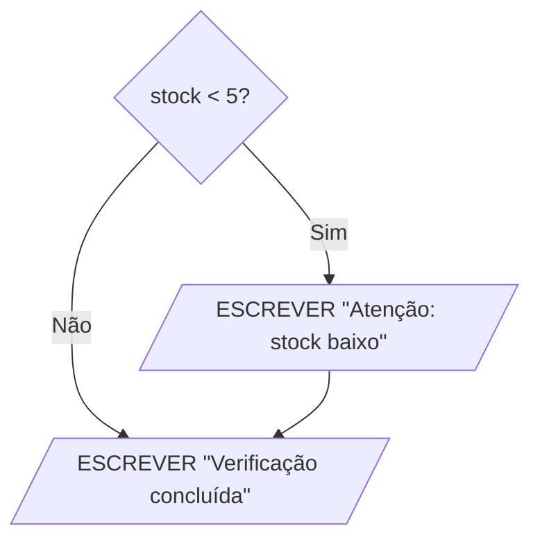
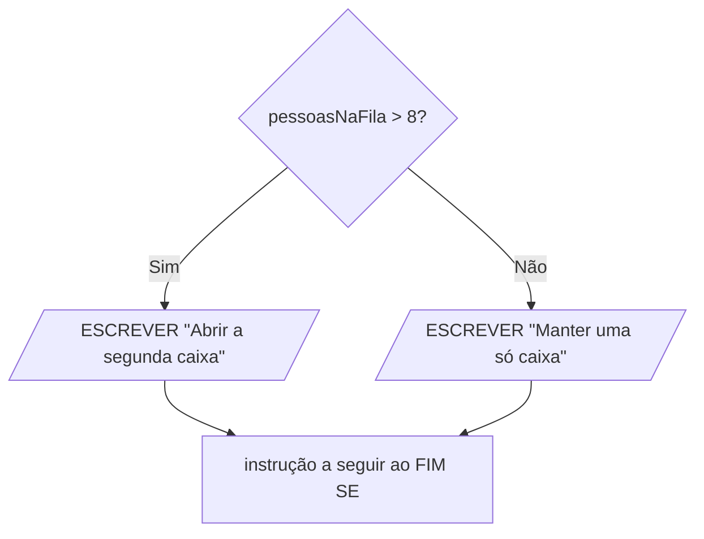
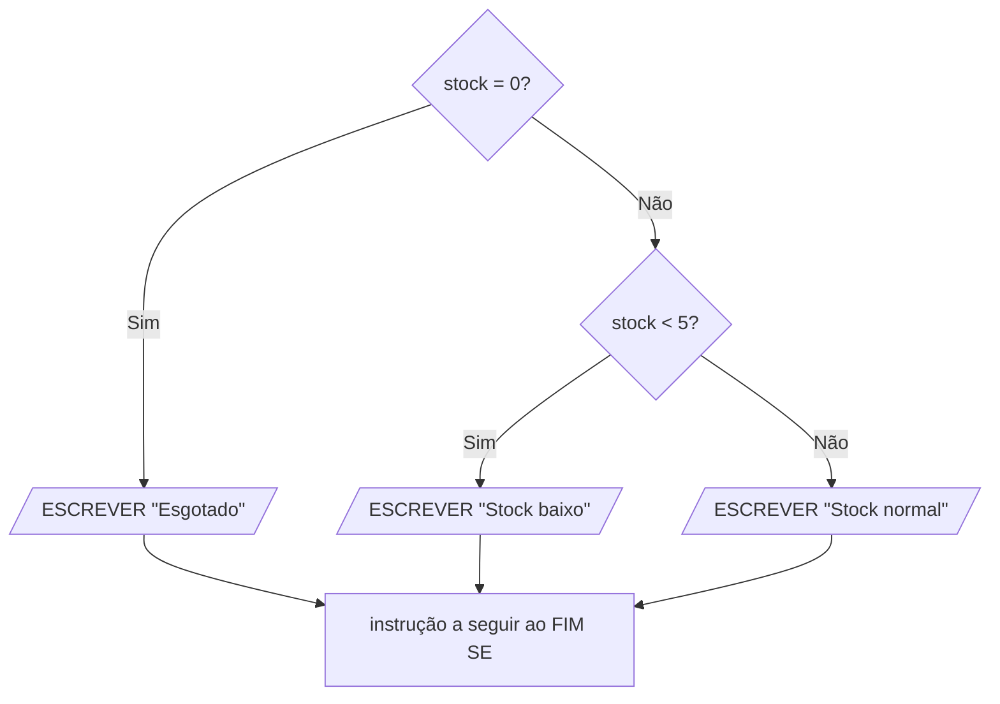
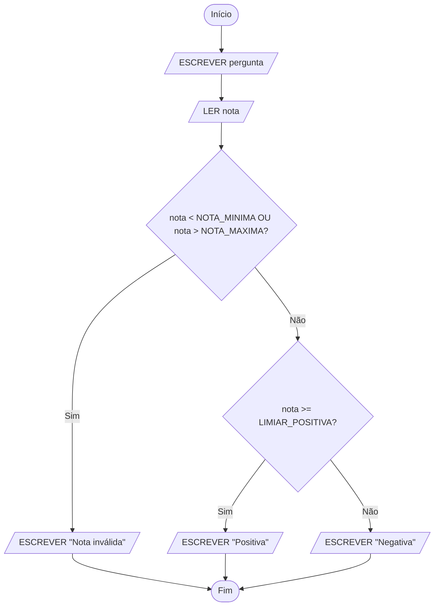

# Decisões e validação

UC: UC00245

Blocos: ALG03

Requisitos: UC00245-R03, UC00245-R04, UC00245-K05, UC00245-K06, UC00245-A05, UC00245-A06, UC00245-C01, UC00245-C02, UC00245-P02

| Identificação | Valor |
| --- | --- |
| Material | M-ALG03, terceiro bloco de Desenvolver algoritmos |
| Fundamento curricular | Unidade de competência UC00245, bloco ALG03 |
| Duração | 120 minutos dos 300 do bloco; a prática guiada (60 minutos) está no [laboratório](03-decisoes-e-validacao-laboratorio.md) e a prática autónoma e o desafio (120 minutos) estão na [ficha de exercícios](03-decisoes-e-validacao-exercicios.md) |
| Evidência a guardar | Árvore de casos, tabela de casos esperados e fluxograma com os caminhos possíveis, desenhado na aplicação |

## Objetivos

No final deste bloco, serás capaz de:

- escrever condições com operadores de comparação e dizer se são verdadeiras ou falsas para valores concretos, incluindo o valor que fica exatamente no limite;
- explicar por que razão, a partir deste bloco, o sinal de igual pergunta e a seta dá valores;
- juntar condições com `E`, `OU` e `NÃO`, usando as tabelas de verdade para prever o resultado;
- escrever seleções simples, compostas e encadeadas, em pseudocódigo e em fluxograma;
- escrever um intervalo de valores como condição, com os extremos incluídos ou excluídos conforme o enunciado, e escrever também o seu contrário;
- validar uma entrada, recusando o que está fora do domínio antes de o usar;
- construir a árvore de casos de um problema e a tabela de casos esperados, com casos abaixo, no e acima de cada limite, e confirmar que as condições não se sobrepõem.

## O que precisas de saber antes

Este guia continua os dois anteriores e dá por sabido o que lá está. Antes de começares, confirma que consegues fazer tudo o que está nesta lista. Se algum ponto não estiver claro, volta à secção indicada antes de avançares, porque tudo o que vem a seguir se apoia nele.

Do guia [Do problema ao algoritmo](01-do-problema-ao-algoritmo.md), o primeiro deste percurso:

- escrever o **contrato** de um problema: as entradas, as saídas, as restrições, as condições e os exemplos concretos, cada um com o resultado esperado. Vais usar as cinco partes, e três delas ganham agora uma forma mais precisa. Nesse guia, uma condição era uma situação que pode acontecer ou não e que obriga a fazer uma coisa diferente. É exatamente isso que vais aprender a escrever neste bloco, com uma notação própria. Os exemplos concretos já incluíam casos de fronteira, com valores em cima dos limites; aqui vais aprender a escolhê-los de forma sistemática. E o contrato de cada entrada já dizia que valores são aceitáveis, como "número da senha, inteiro de 1 a 40"; aqui vais aprender a verificar isso dentro do algoritmo;
- reconhecer uma instrução ambígua e reescrevê-la sem dúvidas. Vais encontrar um tipo novo de ambiguidade: o limite mal dito, como "entre 10 e 20", sem dizer se o 10 e o 20 contam.

Do guia [Pseudocódigo e fluxogramas](02-pseudocodigo-e-fluxogramas.md), o segundo:

- a forma de um algoritmo em pseudocódigo, com `ALGORITMO`, `CONSTANTES`, `VARIÁVEIS`, `INÍCIO` e `FIM`;
- os quatro tipos de dados, e em especial o tipo `lógico`, que só tem dois valores, `VERDADEIRO` e `FALSO`, e que nesse guia serviu para guardar respostas de sim ou não, como em `pago ← FALSO`. Nesse guia usaste-o pouco. Neste passa a estar em todo o lado;
- as instruções `LER` e `ESCREVER`;
- a atribuição com a seta, como em `total ← total + 5`, e a diferença entre dar um valor e perguntar se dois valores são iguais, explicada na secção "Atribuição: dar um valor não é perguntar se é igual";
- as constantes, escritas em maiúsculas, para os valores fixos de um problema;
- os símbolos do fluxograma: o oval para o início e o fim, o paralelogramo para a entrada e a saída, o retângulo para o processamento e a seta para a ordem. O losango foi apresentado nesse guia mas não foi usado. É neste bloco que entra em uso;
- a tabela de trace, com uma coluna por variável, onde se segue a execução instrução a instrução.

Do [laboratório do bloco 02](02-pseudocodigo-e-fluxogramas-laboratorio.md): abrir o diagrams.net, guardar o ficheiro no computador, encontrar o grupo Fluxograma, pôr figuras na página, escrever o texto dentro delas, ligá-las com setas e exportar uma imagem. O laboratório deste bloco parte daí e só ensina o que é novo.

Se já trabalhaste em aula as instruções se, senão se e senão, vais reconhecê-las. Este guia retoma-as desde o princípio, na notação da disciplina, porque são a base de tudo o resto, e acrescenta o que ainda falta: os operadores `E`, `OU` e `NÃO`, os intervalos, as fronteiras e a validação.

## Material e preparação

Para a teoria e o exemplo explicado precisas de papel e lápis, porque as retas, as árvores de casos e as tabelas de casos fazem-se primeiro à mão. Para o laboratório e para o exercício 3 da ficha precisas do computador, com o diagrams.net aberto em `https://app.diagrams.net/?lang=pt`, e da pasta `algoritmos` onde guardaste os fluxogramas do bloco anterior.

## Como está organizado o tempo

Este bloco tem **5 horas**, ou seja 300 minutos. Como nos anteriores, não corresponde a uma aula: o professor reparte-o pelas sessões que existirem.

| Parte | Onde está | Tempo |
| --- | --- | ---: |
| Teoria | Neste guia | 30 min |
| Exemplo explicado | Neste guia | 30 min |
| Prática guiada | No [laboratório](03-decisoes-e-validacao-laboratorio.md) | 60 min |
| Prática autónoma | Na [ficha](03-decisoes-e-validacao-exercicios.md) | 90 min |
| Desafio opcional | Na [ficha](03-decisoes-e-validacao-exercicios.md) | 30 min |
| Consolidação | Neste guia | 60 min |

A ordem recomendada é esta: ler a teoria e o exemplo explicado, fazer o laboratório no computador, resolver a ficha e fechar com a consolidação, no fim deste guia.

Como no guia anterior, a teoria é longa, e 30 minutos de aula não chegam para a ler toda com calma. Na aula, o professor apresenta as ideias principais. Depois, cada secção fica aqui para a releres ao teu ritmo, sempre que te surgir uma dúvida no laboratório ou na ficha.

## Teoria (30 min)

### Algoritmos que escolhem o caminho

Todos os algoritmos do bloco anterior eram **sequenciais**: executavam sempre as mesmas instruções, pela mesma ordem, fosse qual fosse a entrada. O algoritmo das caixas de cadernos fazia as mesmas duas contas para 30 cadernos e para 5 cadernos. E fazia-as também para -30 cadernos, que o contrato diz não ser uma entrada válida, porque não tinha forma de o verificar. O guia anterior terminou precisamente com esse problema.

Na gestão de uma loja, quase nada funciona assim. Um pedido só é aceite se houver stock. Uma encomenda só tem portes grátis a partir de um certo valor. Um código de artigo com cinco algarismos, quando devia ter quatro, tem de ser recusado antes de alguém o usar. Em todos estes casos, o que o algoritmo faz depende dos dados que recebeu.

No dia a dia tomas decisões destas a toda a hora. "Se estiver a chover, levo o guarda-chuva." "Se o semáforo estiver verde, atravesso; senão, espero." Cada uma destas frases tem duas partes: uma pergunta cuja resposta é sim ou não, e o que fazer em cada caso. Os algoritmos decidem exatamente da mesma maneira, e é essa estrutura que vais aprender a escrever.

### Condições

Uma **condição** é uma pergunta cuja resposta só pode ser sim ou não. "O stock é maior do que zero?" é uma condição. "Qual é o stock?" não é, porque a resposta é um número.

Num algoritmo, a resposta a uma condição é um valor do tipo `lógico`, o tipo que conheceste no bloco anterior e que só tem dois valores. Em pseudocódigo esses dois valores escrevem-se em maiúsculas, como as outras palavras reservadas: `VERDADEIRO` e `FALSO`. Uma condição é, portanto, uma expressão que dá um valor lógico, da mesma forma que uma conta dá um valor numérico. `7 + 3` dá `10`. `7 > 3` dá `VERDADEIRO`.

Uma condição não depende do que achas que o valor devia ser. Depende do valor que as variáveis têm no momento em que a condição é avaliada. Se `stock` valer 0, a condição `stock > 0` é falsa, e é falsa mesmo que saibas que vai chegar uma entrega amanhã. O algoritmo só vê o estado, e o estado diz 0.

### Operadores de comparação

As condições mais simples comparam dois valores. Escrevem-se com seis operadores. A tabela mostra o resultado de cada um quando a variável `quantidade` vale 10:

| Operador | Pergunta | Exemplo | Resultado com quantidade a valer 10 |
| --- | --- | --- | --- |
| `=` | é igual a? | `quantidade = 10` | `VERDADEIRO` |
| `!=` | é diferente de? | `quantidade != 10` | `FALSO` |
| `<` | é menor do que? | `quantidade < 10` | `FALSO` |
| `<=` | é menor ou igual a? | `quantidade <= 10` | `VERDADEIRO` |
| `>` | é maior do que? | `quantidade > 10` | `FALSO` |
| `>=` | é maior ou igual a? | `quantidade >= 10` | `VERDADEIRO` |

Na aula de Matemática escreves "menor ou igual" com o sinal ≤, "maior ou igual" com ≥ e "diferente" com ≠. Significam o mesmo. Aqui usam-se `<=`, `>=` e `!=` porque se escrevem com as teclas que existem no teclado, e porque vais encontrar os três tal e qual nas linguagens de programação, incluindo o Python. O `!=` lê-se "diferente de": o ponto de exclamação antes do igual quer dizer "não igual".

Olha com atenção para as linhas de `<` e de `<=`. Com a quantidade a valer 10, `quantidade < 10` é falso e `quantidade <= 10` é verdadeiro. A única diferença entre os dois operadores é o que acontece exatamente no valor 10. Para 9 dão os dois verdadeiro, para 11 dão os dois falso. Guarda esta observação, porque é a razão de ser da secção sobre fronteiras, mais à frente.

Os operadores `=` e `!=` também servem para comparar textos. A condição `resposta = "S"` pergunta se a variável `resposta` guarda exatamente o texto `"S"`. Dois textos só são iguais se tiverem os mesmos caracteres, pela mesma ordem, e isso inclui as maiúsculas: `"S"` e `"s"` são textos diferentes, e `"Sim"` e `"S"` também. Nos exercícios deste bloco, os textos só se comparam com `=` e `!=`.

### O sinal de igual passou a perguntar

No bloco anterior aprendeste que o sinal de igual nunca serve para dar um valor a uma variável, e que para isso existe a seta. Agora o sinal de igual tem finalmente a sua função: comparar.

A razão para usar dois símbolos diferentes vem do primeiro bloco. Um sinal com dois significados é uma ambiguidade. Se o `=` servisse ao mesmo tempo para dar valores e para perguntar, a linha `total = total + 5` podia ser lida de duas maneiras: como uma ordem ("guarda em total o valor de total mais 5") ou como uma pergunta ("total é igual a total mais 5?"). A resposta a essa pergunta é sempre não, porque nenhum número é igual a ele próprio mais cinco. As duas leituras dão resultados completamente diferentes, e quem lê o algoritmo não saberia qual é a certa. Com a seta para dar valores e o igual para perguntar, cada linha só tem uma leitura possível:

```text
total ← total + 5
```

Esta é uma ordem: `total` passa a valer mais 5 do que valia.

```text
SE total = 100 ENTÃO
```

Esta é uma pergunta: `total` vale 100? A resposta é `VERDADEIRO` ou `FALSO`, e **perguntar não muda nada**. Depois de avaliar `total = 100`, a variável `total` continua a valer exatamente o que valia antes. Só uma atribuição muda o valor de uma variável.

As duas coisas podem até aparecer na mesma linha. Imagina uma variável `semStock`, do tipo `lógico`:

```text
semStock ← stock = 0
```

Lê-se "`semStock` recebe a resposta à pergunta `stock` é igual a 0?". Pela regra do bloco anterior, primeiro calcula-se o lado direito, e só depois o resultado é guardado no lado esquerdo. O lado direito é uma comparação, que dá `VERDADEIRO` ou `FALSO`, e é esse valor lógico que fica guardado em `semStock`.

| Valor de stock | O que a comparação `stock = 0` dá | O que fica em semStock | O que acontece ao stock |
| ---: | --- | --- | --- |
| 0 | `VERDADEIRO` | `VERDADEIRO` | nada, continua a valer 0 |
| 7 | `FALSO` | `FALSO` | nada, continua a valer 7 |

Não vais precisar de escrever linhas destas nos exercícios deste bloco. Está aqui porque mostra, numa só linha, as duas coisas que não podes confundir: a seta manda, o igual pergunta.

Quando passares para o Python, no próximo período, vais encontrar a mesma separação com outros símbolos: lá, dar um valor escreve-se com um só `=`, e comparar escreve-se com dois, `==`. Os símbolos mudam de linguagem para linguagem. A ideia de que dar e perguntar são coisas diferentes não muda.

### Seleção simples

Uma **seleção** é uma instrução que escolhe o que executar consoante uma condição. A forma mais simples executa um bloco de instruções quando a condição é verdadeira e não faz nada quando é falsa:

```text
SE condição ENTÃO
    instruções que só se executam se a condição for verdadeira
FIM SE
```

Um exemplo de uma papelaria, que avisa quando um artigo está quase a acabar:

```text
SE stock < 5 ENTÃO
    ESCREVER "Atenção: stock baixo"
FIM SE
ESCREVER "Verificação concluída"
```

Se o stock for 3, a condição `3 < 5` é verdadeira: aparece o aviso, e o algoritmo continua na instrução a seguir ao `FIM SE`, que escreve "Verificação concluída". Se o stock for 12, a condição `12 < 5` é falsa: o aviso é saltado, e o algoritmo continua também na instrução a seguir ao `FIM SE`. Nos dois casos aparece "Verificação concluída". A seleção só decide se o bloco de dentro se executa ou não. O que está depois do `FIM SE` executa-se sempre.

As instruções dentro do `SE` escrevem-se com mais quatro espaços de indentação. É aqui que a indentação deixa de ser decorativa, como o guia anterior avisou: é ela que mostra, à primeira vista, que instruções dependem da condição e quais se executam sempre.

No fluxograma, a condição é o **losango**. O losango tem uma entrada e duas saídas: uma marcada `Sim`, para quando a condição é verdadeira, e outra marcada `Não`, para quando é falsa. É o mesmo algoritmo, desenhado:



Descrição do fluxograma: do losango `stock < 5?` saem duas setas. A seta `Sim` leva a um paralelogramo que escreve "Atenção: stock baixo", e desse paralelogramo sai uma seta para o paralelogramo que escreve "Verificação concluída". A seta `Não` vai diretamente para esse mesmo paralelogramo, sem passar pelo aviso. Os dois caminhos juntam-se no paralelogramo de "Verificação concluída", e esse ponto de encontro corresponde ao `FIM SE`.

A cada um dos caminhos que saem de um losango chama-se **ramo**. Numa seleção simples, o ramo do `Não` não tem nenhuma figura: vai direto ao ponto onde os ramos se juntam.

### Seleção composta

A **seleção composta** escolhe entre dois blocos: um para quando a condição é verdadeira e outro para quando é falsa.

```text
SE condição ENTÃO
    instruções para quando a condição é verdadeira
SENÃO
    instruções para quando a condição é falsa
FIM SE
```

Lembras-te da fila da papelaria do primeiro bloco, e da instrução ambígua "se houver muitas pessoas na fila, abre outra caixa"? Com o limite escrito como número, deixa de ser ambígua:

```text
SE pessoasNaFila > 8 ENTÃO
    ESCREVER "Abrir a segunda caixa"
SENÃO
    ESCREVER "Manter uma só caixa"
FIM SE
```

Com 12 pessoas aparece "Abrir a segunda caixa". Com 5 pessoas aparece "Manter uma só caixa". Com exatamente 8 pessoas, `8 > 8` é falso, e aparece "Manter uma só caixa": são precisas mais de 8 pessoas para abrir a segunda caixa.

Numa seleção composta executa-se sempre exatamente um dos dois blocos, nunca os dois e nunca nenhum. Não há nenhum número de pessoas para o qual apareçam as duas mensagens, nem nenhum para o qual não apareça nenhuma.



Descrição do fluxograma: do losango `pessoasNaFila > 8?` saem duas setas. A seta `Sim` leva ao paralelogramo que escreve "Abrir a segunda caixa". A seta `Não` leva ao paralelogramo que escreve "Manter uma só caixa". Dos dois paralelogramos saem setas para a mesma figura, a instrução que vem a seguir ao `FIM SE`. Aqui os dois ramos têm uma figura cada um, e voltam a juntar-se antes de o algoritmo continuar.

### Seleção encadeada

Às vezes há mais do que duas possibilidades. A **seleção encadeada** usa `SENÃO SE` para acrescentar condições, umas a seguir às outras:

```text
SE condição1 ENTÃO
    instruções para quando a condição1 é verdadeira
SENÃO SE condição2 ENTÃO
    instruções para quando a condição1 é falsa e a condição2 é verdadeira
SENÃO
    instruções para quando todas as condições anteriores são falsas
FIM SE
```

O funcionamento tem três regras, e as três são importantes:

1. As condições avaliam-se por ordem, de cima para baixo.
2. A primeira condição verdadeira ganha: executa-se o seu bloco e salta-se para depois do `FIM SE`. As condições que estão abaixo dela nem chegam a ser avaliadas.
3. Se nenhuma condição for verdadeira, executa-se o bloco do `SENÃO`. Se não houver `SENÃO`, não se executa nada.

Um exemplo, para classificar o stock de um artigo:

```text
SE stock = 0 ENTÃO
    ESCREVER "Esgotado"
SENÃO SE stock < 5 ENTÃO
    ESCREVER "Stock baixo"
SENÃO
    ESCREVER "Stock normal"
FIM SE
```

Segue as três regras com três valores. Com stock 3, a primeira condição, `3 = 0`, é falsa; passa-se à segunda, `3 < 5`, que é verdadeira, e aparece "Stock baixo". Com stock 9, as duas condições são falsas, e aparece "Stock normal", que é o bloco do `SENÃO`.

O caso interessante é o stock 0. A primeira condição, `0 = 0`, é verdadeira, e aparece "Esgotado". Repara que a segunda condição também seria verdadeira, porque 0 é menor do que 5. Mas nunca chega a ser avaliada: a primeira verdadeira ganha, e o algoritmo salta para depois do `FIM SE`. É por isso que um artigo esgotado não aparece também como "Stock baixo".

Destas regras resulta uma consequência que vais usar muito. Quando o algoritmo chega a avaliar a segunda condição, já sabe que a primeira é falsa, porque se não fosse nunca teria chegado ali. No exemplo, quando se pergunta `stock < 5`, já se sabe que o stock não é 0. É por isso que a segunda linha do modelo diz "a condição1 é falsa e a condição2 é verdadeira". Vais ver no exemplo explicado como isto simplifica as condições.

Um `SENÃO SE` pertence ao mesmo `SE` que está acima dele, e por isso há um único `FIM SE` no fim de toda a cadeia. Numa cadeia destas executa-se sempre, no máximo, um bloco. Com `SENÃO` no fim, executa-se sempre exatamente um.



Descrição do fluxograma: há dois losangos. Do primeiro, `stock = 0?`, a seta `Sim` leva ao paralelogramo "Esgotado" e a seta `Não` leva ao segundo losango, `stock < 5?`. Do segundo losango, a seta `Sim` leva ao paralelogramo "Stock baixo" e a seta `Não` leva ao paralelogramo "Stock normal". Os três paralelogramos têm setas para a mesma figura, a instrução a seguir ao `FIM SE`. O segundo losango está pendurado na saída `Não` do primeiro, e é assim que se desenha um `SENÃO SE`: só se chega a ele quando a primeira condição é falsa.

### Operador E

Muitas decisões dependem de mais do que uma pergunta. Os **operadores lógicos** `E`, `OU` e `NÃO` juntam condições para formar uma condição maior, e cada um tem uma regra fixa.

Uma condição do tipo `A E B` é verdadeira só quando `A` e `B` são as duas verdadeiras. Basta uma ser falsa para o conjunto ser falso.

Um exemplo de uma loja online: um pedido sai do armazém no próprio dia se estiver pago **e** tiver chegado antes das 15 horas. O sistema da loja guarda o estado do pagamento numa variável `pago`, do tipo lógico, como a do guia anterior: vale `VERDADEIRO` se o pedido já foi pago e `FALSO` se ainda não foi. A hora de chegada está numa variável `hora`, do tipo inteiro. A condição escreve-se assim:

```text
pago E hora < 15
```

Repara que `pago` entra na condição sozinho, sem nenhuma comparação. Não precisa: uma variável lógica já vale `VERDADEIRO` ou `FALSO`, que é exatamente o que uma condição tem de dar. Escrever `pago = VERDADEIRO` dava o mesmo resultado, com mais letras.

As duas partes são independentes uma da outra: um pedido pode estar pago e chegar tarde, ou chegar cedo e não estar pago. Por isso há quatro combinações possíveis, e a tabela seguinte mostra o resultado de cada uma. A uma tabela destas, que mostra o resultado de um operador para todas as combinações possíveis, chama-se **tabela de verdade**. Antes de leres a tabela, tapa a última coluna e tenta prever tu o resultado de cada linha.

| A: `pago` | B: `hora < 15` | `A E B` |
| --- | --- | --- |
| `VERDADEIRO` | `VERDADEIRO` | `VERDADEIRO` |
| `VERDADEIRO` | `FALSO` | `FALSO` |
| `FALSO` | `VERDADEIRO` | `FALSO` |
| `FALSO` | `FALSO` | `FALSO` |

Lê a tabela linha a linha, com um pedido concreto em cada uma:

1. Primeira linha: um pedido pago que chegou às 10 horas. `pago` vale `VERDADEIRO` e `10 < 15` é verdadeiro. As duas partes cumprem-se, e o pedido sai hoje. É a única linha em que o `E` dá verdadeiro.
2. Segunda linha: um pedido pago que chegou às 16 horas. Está pago, mas `16 < 15` é falso. Chegou tarde, e já não sai hoje, apesar de estar pago.
3. Terceira linha: um pedido por pagar que chegou às 10 horas. Chegou a tempo, mas `pago` vale `FALSO`. Não se envia o que não está pago, por muito cedo que tenha chegado.
4. Quarta linha: um pedido por pagar que chegou às 16 horas. Falham as duas partes, e o resultado é falso.

A forma de decorar o `E` é esta: o `E` é exigente. Só dá verdadeiro quando tudo se cumpre.

### Operador OU

Uma condição do tipo `A OU B` é verdadeira quando pelo menos uma das duas é verdadeira. Só é falsa quando são as duas falsas.

Volta à fila da papelaria. A regra passou a ser esta: abre-se a segunda caixa se houver mais de 8 pessoas na fila **ou** se o tempo de espera passar de 10 minutos. Com a variável `espera` para os minutos de espera, a condição escreve-se:

```text
pessoasNaFila > 8 OU espera > 10
```

Outra vez, tapa a última coluna e prevê cada linha antes de a leres.

| A: `pessoasNaFila > 8` | B: `espera > 10` | `A OU B` |
| --- | --- | --- |
| `VERDADEIRO` | `VERDADEIRO` | `VERDADEIRO` |
| `VERDADEIRO` | `FALSO` | `VERDADEIRO` |
| `FALSO` | `VERDADEIRO` | `VERDADEIRO` |
| `FALSO` | `FALSO` | `FALSO` |

Outra vez linha a linha:

1. Primeira linha: 12 pessoas e 15 minutos de espera. As duas partes são verdadeiras, e abre-se a segunda caixa. Com mais razão ainda, se se quiser.
2. Segunda linha: 12 pessoas e 4 minutos de espera. A fila anda depressa, mas é comprida. Basta a primeira parte para abrir a caixa.
3. Terceira linha: 5 pessoas e 15 minutos de espera. A fila é curta, mas está parada. Basta a segunda parte.
4. Quarta linha: 5 pessoas e 4 minutos de espera. Nenhuma das razões se verifica, e é a única linha em que o `OU` dá falso.

O `OU` é tolerante: basta uma parte para dar verdadeiro.

Repara na primeira linha: com as duas partes verdadeiras, o `OU` dá verdadeiro. No português do dia a dia, "ou" às vezes quer dizer "um ou outro, mas não os dois", como em "ao almoço podes escolher sopa ou sobremesa". O `OU` dos algoritmos não é esse. Funciona como "podes pagar com dinheiro ou com cartão": se tiveres os dois, continuas a poder pagar.

### Operador NÃO

`NÃO A` troca o valor de `A`: se `A` é verdadeiro, dá falso, e se `A` é falso, dá verdadeiro. A tabela de verdade só tem duas linhas, porque só há uma condição:

| A: `stock > 0` | `NÃO A` |
| --- | --- |
| `VERDADEIRO` | `FALSO` |
| `FALSO` | `VERDADEIRO` |

Com stock 7, `stock > 0` é verdadeiro e `NÃO (stock > 0)` é falso: há stock. Com stock 0, `stock > 0` é falso e `NÃO (stock > 0)` é verdadeiro: não há stock.

O `NÃO` é útil, mas quase sempre se pode escrever a mesma coisa sem ele, trocando a comparação pelo seu contrário. `NÃO (stock > 0)` é o mesmo que `stock <= 0`. E aqui está uma armadilha em que muita gente cai: o contrário de "maior do que 0" não é "menor do que 0". É "menor ou igual a 0", porque o 0 tem de ficar de algum lado, e se não é maior do que 0, está do outro lado. Quando trocas o sentido de uma comparação, o valor do limite muda de lado.

| Condição | O seu contrário |
| --- | --- |
| `a = b` | `a != b` |
| `a != b` | `a = b` |
| `a < b` | `a >= b` |
| `a <= b` | `a > b` |
| `a > b` | `a <= b` |
| `a >= b` | `a < b` |

Também se pode escrever o contrário de uma condição com `E` ou com `OU`. A regra é esta: troca-se o `E` por `OU` (ou o `OU` por `E`), e cada parte pelo seu contrário. O pedido que **não** sai hoje é o contrário de `pago E hora < 15`:

```text
NÃO pago OU hora >= 15
```

Aqui o `NÃO` é mesmo preciso. `pago` é uma variável lógica e não uma comparação, e por isso não há comparação contrária para escrever: o contrário de `pago` é `NÃO pago`. A outra parte é uma comparação, e troca-se pela contrária, como na tabela acima.

Lê-se: o pedido não sai hoje se não estiver pago, ou se tiver chegado às 15 horas ou depois. Confirma com as quatro linhas da tabela do `E`. Na primeira linha, que era a única verdadeira, esta condição dá falso, porque `NÃO pago` é falso e `10 >= 15` é falso. Nas outras três dá verdadeiro. Dá sempre o contrário, que era o que se queria.

Do mesmo modo, a fila mantém uma só caixa quando **não** se cumpre `pessoasNaFila > 8 OU espera > 10`, isto é:

```text
pessoasNaFila <= 8 E espera <= 10
```

Uma só caixa só chega se a fila for curta **e** andar depressa. Faz sentido: para manter uma caixa, as duas coisas têm de estar bem.

### Misturar E e OU

Quando uma condição tem `E` e `OU` ao mesmo tempo, a ordem por que se avaliam muda o resultado, tal como nas contas `2 + 3 * 4` e `(2 + 3) * 4`. Imagina que a loja online passou a enviar no próprio dia também os pedidos urgentes, marcados numa variável lógica `urgente`. Há duas maneiras de pôr os parênteses, e dizem coisas diferentes:

```text
(pago E hora < 15) OU urgente
pago E (hora < 15 OU urgente)
```

Experimenta com um pedido urgente, por pagar, que chegou às 10 horas: `pago` é falso, `hora < 15` é verdadeiro e `urgente` é verdadeiro.

- Na primeira forma, avalia-se primeiro o parêntese: falso `E` verdadeiro dá falso. Depois, falso `OU` verdadeiro dá verdadeiro. O pedido sai hoje, mesmo por pagar.
- Na segunda forma, o parêntese é verdadeiro `OU` verdadeiro, que dá verdadeiro. Depois, falso `E` verdadeiro dá falso. O pedido não sai, porque não está pago.

As mesmas três partes dão resultados diferentes conforme os parênteses. Qual das duas está certa? Depende do que o enunciado diz sobre os pedidos urgentes por pagar, e se o enunciado não disser, é uma ambiguidade que se pergunta a quem pediu o algoritmo. Nesta disciplina a regra é simples: **sempre que misturares `E` com `OU`, usa parênteses** para mostrar o que se avalia primeiro. Não custa nada, e evita que tu, ou quem ler o algoritmo, tenha de adivinhar.

### Intervalos

Muitas condições perguntam se um valor está entre dois limites. A esse conjunto de valores chama-se **intervalo**.

Na Matemática aprendeste a escrever intervalos com parênteses retos: [1, 40] são os números de 1 a 40, incluindo o 1 e o 40. Um extremo que pertence ao intervalo diz-se **fechado**. Um extremo que não pertence diz-se **aberto**, e na notação portuguesa escreve-se com o parêntese reto virado para fora, como em [1, 40[, que inclui o 1 e exclui o 40.

Lembras-te das senhas da papelaria do primeiro bloco? A loja distribui no máximo 40 senhas por dia, numeradas de 1 a 40. Quando o funcionário escreve o número de uma senha, esse número só faz sentido se estiver entre 1 e 40, incluindo os extremos. Num algoritmo, um intervalo escreve-se como duas comparações ligadas por `E`:

```text
senha >= 1 E senha <= 40
```

Lê-se "a senha é maior ou igual a 1 e a senha é menor ou igual a 40". Porquê `E`? Porque o valor tem de cumprir as duas coisas ao mesmo tempo: não pode estar abaixo do limite de baixo, e não pode estar acima do limite de cima. O 45 cumpre a primeira parte e falha a segunda. O 0 cumpre a segunda e falha a primeira. Só os números de 1 a 40 cumprem as duas.

Os operadores escolhem-se pelo que o enunciado diz sobre os extremos. "Entre 1 e 40, inclusive" leva `>=` e `<=`. "Maior do que 0 e menor do que 41" leva `>` e `<`, e para números inteiros acaba por ser o mesmo conjunto de valores. Quando o enunciado não diz se os extremos estão incluídos, não adivinhes: é uma ambiguidade, e trata-se como aprendeste no primeiro bloco, perguntando.

Há uma forma de escrever intervalos que parece natural e que não é permitida nesta convenção:

```text
1 <= senha <= 40
```

A razão é que o algoritmo avalia uma comparação de cada vez. Avaliaria primeiro `1 <= senha`, que dá `VERDADEIRO` ou `FALSO`, e depois tentaria comparar esse valor lógico com 40, o que não faz sentido. Em algumas linguagens, como o Python que vais aprender a seguir, esta forma até funciona. Noutras dá um resultado errado sem avisar. Para o teu algoritmo não depender da linguagem em que um dia vai ser escrito, nesta convenção cada comparação compara dois valores, e as comparações juntam-se com `E` ou `OU`.

### A reta com as regiões

A forma mais segura de pensar num intervalo é desenhá-lo. Desenha-se uma reta com os valores possíveis, marcam-se os limites, e escreve-se por cima de cada pedaço da reta, a que se chama **região**, a resposta que o algoritmo deve dar aos valores que lá caem. Para o número da senha:

```text
       inválida    |              válida              |    inválida
  ...  -1    0     |   1    2    3   ...   39    40   |   41    42  ...
                   ↑                                  ↑
              entre 0 e 1                        entre 40 e 41
```

A reta tem três regiões. Os sítios onde se passa de uma região para outra, marcados com as setas, chamam-se **fronteiras**. Aqui há duas: entre o 0 e o 1, e entre o 40 e o 41. Vais usar muito esta palavra.

### O contrário de um intervalo

Muitas vezes o que interessa é o contrário: a senha **não** está entre 1 e 40. Um valor está fora do intervalo quando está abaixo do limite de baixo ou acima do limite de cima:

```text
senha < 1 OU senha > 40
```

Repara no que mudou em relação à condição de dentro. É a regra que viste no operador `NÃO`: o `E` passou a `OU`, e cada comparação passou para o seu contrário, com o limite a mudar de lado. `>= 1` passou a `< 1`, e `<= 40` passou a `> 40`.

Porquê `OU`? Porque, para estar fora, basta falhar um dos lados. O 0 está fora por estar abaixo de 1. O 45 está fora por estar acima de 40. E não existe nenhum número que esteja ao mesmo tempo abaixo de 1 e acima de 40. Se escrevesses `senha < 1 E senha > 40`, estarias a pedir um número que fosse as duas coisas ao mesmo tempo, e essa condição seria falsa para todos os números que existem. É um dos erros mais frequentes desta matéria, e vais vê-lo com números na secção de erros comuns.

Também podias escrever `NÃO (senha >= 1 E senha <= 40)`. Está correto e diz o mesmo, mas é mais difícil de ler, e por isso nestes guias usa-se a forma com `OU`.

### Condições que não se sobrepõem e que cobrem todos os casos

Quando uma seleção separa os valores possíveis em grupos, há duas propriedades a verificar.

A primeira é que as condições **não se sobrepõem**: nenhum valor pode pertencer a dois grupos ao mesmo tempo. A condições assim chama-se **mutuamente exclusivas**. Se uma regra dissesse "stock baixo até 10 unidades, inclusive" e "stock normal a partir de 10 unidades, inclusive", o 10 pertencia aos dois grupos, e o algoritmo não saberia o que dizer de um artigo com 10 unidades.

A segunda é que as condições **cobrem todos os casos**: todos os valores possíveis pertencem a algum grupo. Se a regra dissesse "stock baixo abaixo de 10" e "stock normal acima de 10", o 10 não pertencia a nenhum, e ficava sem resposta.

Para verificar as duas propriedades, usa a reta. Cada valor da reta tem de cair numa região, e numa só.

A seleção encadeada ajuda com a primeira propriedade, mas não a resolve. Como a primeira condição verdadeira ganha e as seguintes nem são avaliadas, dois blocos nunca se executam para o mesmo valor. Isso não elimina a sobreposição, esconde-a: o valor que pertencia a dois grupos passa a ir, sem aviso, para o que estiver escrito primeiro. Se não era isso que o enunciado pedia, o algoritmo está errado e nada no ecrã te avisa. Por isso, a verificação na reta faz-se na mesma.

### Fronteiras e casos de teste

Uma fronteira é o sítio onde a resposta de um algoritmo muda: de um lado dá uma coisa, do outro dá outra. Os erros de decisão concentram-se nas fronteiras.

Viste na secção dos operadores que `<` e `<=` dão o mesmo resultado para todos os valores menos um, o próprio limite. Com as senhas: `senha <= 40` e `senha < 40` dão o mesmo para 39, para 41, e para qualquer valor longe de 40. Só discordam no 40. Se testares um algoritmo com as senhas 20 e 50, nunca vais descobrir que escreveste o operador errado, porque para esses valores os dois operadores respondem o mesmo.

Daí a regra para escolher os casos de teste de uma decisão: **para cada limite, testar o valor imediatamente abaixo, o próprio limite e o valor imediatamente acima**. Com números inteiros, os vizinhos são os valores a uma unidade de distância. Para o limite 40 das senhas, são o 39, o 40 e o 41. Para o limite 1, são o 0, o 1 e o 2.

Cada um destes três casos apanha um erro diferente:

- **o próprio limite** apanha quem trocou o operador com igual pelo operador sem igual. Quem escreveu `senha < 40` em vez de `senha <= 40` só erra no 40, e quem escreveu `senha > 1` em vez de `senha >= 1` só erra no 1;
- **o valor do lado de fora** apanha quem pôs o limite uma unidade ao lado. Quem escreveu `senha <= 41` só erra no 41, e quem escreveu `senha >= 0` só erra no 0;
- **o valor do lado de dentro** apanha quem escreveu `=` em vez de `<=` ou `>=`. A condição `senha = 1` acerta no 1 e falha logo no 2, e `senha = 40` acerta no 40 e falha logo no 39.

Os dois primeiros erros nunca aparecem se testares só com valores do meio, como 20 e 50, porque só se notam exatamente na fronteira. O terceiro até aparecia com o 20, mas quem testa assim encontra-o por sorte, sem saber porquê. Os três casos junto de cada limite apanham os três erros de propósito.

### Validar os dados antes de os usar

No primeiro guia, o contrato de cada entrada dizia que valores são aceitáveis, e avisava que, se alguém der uma entrada fora do combinado, como a senha 57, o contrato tem de dizer o que acontece nesse caso. Chegou a altura de o algoritmo tratar esse caso por si próprio.

O **domínio** de uma entrada é o conjunto de valores que ela pode ter para o problema fazer sentido. É o que o contrato diz sobre os valores aceitáveis. O domínio do número de uma senha são os inteiros de 1 a 40. O domínio da quantidade de um pedido são os inteiros a partir de 1, porque ninguém encomenda zero cadernos, nem menos três. O domínio de uma resposta a uma pergunta de sim ou não são os textos `"S"` e `"N"`.

Uma entrada é **válida** quando pertence ao domínio e **inválida** quando não pertence. **Validar** uma entrada é verificar se é válida antes de a usar, e recusá-la com uma mensagem se não for.

Porque é que um algoritmo há de desconfiar dos dados? Porque quem os escreve é gente, e a gente engana-se. Quem quer escrever 10 pode escrever 100, ou -10, ou 1. Sem validação, um algoritmo de notas aceita o 100 e classifica-o, com toda a confiança, como uma nota positiva, e um algoritmo de stock aceita um pedido de -10 cadernos e aumenta o stock em vez de o diminuir. Um algoritmo que dá respostas erradas com ar de certas é pior do que um que avisa que não consegue responder.

No dia a dia estás rodeado de validações. Um formulário de inscrição que não aceita uma data de nascimento no futuro está a validar. Uma máquina de bilhetes que devolve uma moeda estrangeira está a validar. Em ambos os casos, a entrada é verificada antes de ser usada, e quem a escreveu fica a saber que tem de a corrigir.

Validar faz-se sempre da mesma maneira:

1. Relê o enunciado e escreve o domínio de cada entrada, com os limites e os extremos bem claros.
2. Transforma cada limite numa condição. Um domínio que é um intervalo dá uma condição de inválido com `OU`, como viste no contrário de um intervalo.
3. Põe a validação em primeiro lugar, antes de qualquer conta ou decisão que use o valor. Não faz sentido calcular, classificar ou decidir com um valor que ainda não se sabe se é aceitável.
4. No ramo do inválido, escreve uma mensagem que diga o que está errado, e não uses o valor para mais nada.

Há um limite ao que se valida nesta fase. Assume-se que o `LER` de uma variável inteira recebe sempre um número inteiro. O que fazer quando alguém escreve letras onde se esperava um número é um problema que vais tratar quando passares para o Python.

Há também uma coisa que ainda não consegues fazer: voltar a pedir o valor até a pessoa acertar. Neste bloco, uma entrada inválida termina o algoritmo com uma mensagem. Repetir o pedido exige repetir instruções, e isso é o bloco seguinte.

### A árvore de casos e a tabela de casos esperados

Antes de escreveres o pseudocódigo de uma decisão, há duas ferramentas que te dizem se a percebeste. São elas a entrega principal deste bloco.

A **árvore de casos** mostra as perguntas que o algoritmo faz, pela ordem em que as faz, e onde vai parar cada resposta. Cada resposta leva a outra pergunta ou a um resultado. Cada ponta da árvore, onde já não há mais perguntas, é um **caso**: um dos resultados possíveis do algoritmo. Para a classificação do stock que viste na seleção encadeada, a árvore é esta:

```text
Pergunta 1: stock = 0?
├── Sim → "Esgotado"
└── Não → Pergunta 2: stock < 5?
          ├── Sim → "Stock baixo"
          └── Não → "Stock normal"
```

A árvore tem três pontas, e por isso o algoritmo tem três casos. Cada ponta corresponde a um ramo do pseudocódigo e a um caminho do fluxograma, do início até ao fim. Se desenhares o fluxograma e contares mais ou menos caminhos do que pontas na árvore, uma das duas representações está errada.

A **tabela de casos esperados** é a lista das entradas com que vais testar o algoritmo, cada uma com o resultado que o algoritmo deve dar e a razão por que foi escolhida. Já a conheces: é a parte "exemplos concretos" do contrato, do primeiro guia, que já tinha casos em cima das fronteiras. A diferença é que, numa decisão, os casos deixam de se escolher a olho. A tabela constrói-se antes do algoritmo, a partir do enunciado, e tem duas regras:

- cada ponta da árvore tem pelo menos um caso de teste, para que todos os caminhos sejam percorridos;
- cada limite dá três casos: abaixo, no limite e acima.

A árvore diz que caminhos existem. A tabela diz com que valores se testa cada um. Juntas, são o que permite dizer que um algoritmo de decisão está certo, e não apenas que funcionou com os valores que te lembraste de experimentar.

Numa árvore, uma pergunta aparece pendurada na resposta de outra. Em pseudocódigo, isso escreve-se com `SENÃO SE`, como já viste. Também é possível escrever um `SE` completo dentro de um ramo de outro `SE`, com o seu próprio `FIM SE` e mais quatro espaços de indentação. Neste bloco não precisas disso, porque as cadeias com `SENÃO SE` chegam para todos os problemas, e são mais fáceis de ler.

## Exemplo explicado (30 min)

Este exemplo usa uma situação que conheces de dentro, as notas dos testes, para te poderes concentrar só nas decisões. Os problemas de gestão ficam para o laboratório e para a ficha.

### O problema

> Um professor quer um algoritmo que o ajude a classificar os testes. O algoritmo lê a nota de um teste, que é um número inteiro na escala de 0 a 20. Se a nota for igual ou superior a 10, escreve "Positiva". Se for inferior a 10, escreve "Negativa". Se a nota escrita não pertencer à escala, o algoritmo escreve "Nota inválida" e não a classifica.

### Passo 1: O contrato

Começa-se, como sempre, pelo contrato. Os exemplos concretos ficam para os passos 2 a 4, porque neste bloco escolhem-se com a ajuda da reta e da árvore.

| Parte do contrato | Resposta |
| --- | --- |
| Entradas | A nota do teste, um número inteiro |
| Saídas | Exatamente uma de três mensagens: "Positiva", "Negativa" ou "Nota inválida" |
| Restrições | A escala vai de 0 a 20 e inclui os dois extremos; a nota é inteira |
| Condições | A nota pode estar fora da escala; se estiver dentro, pode ser igual ou superior a 10, ou inferior a 10 |

Repara num pormenor. O algoritmo aceita qualquer inteiro que lhe escrevam, e é ele próprio que verifica se o valor pertence à escala. O domínio da nota são os inteiros de 0 a 20. É isso que o enunciado pede quando diz o que fazer com uma nota fora da escala.

Os extremos da escala estão incluídos, porque 0 e 20 são notas possíveis. O limiar de positiva é 10, e "igual ou superior a 10" quer dizer que o 10 já é positiva.

O limiar é um dado do enunciado, e não uma regra que o algoritmo possa ir buscar a outro lado. Sabes da tua escola que há situações em que um 9,5 se arredonda para 10. Este enunciado não fala de arredondamentos e diz que a nota é inteira, e por isso o algoritmo não arredonda nada. Usar uma regra que conheces de fora, mas que o enunciado não dá, é inventar requisitos. Se o enunciado dissesse que o limiar era 12, o limiar seria 12.

### Passo 2: A reta com as regiões

Antes de escrever uma única condição, desenha-se a reta dos valores inteiros e marcam-se as regiões com a resposta que cada uma deve dar:

```text
     inválida   |         negativa         |          positiva          |   inválida
  ...  -2   -1  |   0   1   2  ...  8   9  |  10  11  12  ...  19  20   |  21  22  ...
                ↑                          ↑                            ↑
           entre -1 e 0               entre 9 e 10                entre 20 e 21
```

A reta mostra quatro regiões e três fronteiras. Verifica as duas propriedades da teoria: cada inteiro cai numa região, e numa só. Não há nenhum valor sem resposta, e nenhum valor com duas.

### Passo 3: A árvore de casos

A reta mostra as regiões. A árvore mostra por que ordem o algoritmo as vai distinguir. A primeira pergunta é a da validação, porque não faz sentido perguntar se uma nota é positiva antes de saber se é uma nota:

```text
Pergunta 1: a nota está fora da escala?  (nota < 0 OU nota > 20)
├── Sim → "Nota inválida"
└── Não → Pergunta 2: a nota é 10 ou mais?  (nota >= 10)
          ├── Sim → "Positiva"
          └── Não → "Negativa"
```

A árvore tem três pontas, uma por cada mensagem, e por isso o algoritmo vai ter três caminhos. Repara que as duas regiões inválidas da reta, a de baixo e a de cima, vão parar à mesma ponta: dão a mesma resposta, e por isso são um só caso, apanhado por uma única pergunta com `OU`.

### Passo 4: A tabela de casos esperados

Para cada limite escolhem-se o valor abaixo, o próprio limite e o valor acima. Os limites do enunciado são o 0, o 10 e o 20. Os resultados esperados escrevem-se agora, antes de haver algoritmo, a partir do enunciado e da reta:

| Nota | Resultado esperado | Ponta da árvore | Porque é que este caso foi escolhido |
| ---: | --- | --- | --- |
| -1 | Nota inválida | Nota inválida | Imediatamente abaixo do limite 0 |
| 0 | Negativa | Negativa | O próprio limite 0, que é uma nota válida |
| 1 | Negativa | Negativa | Imediatamente acima do limite 0 |
| 9 | Negativa | Negativa | Imediatamente abaixo do limiar 10 |
| 10 | Positiva | Positiva | O próprio limiar, que o enunciado diz ser positiva |
| 11 | Positiva | Positiva | Imediatamente acima do limiar |
| 19 | Positiva | Positiva | Imediatamente abaixo do limite 20 |
| 20 | Positiva | Positiva | O próprio limite 20, que é uma nota válida |
| 21 | Nota inválida | Nota inválida | Imediatamente acima do limite 20 |

Confirma as duas regras da tabela: as três pontas da árvore têm casos de teste, e os três limites têm os seus três vizinhos. Esta tabela de casos com os resultados esperados é tão importante como o algoritmo, porque é ela que vai dizer se o algoritmo está certo.

### Passo 5: As condições

A condição de validação é o contrário do intervalo da escala. A nota é inválida se estiver abaixo de 0 ou acima de 20:

```text
nota < NOTA_MINIMA OU nota > NOTA_MAXIMA
```

A condição de positiva é a do limiar, com o 10 incluído:

```text
nota >= LIMIAR_POSITIVA
```

Repara que a condição de positiva não diz nada sobre a nota ser menor ou igual a 20. Não precisa, e a razão está nas regras da seleção encadeada. Esta condição vai ficar num `SENÃO SE` logo a seguir à validação. Quando o algoritmo chegar a ela, já sabe que a nota não é inválida, porque se fosse tinha entrado no primeiro ramo. Uma nota válida está sempre entre 0 e 20, e por isso basta perguntar se é maior ou igual a 10.

A negativa não precisa de condição nenhuma. Se a nota não é inválida e não é positiva, só pode ser negativa, e isso é exatamente o que o `SENÃO` apanha.

### Passo 6: O pseudocódigo

```text
ALGORITMO ClassificarNota
CONSTANTES
    NOTA_MINIMA ← 0
    NOTA_MAXIMA ← 20
    LIMIAR_POSITIVA ← 10
VARIÁVEIS
    nota: inteiro
INÍCIO
    ESCREVER "Nota do teste (inteiro de 0 a 20)?"
    LER nota
    SE nota < NOTA_MINIMA OU nota > NOTA_MAXIMA ENTÃO
        ESCREVER "Nota inválida"
    SENÃO SE nota >= LIMIAR_POSITIVA ENTÃO
        ESCREVER "Positiva"
    SENÃO
        ESCREVER "Negativa"
    FIM SE
FIM
```

As decisões deste pseudocódigo, uma a uma:

1. Os limites da escala e o limiar são constantes. São regras do enunciado e não dados que mudem de teste para teste. Se o professor passar a usar outro limiar, muda-se uma linha.
2. A variável `nota` é `inteiro`, porque o enunciado diz que a nota é inteira.
3. A pergunta do `ESCREVER` diz a escala. Quem usa o algoritmo fica a saber o que se espera dele, e é menos provável que se engane.
4. A validação é a primeira condição da cadeia. As outras só são avaliadas para notas válidas.
5. Há um único `FIM SE`, porque o `SENÃO SE` e o `SENÃO` pertencem ao mesmo `SE`.
6. Qualquer que seja a nota, aparece exatamente uma mensagem, porque numa seleção encadeada com `SENÃO` se executa sempre exatamente um bloco.
7. Os três ramos da cadeia correspondem, pela mesma ordem, às três pontas da árvore do passo 3.

### Passo 7: A validação vem primeiro

Imagina que a cadeia começava pela positiva:

```text
    SE nota >= LIMIAR_POSITIVA ENTÃO
        ESCREVER "Positiva"
    SENÃO SE nota < NOTA_MINIMA OU nota > NOTA_MAXIMA ENTÃO
        ESCREVER "Nota inválida"
    SENÃO
        ESCREVER "Negativa"
    FIM SE
```

Com a nota 21, a primeira condição pergunta se 21 é maior ou igual a 10. É verdadeiro. Pela segunda regra da seleção encadeada, a primeira condição verdadeira ganha: aparece "Positiva" e o algoritmo salta para depois do `FIM SE`. A validação nunca chega a ser avaliada, e uma nota que não existe foi classificada como positiva.

Repara num pormenor que torna este erro traiçoeiro: com a nota -1, esta versão errada responde bem. -1 não é maior ou igual a 10, a primeira condição é falsa, passa-se à validação, que é verdadeira, e aparece "Nota inválida". Quem testasse só -1 como caso inválido ficava convencido de que a validação funcionava. É por isso que a tabela de casos tem um caso inválido de cada lado da escala.

### Passo 8: O fluxograma



Descrição do fluxograma: do oval de início desce-se para um paralelogramo que escreve a pergunta e para outro que lê a nota. Segue-se o primeiro losango, com a condição `nota < NOTA_MINIMA OU nota > NOTA_MAXIMA?`. A sua seta `Sim` leva ao paralelogramo que escreve "Nota inválida". A sua seta `Não` leva ao segundo losango, com a condição `nota >= LIMIAR_POSITIVA?`. Deste, a seta `Sim` leva ao paralelogramo "Positiva" e a seta `Não` leva ao paralelogramo "Negativa". Dos três paralelogramos de resultado saem setas para o mesmo oval de fim, que é onde os três caminhos se juntam.

Segue com o dedo o caminho de uma entrada inválida, como 21. Depois de ler a nota, chegas ao primeiro losango. A condição é verdadeira e sais pelo `Sim`. Mostras "Nota inválida" e segues diretamente para o fim, sem passar pelo segundo losango. É o desenho da regra "a primeira condição verdadeira ganha": o segundo losango está no caminho do `Não` e por isso só é visitado por notas válidas.

Agora segue o caminho de 10. No primeiro losango a condição é falsa e sais pelo `Não`. No segundo losango, 10 é maior ou igual a 10, sais pelo `Sim` e mostras "Positiva". Com 9 farias o mesmo caminho até ao segundo losango e sairias pelo `Não`, para "Negativa".

Compara o desenho com o pseudocódigo e com a árvore. O primeiro losango é o `SE` e a pergunta 1 da árvore. O segundo losango, pendurado no `Não` do primeiro, é o `SENÃO SE` e a pergunta 2. A figura do `Não` do segundo losango é o `SENÃO`. O ponto onde os três caminhos se juntam corresponde ao `FIM SE`. Há três caminhos possíveis do início ao fim, um por cada ponta da árvore, e cada entrada percorre exatamente um deles.

No laboratório vais desenhar este fluxograma no diagrams.net e seguir com o dedo os nove casos da tabela.

### Passo 9: O trace dos casos de fronteira

Primeiro, o trace completo de duas entradas, instrução a instrução. As constantes não têm coluna, porque nunca mudam. Numa linha com uma condição, a coluna "Condição e resultado" mostra a condição com os valores substituídos e o resultado da avaliação.

Com a nota 10, o próprio limiar:

| Passo | Instrução executada | nota | Condição e resultado | Ecrã |
| ---: | --- | ---: | --- | --- |
| 0 | antes de começar | sem valor | nenhuma | nada |
| 1 | `ESCREVER "Nota do teste (inteiro de 0 a 20)?"` | sem valor | nenhuma | Nota do teste (inteiro de 0 a 20)? |
| 2 | `LER nota` | 10 | nenhuma | a pessoa escreve 10 |
| 3 | `SE nota < NOTA_MINIMA OU nota > NOTA_MAXIMA ENTÃO` | 10 | `10 < 0` é FALSO, `10 > 20` é FALSO; FALSO OU FALSO dá FALSO | nada |
| 4 | `SENÃO SE nota >= LIMIAR_POSITIVA ENTÃO` | 10 | `10 >= 10` é VERDADEIRO | nada |
| 5 | `ESCREVER "Positiva"` | 10 | nenhuma | Positiva |

No passo 3 a validação é falsa, e por isso o bloco do `ENTÃO` é saltado e passa-se ao `SENÃO SE`. No passo 4 a condição é verdadeira, e executa-se o seu bloco, no passo 5. Depois disso o algoritmo salta para depois do `FIM SE`: o `SENÃO` e o `ESCREVER "Negativa"` não aparecem na tabela porque não foram executados. A variável `nota` nunca muda depois do `LER`, porque avaliar uma condição não altera o estado.

Com a nota 21, acima da escala:

| Passo | Instrução executada | nota | Condição e resultado | Ecrã |
| ---: | --- | ---: | --- | --- |
| 0 | antes de começar | sem valor | nenhuma | nada |
| 1 | `ESCREVER "Nota do teste (inteiro de 0 a 20)?"` | sem valor | nenhuma | Nota do teste (inteiro de 0 a 20)? |
| 2 | `LER nota` | 21 | nenhuma | a pessoa escreve 21 |
| 3 | `SE nota < NOTA_MINIMA OU nota > NOTA_MAXIMA ENTÃO` | 21 | `21 < 0` é FALSO, `21 > 20` é VERDADEIRO; FALSO OU VERDADEIRO dá VERDADEIRO | nada |
| 4 | `ESCREVER "Nota inválida"` | 21 | nenhuma | Nota inválida |

Aqui a primeira condição é verdadeira, executa-se o seu bloco e o algoritmo salta para depois do `FIM SE`. A condição do `SENÃO SE` nunca é avaliada. Se fosse, `21 >= 10` daria verdadeiro, e é precisamente por ela não ser avaliada que a nota 21 não aparece como positiva.

Os outros casos seguem o mesmo raciocínio. Na tabela seguinte, cada linha resume o trace de uma entrada: o valor de cada comparação, o ramo por onde a execução seguiu e o que apareceu no ecrã.

| nota | `nota < NOTA_MINIMA` | `nota > NOTA_MAXIMA` | Validação (OU) | `nota >= LIMIAR_POSITIVA` | Ramo executado | Ecrã |
| ---: | --- | --- | --- | --- | --- | --- |
| -1 | VERDADEIRO | FALSO | VERDADEIRO | não é avaliada | `ENTÃO` do `SE` | Nota inválida |
| 0 | FALSO | FALSO | FALSO | FALSO | `SENÃO` | Negativa |
| 1 | FALSO | FALSO | FALSO | FALSO | `SENÃO` | Negativa |
| 9 | FALSO | FALSO | FALSO | FALSO | `SENÃO` | Negativa |
| 10 | FALSO | FALSO | FALSO | VERDADEIRO | `SENÃO SE` | Positiva |
| 11 | FALSO | FALSO | FALSO | VERDADEIRO | `SENÃO SE` | Positiva |
| 19 | FALSO | FALSO | FALSO | VERDADEIRO | `SENÃO SE` | Positiva |
| 20 | FALSO | FALSO | FALSO | VERDADEIRO | `SENÃO SE` | Positiva |
| 21 | FALSO | VERDADEIRO | VERDADEIRO | não é avaliada | `ENTÃO` do `SE` | Nota inválida |

Vale a pena explicar por palavras os casos de fronteira, porque é essa explicação que mostra que percebeste a decisão, e não apenas que acertaste no resultado.

O 0 é negativa, e não inválida, porque `0 < 0` é falso: zero não é menor do que zero. Pertence à escala, a validação deixa-o passar, e depois `0 >= 10` é falso, pelo que cai no `SENÃO`. O -1 é inválido porque `-1 < 0` é verdadeiro.

O 10 é positiva, e não negativa, porque o operador é `>=` e não `>`. `10 >= 10` é verdadeiro. O 9 é negativa porque `9 >= 10` é falso.

O 20 é positiva, e não inválida, porque `20 > 20` é falso: vinte não é maior do que vinte. O 21 é inválido porque `21 > 20` é verdadeiro.

Em todas as fronteiras, a decisão é tomada por um único operador, e a diferença entre o operador com igual e o operador sem igual é exatamente o valor da fronteira.

### Passo 10: Comparar com o previsto

Compara a coluna "Ecrã" da tabela anterior com a coluna "Resultado esperado" da tabela do passo 4. Coincidem nos nove casos. O algoritmo cumpre o enunciado em todas as fronteiras e em todas as regiões da reta. Se algum caso não coincidisse, o trace mostraria qual foi a condição que deu um resultado diferente do que devia, e é essa condição que se corrigia.

## Prática guiada (60 min)

A prática guiada deste bloco faz-se no computador, no [laboratório](03-decisoes-e-validacao-laboratorio.md). Vais desenhar no diagrams.net o fluxograma deste exemplo, com os losangos, as setas `Sim` e `Não` e o ponto onde os ramos se juntam, seguir com o dedo o caminho de cada caso da tabela do passo 4, e terminar com um problema de gestão parecido, feito por ti.

## Erros comuns

Os primeiros erros desta secção são versões erradas do exemplo explicado. Para cada um vais ver o que acontece e, mais importante, que entrada o demonstra. Um erro só está bem explicado quando se consegue mostrar a entrada que o revela.

### Limiar sem o igual

Se a condição de positiva for `nota > LIMIAR_POSITIVA`, a nota 10 aparece como negativa, quando o enunciado diz que é positiva. A entrada que demonstra o erro é o 10, e só o 10: com 9 e com 11 as duas versões dão o mesmo resultado. É o exemplo perfeito de um erro que só se encontra testando o valor do próprio limite.

A correção é voltar ao enunciado. "Igual ou superior" inclui o igual, e por isso o operador é `>=`.

### Limite da escala com o igual no sítio errado

Se a validação for `nota < NOTA_MINIMA OU nota >= NOTA_MAXIMA`, o 20 passa a ser considerado inválido, quando é uma nota possível. A entrada que demonstra o erro é o 20. O 21 continua a dar inválido e o 19 continua a dar positiva, e por isso quem só testasse esses dois não dava por nada.

Numa condição de inválido, o limite de cima tem de ficar de fora: é inválido o que é maior do que 20, e não o que é maior ou igual a 20.

### E onde é preciso OU

Se a validação for `nota < NOTA_MINIMA E nota > NOTA_MAXIMA`, a condição pede uma nota que seja ao mesmo tempo menor do que 0 e maior do que 20. Nenhum número é as duas coisas, e por isso a condição é falsa para todas as notas. A validação nunca apanha nada.

As entradas que demonstram o erro são quaisquer valores fora da escala. Com -1, a validação é falsa, a condição de positiva também, e o algoritmo escreve "Negativa". Com 21, a validação é falsa, `21 >= 10` é verdadeiro, e o algoritmo escreve "Positiva". Todos os casos válidos continuam a dar o resultado certo, e é por isso que este erro passa despercebido a quem só testa notas normais.

### OU onde é preciso E

O erro simétrico aparece em quem prefere perguntar se a nota é válida, para depois classificar só as notas válidas, e escreve essa condição com `OU`: `nota >= NOTA_MINIMA OU nota <= NOTA_MAXIMA`. Qualquer número é maior ou igual a 0 ou menor ou igual a 20, porque os números que falham a primeira parte, os negativos, cumprem a segunda. Esta condição é verdadeira para todos os números, e por isso não separa nada: todas as notas passam por válidas. As entradas que o demonstram são as mesmas do erro anterior, o -1 e o 21, que são aceites e classificadas.

Um intervalo, "entre isto e aquilo", escreve-se com `E`. O seu contrário, "fora disto", escreve-se com `OU`. Trocar um pelo outro, num sentido ou no outro, dá sempre uma condição que não separa nada.

### Igual em vez de maior ou igual

Se a condição de positiva for `nota = LIMIAR_POSITIVA`, só o 10 aparece como positiva. O 11, o 20 e todas as outras notas acima do limiar aparecem como negativas. A entrada que demonstra o erro é o 11. O 10, sozinho, não o mostra, porque essa versão acerta precisamente no 10. É esta a razão de o 11 estar nos casos de teste.

### Ordem da cadeia trocada

Já o viste no passo 7. Se a positiva vier antes da validação, o 21 aparece como positiva. A entrada que demonstra o erro é o 21, e não o -1, que continua a dar o resultado certo. Numa cadeia de `SENÃO SE`, a validação vem primeiro.

### Dois SE separados em vez de uma cadeia

Imagina a validação escrita num `SE` sozinho, com o seu `FIM SE`, e a classificação escrita noutro `SE` a seguir:

```text
    SE nota < NOTA_MINIMA OU nota > NOTA_MAXIMA ENTÃO
        ESCREVER "Nota inválida"
    FIM SE
    SE nota >= LIMIAR_POSITIVA ENTÃO
        ESCREVER "Positiva"
    SENÃO
        ESCREVER "Negativa"
    FIM SE
```

Os dois `SE` são independentes, e o segundo é avaliado sempre, mesmo quando o primeiro já apanhou uma nota inválida. Com 21, aparecem duas mensagens: "Nota inválida" e, logo a seguir, "Positiva". Com -1, aparece "Nota inválida" e depois "Negativa". O enunciado diz que uma nota inválida não é classificada, e esta versão falha-o com qualquer entrada inválida. Com as notas válidas funciona bem, e é por isso que quem só testa notas válidas não dá por nada.

Quando os casos são alternativas uns dos outros, e só um deve acontecer, escrevem-se numa única cadeia com `SENÃO SE`.

### Comparações encadeadas

Escrever `0 <= nota <= 20` parece-se com a Matemática e não é permitido nesta convenção, pela razão que viste na secção dos intervalos. Escreve sempre duas comparações separadas, ligadas por `E` ou por `OU`.

### Testar só valores do meio

Quase todos os erros desta secção têm uma coisa em comum: não aparecem se testares só com notas como 5 e 15. Com essas duas notas, o limiar sem o igual, o igual no sítio errado, o `E` onde é preciso `OU`, o `OU` onde é preciso `E`, a ordem trocada e os dois `SE` separados dão todos o resultado certo. A exceção é o igual em vez de maior ou igual, que o 15 apanha por acaso, porque essa versão dá negativa a todas as notas acima de 10 menos uma. Um algoritmo testado apenas no meio das regiões parece quase sempre certo. Os casos de teste de uma decisão escolhem-se nos limites, e é aí que se encontram os erros.

### Outros erros de escrita e de desenho

| Sintoma | Como investigar | Como prevenir |
| --- | --- | --- |
| Um `FIM SE` por cada `SENÃO SE` | Conta os `SE` que abriste: cada um fecha com um só `FIM SE` | Uma cadeia com `SENÃO SE` tem um único `FIM SE`, no fim |
| Uma instrução que devia executar-se sempre ficou dentro de um ramo | Faz o trace com um valor que siga o outro ramo e vê se a instrução aparece | Indenta só o que depende da condição; o resto fica alinhado com o `SE` |
| `=` usado para dar um valor dentro de um ramo | Procura linhas com `=` que não estejam a seguir a `SE` ou `SENÃO SE` | Dentro dos ramos, os valores dão-se com a seta, como em qualquer outro sítio |
| Comparar `"s"` com `"S"` e esperar igual | Escreve os dois textos lado a lado, carácter a carácter | O enunciado diz que texto é aceite; compara exatamente com esse |
| Losango com uma só saída, ou com saídas sem `Sim` e `Não` | Aponta cada losango e conta as setas que saem dele | Todo o losango tem duas setas de saída, uma com `Sim` e outra com `Não` |
| Ramos que acabam cada um no seu fim, sem se juntarem | Segue os caminhos com o dedo e vê onde cada um termina | Os ramos de uma decisão voltam a juntar-se antes de o algoritmo continuar |
| Mais ou menos caminhos no fluxograma do que pontas na árvore | Conta as pontas da árvore e os caminhos do fluxograma | Desenha a árvore primeiro e confirma que cada ponta tem o seu caminho |

## Consolidação (60 min)

Uma condição é uma pergunta com resposta `VERDADEIRO` ou `FALSO`, e escreve-se com os operadores de comparação. A seta dá valores e o sinal de igual pergunta, e perguntar nunca muda o valor de uma variável. O `E` só é verdadeiro quando as duas partes o são, o `OU` é verdadeiro quando pelo menos uma o é, e o `NÃO` troca o valor; o contrário de uma comparação põe o limite do outro lado. Uma seleção simples executa ou salta um bloco, uma composta escolhe entre dois, e uma encadeada escolhe entre vários, com a primeira condição verdadeira a ganhar. Um intervalo escreve-se com `E` e o seu contrário com `OU`. Validar é recusar o que está fora do domínio antes de o usar, e a validação vem primeiro. A árvore de casos mostra os caminhos, e a tabela de casos esperados testa cada caminho e cada limite abaixo, no limite e acima.

Confirma o que já consegues fazer:

- [ ] Consigo dizer se uma comparação é verdadeira ou falsa para um valor concreto, incluindo quando o valor é igual ao limite.
- [ ] Consigo explicar a diferença entre `stock ← 0` e `stock = 0`.
- [ ] Consigo preencher de memória as tabelas de verdade do `E`, do `OU` e do `NÃO`, e explicar a diferença entre o `OU` dos algoritmos e o "ou" de "sopa ou sobremesa".
- [ ] Consigo escrever o contrário de uma comparação, pondo o limite do lado certo, e o contrário de uma condição com `E` ou com `OU`.
- [ ] Consigo escrever em pseudocódigo uma seleção simples, uma composta e uma encadeada, e desenhar o fluxograma de cada uma.
- [ ] Consigo transformar um intervalo dado por palavras numa condição com `E`, e o seu contrário numa condição com `OU`.
- [ ] Consigo desenhar a reta de um problema, marcar as regiões e as fronteiras, e confirmar que as condições não se sobrepõem e cobrem todos os casos.
- [ ] Consigo construir a árvore de casos de um problema e a tabela de casos esperados, com casos abaixo, no e acima de cada limite, antes de escrever o algoritmo.
- [ ] Perante uma versão errada de um algoritmo de decisão, consigo encontrar a entrada que mostra o erro e dizer qual foi a condição responsável.

### 1. Explica (15 min)

Explica a um colega, por palavras tuas e sem olhares para o guia, porque é que no exemplo explicado a nota 0 é negativa e não inválida, porque é que a nota 10 é positiva e não negativa, e porque é que a nota 20 é positiva e não inválida. Em cada caso, diz qual é o operador que decide e o que aconteceria se ele fosse trocado pelo vizinho, com ou sem igual.

Depois explica porque é que, depois de o algoritmo avaliar `SE stock = 0 ENTÃO`, a variável `stock` continua a valer o mesmo que antes.

Se conseguires as duas explicações sem hesitar, o objetivo do bloco está cumprido.

### 2. Testa o de um colega (20 min)

Pede a um colega o pseudocódigo que ele escreveu para o exercício 3 da ficha. Antes de o leres, constrói a tua própria tabela de casos esperados para esse problema, a partir do enunciado, com os casos abaixo, no e acima de cada limite. Só depois faz o trace do algoritmo dele com cada um dos teus casos.

Devolve-lhe a tabela preenchida, com o resultado esperado e o resultado obtido lado a lado, e não apenas a conclusão. Se algum caso não coincidir, aponta a condição responsável.

### 3. Encontra o erro (15 min)

Num armazém de iogurtes, a temperatura da câmara frigorífica tem de estar entre 2 e 8 graus, incluindo os extremos. Cada vez que alguém lê o termómetro, escreve a temperatura (um número inteiro de graus) e este algoritmo devia escrever uma de três mensagens:

```text
ALGORITMO VerificarCamara
CONSTANTES
    TEMPERATURA_MINIMA ← 2
    TEMPERATURA_MAXIMA ← 8
VARIÁVEIS
    temperatura: inteiro
INÍCIO
    ESCREVER "Temperatura da câmara (graus)?"
    LER temperatura
    SE temperatura < TEMPERATURA_MINIMA ENTÃO
        ESCREVER "Demasiado fria"
    SENÃO SE temperatura > TEMPERATURA_MAXIMA ENTÃO
        ESCREVER "Demasiado quente"
    SENÃO SE temperatura > TEMPERATURA_MINIMA E temperatura < TEMPERATURA_MAXIMA ENTÃO
        ESCREVER "Temperatura correta"
    FIM SE
FIM
```

Desenha a reta do problema com as três regiões, constrói a tabela de casos esperados com os valores abaixo, no e acima de cada limite, e faz o trace do algoritmo com cada caso. Escreve que entradas revelam o erro, o que o algoritmo faz com elas, qual é a condição responsável e como a corrigias. Diz também qual das duas propriedades da teoria este algoritmo não cumpre.

### 4. Regista as tuas dificuldades (10 min)

Escreve duas ou três linhas sobre o que te custou mais neste bloco: as tabelas de verdade, pôr o limite do lado certo, a ordem da cadeia, a árvore de casos ou o desenho na aplicação. Guarda-as.

**Evidência a guardar:** a árvore de casos, a tabela de casos esperados e o fluxograma do exercício 3 da ficha, com os caminhos seguidos com o dedo; os ficheiros do laboratório; o erro que encontraste no algoritmo da câmara frigorífica; e as tuas notas de dificuldade.

## A seguir

O [laboratório](03-decisoes-e-validacao-laboratorio.md) ocupa os 60 minutos da prática guiada e a [ficha de exercícios](03-decisoes-e-validacao-exercicios.md) os 120 minutos da prática autónoma e do desafio.

No algoritmo deste guia, uma nota inválida termina o algoritmo com uma mensagem. Se a pessoa se enganou, tem de começar tudo outra vez. Seria mais útil o algoritmo voltar a pedir a nota até receber uma válida, mas para isso tem de repetir instruções, e até agora cada instrução executava-se no máximo uma vez. No bloco seguinte vais aprender a escrever repetições, a contar e a somar valores ao longo delas, e a garantir que uma repetição acaba.

## Referências

Unidade de competência UC00245, *Desenvolver algoritmos*, do referencial de Técnico/a de Informática de Gestão (481RA117), nível 4. A ficha oficial da unidade pode ser consultada no [Catálogo Nacional de Qualificações](https://catalogo.snq.gov.pt/ucDetalhe/355272).


