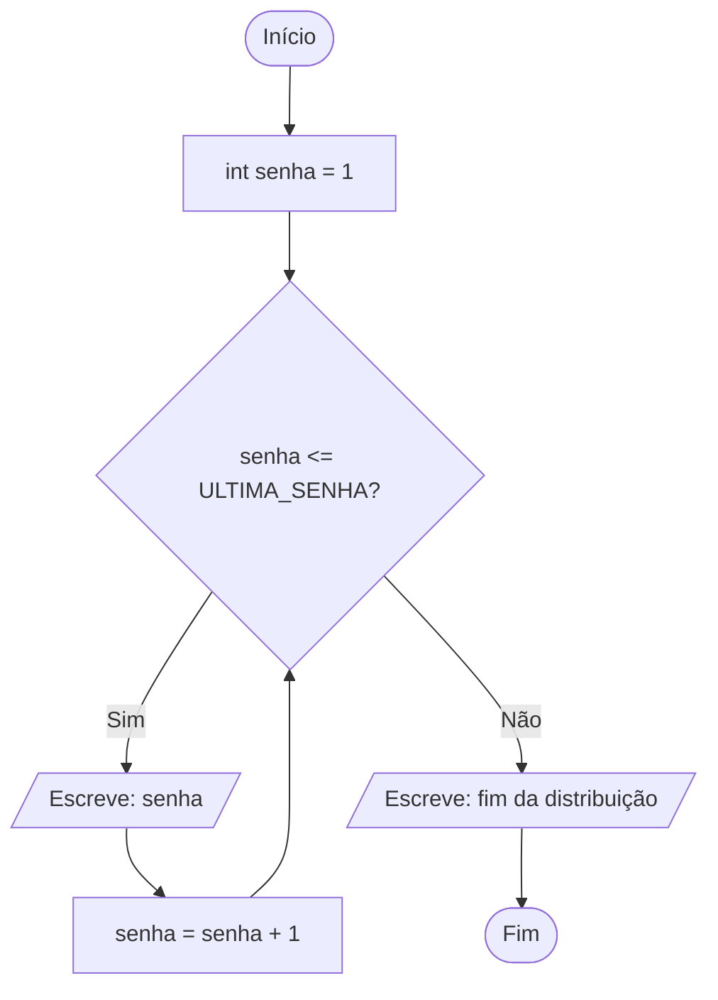
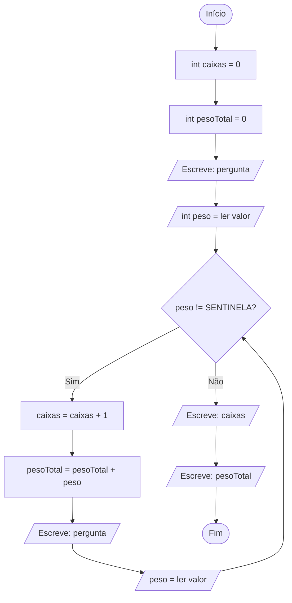
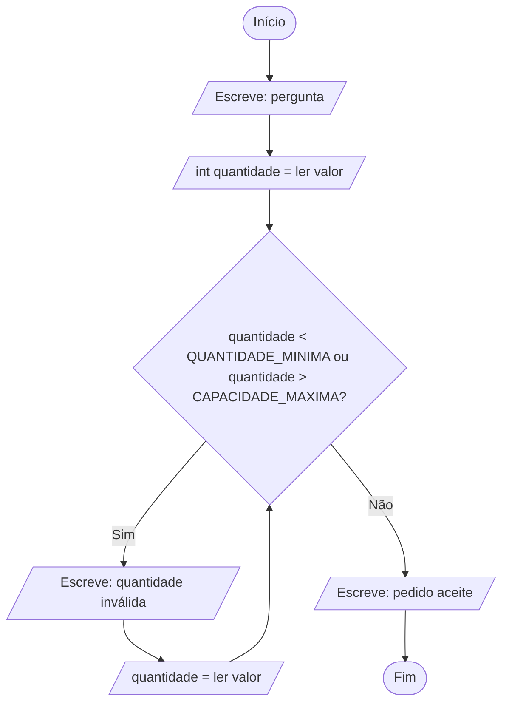
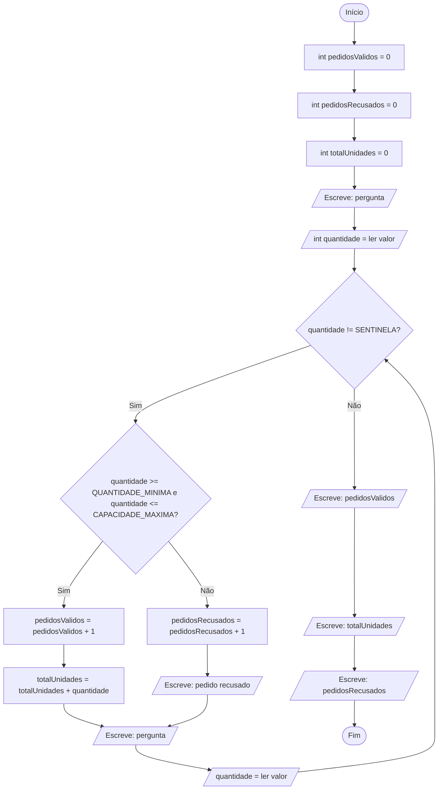

# Repetição e padrões

UC: UC00245

Blocos: ALG04

Requisitos: UC00245-R03, UC00245-R04, UC00245-R05, UC00245-K05, UC00245-K06, UC00245-A05, UC00245-A06, UC00245-A07, UC00245-C01, UC00245-C02, UC00245-P02

| Identificação | Valor |
| --- | --- |
| Material | M-ALG04, quarto bloco de Desenvolver algoritmos |
| Fundamento curricular | Unidade de competência UC00245, bloco ALG04 |
| Duração | 120 minutos neste guia (teoria, exemplo explicado e consolidação); a prática guiada, 60 minutos, faz-se em aula, com o professor; a prática autónoma, 127 minutos, e o desafio, 30 minutos, estão na [ficha de exercícios](04-repeticao-e-padroes-exercicios.md); o [laboratório](04-repeticao-e-padroes-laboratorio.md), de fluxogramas, é opcional e só se faz quando o professor o indicar. O bloco foi planeado com 300 minutos e passou a 337, porque os arrays e a flag entraram nele depois de planeado |
| Evidência a guardar | Tabela de iterações, algoritmo e conjunto de testes do exemplo e da ficha; o fluxograma do exemplo desenhado na aplicação, só se o professor indicar o laboratório |

## Objetivos

No final deste bloco, serás capaz de:

- escrever um ciclo `Enquanto` com as suas três peças, a inicialização, a condição e a atualização, e explicar para que serve cada uma;
- mostrar, pela indentação, que instruções estão dentro do ciclo e quais estão fora, e explicar o que muda quando uma instrução passa de um lado para o outro;
- seguir a execução de um ciclo numa tabela, primeiro instrução a instrução e depois iteração a iteração, e dizer quantas vezes o ciclo se repete e com que valores termina;
- reconhecer num trace um ciclo que nunca começa e um ciclo que nunca acaba, e dizer qual das três peças o provoca;
- escrever um ciclo contado com `Para` e reescrevê-lo com `Enquanto`;
- usar cinco padrões que vão aparecer em quase todos os algoritmos que escreveres daqui para a frente: o contador, o totalizador, a sentinela, a validação repetida e a flag;
- escolher entre `Enquanto` e `Para` e justificar a escolha;
- criar um array, percorrê-lo com o índice e com o para cada, e explicar porque é que mudar a variável do para cada não muda o array;
- reconhecer um ciclo num fluxograma, pela seta que volta atrás até ao losango da condição.

## O que precisas de saber antes

Este guia foi escrito antes de a matéria ser dada, e parte do princípio de que já trabalhaste os três guias anteriores desta área. Não vais aprender aqui nada dessa matéria outra vez: vais usá-la. Por isso, antes de começares, confirma que consegues fazer o que está nesta lista.

Do [guia 01, Do problema ao algoritmo](01-do-problema-ao-algoritmo.md), vais usar o contrato de um problema, as respostas às quatro perguntas (entradas, saídas, restrições e condições), com exemplos concretos e o resultado esperado de cada um. Vais usar também a ideia de estado: o conjunto de valores que descrevem uma situação num determinado momento, como uma fotografia. Neste guia, essa fotografia vai ser tirada muitas vezes seguidas.

Do [guia 02, Pseudocódigo e fluxogramas](02-pseudocodigo-e-fluxogramas.md), vais usar quase tudo: variáveis e constantes, os tipos `int`, `float`, `string` e `bool`, e a forma de pseudocódigo que usamos nas aulas. Nessa forma não há cabeçalho nem marcas de início e de fim: o algoritmo começa na primeira instrução. Uma constante escreve-se no início, antes de ser usada, como em `const ULTIMA_SENHA = 3`. Uma variável aparece com o tipo à frente na linha onde nasce, como em `int total = 0` ou `int quantidade = ler valor`, e daí para a frente usa-se só pelo nome. Vais usar também o `ler valor` para a entrada, o `Escreve:` para a saída, os símbolos do fluxograma e a tabela de trace, com uma coluna por variável. E vais lembrar-te de que um algoritmo escrito em frases claras também é válido, desde que não deixe dúvidas: o que conta agora é a lógica, e a forma do pseudocódigo é só uma maneira combinada de a escrever depressa. Há uma linha desse guia que tem de te parecer perfeitamente natural, porque vais escrevê-la dezenas de vezes neste:

```text
total = total + 5
```

Lê-se "total recebe o valor que total tem agora, mais 5". O `=` sozinho dá um valor: primeiro calcula-se o lado direito, com o valor atual, e depois guarda-se o resultado na mesma variável. Não é uma pergunta, e por isso não faz mal que `total` apareça dos dois lados. Se esta linha ainda te fizer confusão, volta ao guia 02 antes de continuares.

Do [guia 03, Decisões e validação](03-decisoes-e-validacao.md), vais usar as condições, que só podem dar verdadeiro ou falso (`true` ou `false`), as comparações (`==`, `!=`, `<`, `<=`, `>`, `>=`), em que o `==` pergunta se dois valores são iguais, os operadores `e`, `ou` e `não`, a regra de pôr parênteses sempre que se mistura `e` com `ou`, a seleção com `Se`, `Senão se` e `Senão`, o losango do fluxograma com as saídas `Sim` e `Não`, os intervalos (por exemplo, `quantidade >= 1 e quantidade <= 50`), o contrário de um intervalo, escrito com `ou`, e a validação de uma entrada antes de a usar. Vais usar também as fronteiras e a tabela de casos esperados, com casos abaixo, no e acima de cada limite, escrita antes do algoritmo.

Há uma ideia do guia 03 que neste guia passa a ser ainda mais importante: a indentação. Num `Se`, as instruções que só se executam quando a condição é verdadeira escrevem-se debaixo dele, quatro espaços mais à direita, e é essa margem, e nenhuma palavra de fecho, que mostra onde acaba o bloco. Com os ciclos vai ser igual, e vais ver que pôr uma linha quatro espaços mais à esquerda ou mais à direita pode transformar um algoritmo certo num que nunca acaba.

Os laboratórios de fluxogramas são opcionais, e só os fazes quando o professor o indicar. Se o professor indicar o laboratório deste bloco, vais precisar do que se aprende nos laboratórios dos blocos [02](02-pseudocodigo-e-fluxogramas-laboratorio.md) e [03](03-decisoes-e-validacao-laboratorio.md) sobre o diagrams.net: guardar no computador, desenhar as figuras, ligá-las com setas, escrever `Sim` e `Não` nas saídas de um losango e exportar uma imagem.

## Material e preparação

Papel quadriculado e lápis, porque as tabelas deste guia se fazem à mão.

Neste percurso, os fluxogramas são para saberes o que são e como se leem. Neste guia vais ver como se reconhece um ciclo num fluxograma, pela seta que volta ao losango da condição, e como se segue o caminho com o dedo. Desenhar fluxogramas, no papel ou numa aplicação, é uma parte opcional, que só fazes quando o professor o indicar, e nenhum exercício obrigatório precisa dela. Para o laboratório, se o professor o indicar, precisas do computador com o diagrams.net aberto em `https://app.diagrams.net/?lang=pt`, e da pasta `algoritmos` dos laboratórios anteriores.

## Como está organizado o tempo

Este bloco foi planeado com **5 horas**, ou seja 300 minutos, distribuídos por três documentos com o mesmo número: este guia, que se lê e estuda; o laboratório, que se segue passo a passo no computador e é opcional; e a ficha, que se resolve sem ajuda.

Depois de o bloco estar planeado, entraram nele os arrays e a flag, que estão no fim da teoria deste guia, e a ficha ganhou três exercícios sobre eles, do 8 ao 10. Por isso a prática autónoma passou de 90 para 127 minutos, e o bloco passa os 300 minutos: as partes da tabela somam 337.

| Parte | Onde está | Tempo |
| --- | --- | ---: |
| Teoria | Neste guia | 30 min |
| Exemplo explicado | Neste guia | 30 min |
| Prática guiada | Em aula, com o professor. O [laboratório](04-repeticao-e-padroes-laboratorio.md), de fluxogramas, é opcional: só o fazes quando o professor o indicar | 60 min |
| Prática autónoma | Na [ficha](04-repeticao-e-padroes-exercicios.md), exercícios 1 a 10 | 127 min |
| Desafio | Na [ficha](04-repeticao-e-padroes-exercicios.md) | 30 min |
| Consolidação | Neste guia | 60 min |
| Total | | 337 min |

A teoria é longa para ler em 30 minutos, e é de propósito. Em aula, o professor vai explicá-la por partes, com traces no quadro. Depois, este guia fica contigo para voltares a ler com calma, e cada secção explica o mesmo assunto por mais do que um caminho.

## Teoria (30 min)

### A mesma instrução cem vezes

Lembras-te da papelaria que atende os clientes por senha, dos guias anteriores? Distribuía no máximo 40 senhas por dia. Imagina que o movimento cresceu, e que agora a máquina imprime todas as manhãs, antes de a loja abrir, as senhas do dia, numeradas de 1 a 100. Com o que aprendeste até agora, o algoritmo que imprime as senhas seria assim:

```text
Escreve: "Senha ", 1
Escreve: "Senha ", 2
Escreve: "Senha ", 3
(e assim por diante, uma linha por senha, até)
Escreve: "Senha ", 100
```

Cem linhas quase iguais. Tem três problemas, e o terceiro é o mais grave.

O primeiro é o tamanho. Cem linhas escrevem-se, mas ninguém as consegue ler com atenção, e um engano na linha 57 passa despercebido.

O segundo é a mudança. Se amanhã a loja precisar de 150 senhas, alguém tem de acrescentar cinquenta linhas. Se precisar de 20, alguém tem de apagar oitenta. O algoritmo não se adapta: tem de ser reescrito.

O terceiro é o que torna esta forma impossível em muitos problemas. Imagina que, em vez de imprimir senhas, o algoritmo tem de ler as quantidades dos pedidos que chegam a uma papelaria ao longo do dia. Quantas linhas com `ler valor` escreves? Não sabes. Há dias com 3 pedidos e dias com 40. Nenhum número fixo de linhas serve para todos os dias.

Olha outra vez para as cem linhas das senhas. São todas iguais, exceto num pormenor: o número, que aumenta 1 de uma linha para a seguinte. Reparar nesta regularidade é o que permite resolver o problema. Se conseguirmos dizer ao algoritmo "escreve uma senha, aumenta o número, e volta a fazer o mesmo até chegares à última", as cem linhas passam a ser quatro. E, se o número de senhas estiver numa constante, passar de 100 para 150 senhas é mudar um único valor.

É isso que este guia ensina: a escrever instruções que se repetem, e a controlar quantas vezes se repetem.

### Um ciclo volta atrás e pergunta outra vez

Fazes repetições destas todos os dias, sem lhes dares esse nome. "Enquanto houver pratos na banca, lava um prato." "Enquanto houver clientes na fila, atende o próximo." "Enquanto a massa não estiver lisa, amassa mais um minuto."

Todas estas frases têm a mesma forma, com três partes. Há uma pergunta cuja resposta é sim ou não: há pratos na banca? Há uma ação que se faz quando a resposta é sim: lavar um prato. E há uma consequência escondida, que é a mais importante de todas: a ação muda a resposta à pergunta. Cada prato lavado sai da banca. Mais cedo ou mais tarde, a banca fica vazia, a resposta passa a ser não, e paras.

Pensa no que aconteceria se lavar um prato não o tirasse da banca. A pergunta teria sempre a mesma resposta, e ficarias a lavar o mesmo prato para sempre. Parece uma brincadeira, mas é exatamente o erro mais frequente de quem começa a escrever repetições, e vais vê-lo com números mais à frente.

Num algoritmo, a uma parte que se executa várias vezes seguidas chama-se **ciclo**, e a cada uma dessas execuções chama-se **iteração**. Na conversa de todos os dias diz-se também uma volta do ciclo, e vais ouvir as duas palavras: se o algoritmo lava três pratos, o ciclo teve três iterações, ou deu três voltas.

Até agora, cada instrução dos teus algoritmos executava-se no máximo uma vez. Numa sequência, cada instrução executa-se exatamente uma vez. Numa seleção, uma instrução dentro de um `Se` executa-se uma vez ou nenhuma. Com os ciclos, pela primeira vez, a mesma instrução pode executar-se muitas vezes, e é por isso que o trace vai ser ainda mais importante do que era.

### Enquanto: repetir enquanto a condição for verdadeira

Na forma de pseudocódigo que usamos nas aulas, a repetição escreve-se assim:

```text
Enquanto condição
    instruções que se repetem
```

A `condição` é uma condição como as do guia 03: uma pergunta cuja resposta só pode ser verdadeiro ou falso. Às instruções escritas debaixo do `Enquanto`, com mais quatro espaços de indentação, chama-se **corpo do ciclo**. Não há nenhuma palavra a fechar o ciclo: tal como num `Se`, é a indentação que mostra onde o corpo começa e onde acaba. O corpo começa na linha logo a seguir ao `Enquanto` e acaba na última linha que tem esses quatro espaços a mais. A primeira linha que volta a começar na mesma coluna do `Enquanto` já não faz parte do ciclo.

O `Enquanto` funciona com quatro regras, e as quatro são importantes:

1. Quando o algoritmo chega à linha do `Enquanto`, avalia a condição, com os valores que as variáveis têm nesse momento.
2. Se a condição for verdadeira, executa o corpo do ciclo, de cima para baixo, até à última linha indentada.
3. Depois da última linha do corpo, o algoritmo não continua para baixo. Volta à linha do `Enquanto` e avalia outra vez a condição, agora com os valores que as variáveis têm depois de o corpo ter sido executado. E recomeça na regra 2.
4. Se a condição for falsa, o corpo é saltado, e o algoritmo continua na primeira linha a seguir ao corpo, a que está outra vez alinhada com o `Enquanto`.

Compara com o `Se` do guia 03. O `Se` avalia a condição uma vez e segue em frente. O `Enquanto` avalia a condição, executa o corpo e, no fim, volta atrás para perguntar outra vez. Uma boa forma de o pensar: um `Enquanto` é um `Se` que, quando acaba o seu bloco, volta a subir para fazer a mesma pergunta.

Há duas consequências destas regras que convém fixar desde já.

A primeira: **a condição do `Enquanto` diz quando continuar, e não quando parar**. "Enquanto houver pratos na banca" descreve a situação em que se continua a lavar. O ciclo para quando essa condição deixa de ser verdadeira. Quando escreveres um ciclo, pergunta-te "em que situação quero continuar?", e escreve essa situação. Quem escreve a situação em que quer parar obtém um ciclo que faz exatamente o contrário do que queria.

A segunda: a condição só é avaliada na linha do `Enquanto`. Se, a meio do corpo, as variáveis mudarem de forma a tornar a condição falsa, o corpo não é interrompido. Continua até à última linha do corpo, e só no teste seguinte o ciclo termina.

Este é o algoritmo das senhas, escrito com um ciclo. Vamos chamar-lhe `DistribuirSenhas`, para podermos voltar a ele pelo nome. Para o trace ficar curto, a constante vale 3. Para imprimir as cem senhas, bastaria mudá-la para 100.

```text
const ULTIMA_SENHA = 3
int senha = 1
Enquanto senha <= ULTIMA_SENHA
    Escreve: "Senha ", senha
    senha = senha + 1
Escreve: "Fim da distribuição"
```

Lê-o por palavras: a última senha é a 3; a senha começa em 1; enquanto a senha for menor ou igual à última, escreve-se a senha e passa-se à seguinte; quando se ultrapassar a última, escreve-se que a distribuição acabou.

### A indentação mostra o que está dentro do ciclo

Olha outra vez para o algoritmo das senhas, agora só para a margem esquerda de cada linha. Há duas linhas que começam quatro espaços mais à direita, `Escreve: "Senha ", senha` e `senha = senha + 1`, e são essas, e só essas, o corpo do ciclo. As outras três, `const ULTIMA_SENHA = 3`, `int senha = 1` e `Escreve: "Fim da distribuição"`, começam na mesma coluna do `Enquanto` e estão fora do ciclo: as duas primeiras vêm antes dele, e a última vem depois.

A tabela seguinte mostra, para cada linha do algoritmo, menos a do `const`, onde está e quantas vezes é executada quando a constante vale 3:

| Linha | Indentação | Onde está | Quantas vezes é executada |
| --- | --- | --- | ---: |
| `int senha = 1` | nenhuma | antes do ciclo | 1 |
| `Enquanto senha <= ULTIMA_SENHA` | nenhuma | é a linha da condição | 4 |
| `Escreve: "Senha ", senha` | quatro espaços | dentro do ciclo | 3 |
| `senha = senha + 1` | quatro espaços | dentro do ciclo | 3 |
| `Escreve: "Fim da distribuição"` | nenhuma | depois do ciclo | 1 |

A linha do `const` não entra na tabela, e também não vai entrar nos traces: não é um passo que se execute, é o valor fixo da constante, que vale desde o início. A tabela mostra a diferença entre estar dentro e estar fora: o que está dentro do ciclo executa-se uma vez por iteração, e o que está fora executa-se uma vez só. A linha do `Enquanto` executa-se mais uma vez do que o corpo, e vais perceber porquê no trace mais abaixo.

Como não há nenhuma palavra a fechar o ciclo, a indentação não é enfeite. As mesmas linhas, com outra margem, fazem outro algoritmo. Repara nestas duas versões, que só diferem da versão certa na margem de uma linha.

Na primeira, a atualização ficou alinhada com o `Enquanto`:

```text
const ULTIMA_SENHA = 3
int senha = 1
Enquanto senha <= ULTIMA_SENHA
    Escreve: "Senha ", senha
senha = senha + 1
Escreve: "Fim da distribuição"
```

Agora o corpo tem uma só linha, o `Escreve:`. A atualização passou para fora do ciclo, e só seria executada depois de o ciclo acabar. Mas, sem ela no corpo, a senha nunca muda, a condição dá sempre verdadeiro, e o ciclo nunca acaba: o ecrã enche-se de "Senha 1". Vais voltar a este erro na secção sobre o ciclo que nunca acaba, porque é um dos mais frequentes de quem começa.

Na segunda, a última linha ganhou quatro espaços:

```text
const ULTIMA_SENHA = 3
int senha = 1
Enquanto senha <= ULTIMA_SENHA
    Escreve: "Senha ", senha
    senha = senha + 1
    Escreve: "Fim da distribuição"
```

Agora a mensagem final faz parte do corpo, e aparece três vezes, uma depois de cada senha, em vez de aparecer uma vez só, no fim. O ciclo termina, mas o ecrã diz que a distribuição acabou quando ela ainda vai a meio.

Para leres a indentação sem te enganares, faz como com um `Se`: põe o dedo, ou a ponta do lápis, por baixo da primeira letra do `Enquanto`, e desce a direito. As linhas que começam à direita do teu dedo, até à primeira que começa em cima dele, são o corpo. No papel quadriculado, alinha as linhas pelos quadrados e usa sempre o mesmo afastamento para cada nível. Um afastamento que ora é de quatro espaços ora é de três deixa quem lê sem saber se uma linha está dentro ou fora do ciclo.

É assim que o Python, a linguagem que vais aprender a seguir, marca os blocos: não há palavra de fecho, há indentação. Lá, uma linha com a margem errada também muda o que o programa faz, e o hábito que ganhares aqui vale diretamente para lá.

### As três peças de um ciclo

Todos os ciclos que terminam têm três peças. Se faltar uma delas, ou se uma estiver errada, o ciclo não faz o que devia, e é quase sempre assim que os ciclos falham. Por isso vale a pena dar nome a cada uma.

A **inicialização** é a instrução, ou as instruções, que dão o valor inicial às variáveis que a condição e o corpo vão usar. Fica antes do `Enquanto`, sem indentação. No algoritmo das senhas é `int senha = 1`, que é também a linha onde a variável nasce, e por isso leva o tipo. Sem ela, a primeira vez que a condição fosse avaliada estaria a comparar uma variável sem valor, e o algoritmo não teria forma de saber se deve entrar no ciclo.

A **condição** é a pergunta que decide se se faz mais uma iteração. Fica na linha do `Enquanto`. No algoritmo das senhas é `senha <= ULTIMA_SENHA`. Diz em que situação se continua.

A **atualização** é a instrução, dentro do corpo, que muda a variável de que a condição depende, e que aproxima o ciclo do fim. No algoritmo das senhas é `senha = senha + 1`, já sem o tipo, porque a variável já existe. Cada iteração aumenta a senha em 1, e por isso, mais cedo ou mais tarde, a senha ultrapassa a última e a condição passa a ser falsa. É a atualização que tira o prato da banca. "Dentro do corpo" quer dizer indentada debaixo do `Enquanto`: acabaste de ver que, com a margem errada, a mesma linha deixa de ser a atualização do ciclo.

O resto do corpo é o trabalho que o ciclo faz em cada iteração. Nas senhas é o `Escreve:`.

Para cada ciclo que escreveres, vais responder a três perguntas, uma por peça. São as perguntas que vais ter de saber justificar no fim deste bloco:

1. Com que valor começa, e porquê esse? (a inicialização)
2. Em que situação continua, e quando é que deixa de continuar? (a condição)
3. O que muda em cada iteração, e essa mudança aproxima o fim? (a atualização)

No algoritmo das senhas: começa em 1 porque a primeira senha é a 1; continua enquanto a senha for menor ou igual a 3, e deixa de continuar quando a senha chegar a 4; em cada iteração a senha aumenta 1, e por isso aproxima-se de 4.

### O trace linha a linha do primeiro ciclo

O trace de um ciclo faz-se com as mesmas regras que aprendeste no guia 02: uma coluna por variável, uma linha por instrução executada, e em cada linha copias os valores da linha de cima e mudas só o que essa instrução muda. Há duas novidades.

A primeira é uma coluna para a condição. Na linha em que o algoritmo passa pelo `Enquanto`, escreves a condição com os valores substituídos e o resultado: "`1 <= 3` é verdadeiro". Quando a condição tem um `e` ou um `ou`, escreves primeiro o resultado de cada comparação e depois o do conjunto, como no guia 03. As constantes não têm coluna, porque nunca mudam, mas o seu valor aparece nas condições. A linha do `const` também não aparece na tabela nem conta como passo: a constante tem o seu valor desde o início e nunca o muda. Já uma linha que dá o primeiro valor a uma variável, como `int senha = 1`, conta como passo, porque muda o estado.

A segunda é que a mesma instrução pode aparecer várias vezes na tabela, uma por cada vez que é executada. A tabela segue a ordem em que as instruções são executadas, e não a ordem em que estão escritas. Depois da última instrução do corpo, a linha seguinte da tabela é outra vez a do `Enquanto`, porque é para lá que o algoritmo volta quando acaba o corpo (regra 3).

Este é o trace completo do algoritmo das senhas:

| Passo | Instrução executada | senha | Condição e resultado | Ecrã |
| ---: | --- | ---: | --- | --- |
| 0 | antes de começar | sem valor | nenhuma | nada |
| 1 | `int senha = 1` | 1 | nenhuma | nada |
| 2 | `Enquanto senha <= ULTIMA_SENHA` | 1 | `1 <= 3` dá `true` | nada |
| 3 | `Escreve: "Senha ", senha` | 1 | nenhuma | Senha 1 |
| 4 | `senha = senha + 1` | 2 | nenhuma | nada |
| 5 | `Enquanto senha <= ULTIMA_SENHA` | 2 | `2 <= 3` dá `true` | nada |
| 6 | `Escreve: "Senha ", senha` | 2 | nenhuma | Senha 2 |
| 7 | `senha = senha + 1` | 3 | nenhuma | nada |
| 8 | `Enquanto senha <= ULTIMA_SENHA` | 3 | `3 <= 3` dá `true` | nada |
| 9 | `Escreve: "Senha ", senha` | 3 | nenhuma | Senha 3 |
| 10 | `senha = senha + 1` | 4 | nenhuma | nada |
| 11 | `Enquanto senha <= ULTIMA_SENHA` | 4 | `4 <= 3` dá `false` | nada |
| 12 | `Escreve: "Fim da distribuição"` | 4 | nenhuma | Fim da distribuição |

Lê a tabela devagar, linha a linha, e compara cada linha com a de cima.

No passo 1, a inicialização dá a `senha` o valor 1. No passo 2, o algoritmo chega ao `Enquanto` pela primeira vez, e a condição `1 <= 3` é verdadeira, por isso entra no corpo. No passo 3 escreve "Senha 1", e no passo 4 a atualização faz a senha passar de 1 para 2.

No passo 5 acontece o que é novo. O algoritmo acabou a última linha do corpo e voltou atrás, à linha do `Enquanto`. Avalia a condição outra vez, agora com `senha` a valer 2. `2 <= 3` continua a ser verdadeiro, e o corpo executa-se mais uma vez, nos passos 6 e 7. O mesmo acontece nos passos 8 a 10, com a senha a valer 3.

No passo 11, a senha já vale 4. `4 <= 3` é falso. Pela regra 4, o corpo é saltado e o algoritmo continua na primeira linha a seguir ao corpo, no passo 12, onde escreve que a distribuição acabou.

Conta agora as linhas do `Enquanto`: são quatro, nos passos 2, 5, 8 e 11. Três deram verdadeiro e uma deu falso. O corpo executou-se três vezes, portanto o ciclo teve três iterações. Isto é sempre assim num ciclo que termina: há sempre mais um teste da condição do que iterações, porque o último teste é o que dá falso e faz o ciclo parar.

Repara também no valor final de `senha`: é 4, e não 3. O ciclo não para quando escreve a última senha. Para quando a senha ultrapassa a última, porque é só nessa altura que a condição fica falsa. É uma surpresa para muita gente e é uma pergunta frequente em testes: depois do ciclo, quanto vale a variável?

Se a constante valesse 100, o algoritmo teria 100 iterações e 101 testes da condição, e esta tabela teria 303 passos. O algoritmo, esse, continuaria a ter as mesmas linhas.

### A tabela de iterações

Uma tabela com 303 passos não é prática. Depois de perceberes como um ciclo se executa instrução a instrução, podes usar uma tabela mais curta, a que se chama **tabela de iterações**. Tem uma linha por cada teste da condição, e não por cada instrução.

Cada linha da tabela de iterações mostra:

- o número do teste (1.º, 2.º, 3.º...);
- o valor de cada variável no momento em que o algoritmo chega ao `Enquanto` e vai testar a condição, como se tirasses uma fotografia do estado nesse instante;
- a condição, com os valores substituídos, e o resultado;
- o que acontece durante a iteração que começa a seguir: o que é escrito no ecrã e o que é lido. Na linha em que a condição é falsa, escreve-se que o ciclo termina.

Para o algoritmo das senhas:

| Teste | senha | Condição | Durante a iteração |
| --- | ---: | --- | --- |
| 1.º | 1 | `1 <= 3` dá `true` | escreve "Senha 1" |
| 2.º | 2 | `2 <= 3` dá `true` | escreve "Senha 2" |
| 3.º | 3 | `3 <= 3` dá `true` | escreve "Senha 3" |
| 4.º | 4 | `4 <= 3` dá `false` | o ciclo termina |

Cada linha desta tabela resume um grupo de linhas da tabela anterior. O 1.º teste corresponde aos passos 2 a 4, o 2.º aos passos 5 a 7, o 3.º aos passos 8 a 10, e o 4.º ao passo 11. A tabela de iterações não mostra os passos um a um, mas mostra tudo o que interessa para perceber o ciclo: com que valores começa cada iteração, quantas iterações há, e com que valores o ciclo termina. Os valores finais estão sempre na última linha, a do teste que dá falso.

A tabela de iterações é a evidência pedida neste bloco. Sempre que te pedirem o trace de um ciclo, é esta tabela que se espera, a não ser que te peçam explicitamente o trace linha a linha. Um conselho: nos primeiros ciclos que fizeres, faz primeiro o trace linha a linha e só depois a tabela de iterações, para veres que as duas dizem o mesmo.

### A seta que volta ao losango

No fluxograma, um ciclo desenha-se com o losango que já conheces do guia 03, e com uma seta nova: uma seta que volta atrás, para cima, até ao losango da condição.


```mermaid
flowchart TD
    A([Início]) --> B["int senha = 1"]
    B --> C{"senha <= ULTIMA_SENHA?"}
    C -->|Sim| D[/"Escreve: senha"/]
    D --> E["senha = senha + 1"]
    E --> C
    C -->|Não| F[/"Escreve: fim da distribuição"/]
    F --> Z([Fim])
```

Segue o percurso com o dedo. Do início passas pela inicialização, `int senha = 1`, e chegas ao losango. Se a condição for verdadeira, sais pelo `Sim`, escreves a senha, fazes a atualização, e a seta leva-te de volta ao losango, para perguntares outra vez. Se a condição for falsa, sais pelo `Não`, escreves a mensagem final e terminas. Para fazer a distribuição de três senhas, o dedo passa quatro vezes pelo losango, tantas quantas as linhas da tabela de iterações.

Compara figura a figura com o pseudocódigo. O losango é a linha do `Enquanto`. O caminho do `Sim` é o corpo do ciclo, as linhas indentadas. A seta que volta ao losango corresponde ao fim do corpo: é o que acontece quando o algoritmo acaba a última linha indentada e volta ao teste. O caminho do `Não` é o que vem depois do corpo, a partir da primeira linha de novo alinhada com o `Enquanto`. Nos fluxogramas destes guias, as constantes não têm figura: o seu valor é o que está escrito no pseudocódigo, e o desenho mostra o caminho que o algoritmo faz com ele. O texto entre aspas de um `Escreve:` é abreviado para caber na figura; no pseudocódigo está completo.

Há três coisas a reter sobre esta seta.

A primeira: a seta de volta vai sempre ao losango da condição. Se voltasse ao retângulo da inicialização, `int senha = 1`, a senha voltaria a valer 1 em cada iteração e o ciclo nunca acabaria. Se voltasse para depois do losango, direto ao `Escreve:`, a condição nunca mais seria avaliada, e o ciclo também nunca acabaria. O losango é o único sítio onde o ciclo decide se continua, e por isso é lá que a seta tem de chegar em todas as iterações.

A segunda: é a seta que sobe que te diz que há um ciclo. Num fluxograma só com sequência e seleção, as setas andam sempre para baixo, e os dois ramos de um `Se` juntam-se mais abaixo. Quando vês uma seta a subir até um losango, estás a ver uma repetição.

A terceira: o desenho tem de ser inequívoco. A seta de volta chega ao losango por um lado diferente daquele por onde chega a seta de cima, não cruza as outras setas, e o `Sim` e o `Não` ficam escritos nas saídas do losango e não na seta de volta. É esta a técnica nova que o laboratório deste bloco treina no diagrams.net, se o professor o indicar.

### O ciclo que nunca começa

Se a condição for falsa logo no primeiro teste, o corpo não se executa nenhuma vez. Diz-se que o ciclo tem zero iterações.

Às vezes isto é um erro. Imagina que alguém escreveu a condição do algoritmo das senhas ao contrário:

```text
const ULTIMA_SENHA = 3
int senha = 1
Enquanto senha > ULTIMA_SENHA
    Escreve: "Senha ", senha
    senha = senha + 1
Escreve: "Fim da distribuição"
```

A tabela de iterações tem uma única linha:

| Teste | senha | Condição | Durante a iteração |
| --- | ---: | --- | --- |
| 1.º | 1 | `1 > 3` dá `false` | o ciclo termina |

No primeiro teste, `1 > 3` é falso, e o algoritmo salta diretamente para a primeira linha a seguir ao corpo. No ecrã aparece "Fim da distribuição" e mais nada: não foi impressa nenhuma senha. Quem escreveu isto pensou em quando o ciclo devia parar (quando a senha passa a última) e escreveu essa situação no `Enquanto`, que é o sítio onde se escreve quando continuar. É a primeira consequência das regras do `Enquanto` a fazer estragos.

Outras vezes, um ciclo com zero iterações é exatamente o que deve acontecer. Se o algoritmo conta os pedidos que chegaram hoje a uma papelaria, e hoje não chegou nenhum, o ciclo não deve executar-se nenhuma vez, e a resposta certa é "0 pedidos". Vais ver este caso no exemplo explicado.

Daqui sai uma regra de teste que vais usar sempre: **testa o caso em que o ciclo devia ter zero iterações**, e confirma que o algoritmo dá uma resposta com sentido, como 0, e não uma resposta disparatada ou uma mensagem que não devia aparecer. A este caso chama-se o **caso de zero voltas**, porque o ciclo não chega a dar nenhuma volta.

### O ciclo que nunca acaba

Um **ciclo infinito** é um ciclo cuja condição nunca chega a ser falsa. O corpo executa-se, volta-se ao teste, a condição continua verdadeira, e assim para sempre.

O algoritmo não dá nenhum aviso. Num computador, um programa com um ciclo infinito fica parado a trabalhar, ou a escrever a mesma coisa no ecrã, até alguém o interromper à força. No papel, o trace mostra o problema com toda a clareza, e é por isso que o trace é a melhor ferramenta para encontrar ciclos infinitos.

A causa mais frequente é esquecer a atualização. A esta versão das senhas vamos chamar `SenhasSemAtualizacao`:

```text
const ULTIMA_SENHA = 3
int senha = 1
Enquanto senha <= ULTIMA_SENHA
    Escreve: "Senha ", senha
Escreve: "Fim da distribuição"
```

As primeiras linhas da tabela de iterações:

| Teste | senha | Condição | Durante a iteração |
| --- | ---: | --- | --- |
| 1.º | 1 | `1 <= 3` dá `true` | escreve "Senha 1" |
| 2.º | 1 | `1 <= 3` dá `true` | escreve "Senha 1" |
| 3.º | 1 | `1 <= 3` dá `true` | escreve "Senha 1" |
| 4.º | 1 | `1 <= 3` dá `true` | escreve "Senha 1" |
| 5.º | 1 | `1 <= 3` dá `true` | escreve "Senha 1" |

E assim para sempre. Olha para a coluna `senha`: vale 1 em todos os testes. A fotografia do estado, tirada cada vez que o algoritmo chega ao `Enquanto`, é sempre igual. Como o corpo não lê nada e parte sempre do mesmo estado, faz sempre as mesmas coisas e volta sempre ao mesmo estado. A condição dá sempre verdadeiro, e o ecrã enche-se de "Senha 1". Num ciclo que não lê nada no corpo, se a fotografia se repetir, o ciclo é infinito.

Há outras três formas de chegar ao mesmo resultado, e todas se reconhecem pela mesma pergunta.

A atualização pode estar escrita, mas no sítio errado, fora do corpo. É a primeira das duas versões que viste na secção sobre a indentação:

```text
int senha = 1
Enquanto senha <= ULTIMA_SENHA
    Escreve: "Senha ", senha
senha = senha + 1
```

A linha existe, mas está alinhada com o `Enquanto`, e por isso está fora do corpo: só seria executada depois de o ciclo acabar, o que nunca acontece. Para o ciclo, é como se ela não existisse. As palavras são exatamente as da versão certa, e só a indentação mostra o erro: a atualização tem de estar alinhada com as outras instruções do corpo, quatro espaços mais à direita do que o `Enquanto`. Sempre que escreveres um ciclo, confirma com o dedo por baixo do `Enquanto` que a atualização fica à direita dele.

A atualização pode andar no sentido errado. Com `senha = senha - 1` em vez de `senha = senha + 1`:

| Teste | senha | Condição | Durante a iteração |
| --- | ---: | --- | --- |
| 1.º | 1 | `1 <= 3` dá `true` | escreve "Senha 1" |
| 2.º | 0 | `0 <= 3` dá `true` | escreve "Senha 0" |
| 3.º | -1 | `-1 <= 3` dá `true` | escreve "Senha -1" |
| 4.º | -2 | `-2 <= 3` dá `true` | escreve "Senha -2" |
| 5.º | -3 | `-3 <= 3` dá `true` | escreve "Senha -3" |

Aqui a fotografia não se repete: a senha muda em todas as iterações. Mas muda no sentido errado. Afasta-se de 4, que é o valor que tornaria a condição falsa, e cada número negativo continua a ser menor ou igual a 3. Não basta que a variável mude. Tem de mudar na direção da saída.

E a atualização pode saltar por cima do valor de saída. Uma condição escrita com `!=`, do tipo "enquanto a variável for diferente de 10", só fica falsa se a variável valer exatamente 10 num dos testes. Se a variável começar em 1 e aumentar 2 em cada iteração, passa por 9 e por 11, mas nunca por 10, e o ciclo nunca acaba.

A pergunta que apanha os quatro casos é sempre a mesma, e é a terceira das três perguntas das peças: **em cada iteração, a variável da condição muda, e aproxima-se de um valor que torna a condição falsa?** Se a resposta for não, o ciclo é infinito.

### Para: a forma curta do ciclo contado

O ciclo das senhas tem uma forma muito comum. Uma variável começa em 1, a condição pergunta se ela ainda não passou de um certo número, e a atualização aumenta-a 1 em cada iteração. A um ciclo em que se sabe, antes de começar, quantas iterações vai ter, chama-se **ciclo contado**.

Os ciclos contados são tão frequentes que têm uma forma curta de escrever, o `Para`. A forma geral é `Para i de 1 até n`: a variável `i` vai de 1 até `n`, de 1 em 1, e o corpo, indentado debaixo do `Para`, executa-se uma vez para cada valor. Nas senhas fica assim:

```text
Para senha de 1 até ULTIMA_SENHA
    Escreve: "Senha ", senha
```

Lê-se "para a senha de 1 até à última senha, escreve a senha". Compara com o `Enquanto` que faz exatamente o mesmo:

```text
int senha = 1
Enquanto senha <= ULTIMA_SENHA
    Escreve: "Senha ", senha
    senha = senha + 1
```

As três peças estão lá todas, mas no `Para` duas delas estão escondidas na primeira linha, e a terceira nem sequer se escreve. A inicialização é o `de 1`: a senha começa em 1, como com o `int senha = 1`. A condição é o `até ULTIMA_SENHA`, que quer dizer "continua enquanto `senha <= ULTIMA_SENHA`". A atualização é feita pelo próprio `Para`, sem linha nenhuma: depois da última linha do corpo, a senha aumenta 1 e o algoritmo volta ao teste. À variável que o `Para` controla chama-se **variável de controlo**.

Repara que a variável de controlo não leva tipo. É o próprio `Para` que a cria, e ela é sempre um número inteiro que avança de 1 em 1, por isso não há nada a acrescentar. No `Enquanto` equivalente, a inicialização é uma linha escrita por ti, e leva o tipo, como qualquer variável na linha onde aparece pela primeira vez.

O corpo do `Para` marca-se como o do `Enquanto`, pela indentação. O que está quatro espaços mais à direita, debaixo do `Para`, repete-se; a primeira linha de novo alinhada com o `Para` já é depois do ciclo.

O `Para` segue quatro regras:

1. A variável de controlo avança sempre de 1 em 1.
2. Dentro do corpo, não se muda a variável de controlo nem o limite. O `Para` trata disso sozinho. Se precisares de mudar a variável a meio, o ciclo não é contado, e deves usar `Enquanto`.
3. Se o limite for menor do que o valor inicial, por exemplo `Para dia de 1 até 0`, o corpo executa-se zero vezes, porque `1 <= 0` é falso logo no primeiro teste. É o caso de zero voltas do `Para`.
4. Depois do ciclo, não se usa o valor da variável de controlo. No `Enquanto` equivalente ela ficaria com o limite mais 1, mas há linguagens em que fica com outro valor, incluindo o Python, que vais aprender a seguir. Por isso, nos nossos algoritmos, a variável de controlo só se usa dentro do ciclo.

Na forma geral, a variável de controlo chama-se `i`, e vais ver muitas vezes o `Para` escrito assim, `Para i de 1 até n`. É um costume antigo e aceita-se, mas um nome que diga o que se está a contar (`senha`, `dia`, `produto`) torna o algoritmo mais fácil de ler, e é o que fazem os exemplos deste guia.

O algoritmo completo, com `Para`:

```text
const ULTIMA_SENHA = 3
Para senha de 1 até ULTIMA_SENHA
    Escreve: "Senha ", senha
Escreve: "Fim da distribuição"
```

A tabela de iterações é igual à do `Enquanto`, e é essa a prova de que os dois algoritmos são equivalentes:

| Teste | senha | Condição | Durante a iteração |
| --- | ---: | --- | --- |
| 1.º | 1 | `1 <= 3` dá `true` | escreve "Senha 1" |
| 2.º | 2 | `2 <= 3` dá `true` | escreve "Senha 2" |
| 3.º | 3 | `3 <= 3` dá `true` | escreve "Senha 3" |
| 4.º | 4 | `4 <= 3` dá `false` | o ciclo termina |

A condição que aparece na tabela é a condição escondida do `Para`, `senha <= ULTIMA_SENHA`.

A grande vantagem do `Para` é que não te podes esquecer da inicialização nem da atualização, porque não és tu que as escreves. É muito mais difícil escrever um `Para` infinito do que um `Enquanto` infinito. A desvantagem é que só serve quando se sabe quantas vezes o ciclo se vai repetir antes de ele começar.

No fluxograma, o `Para` desenha-se como o `Enquanto` equivalente: um retângulo com a inicialização `int senha = 1`, o losango com a condição `senha <= ULTIMA_SENHA?`, o corpo, um retângulo com a atualização `senha = senha + 1` e a seta de volta ao losango. Alguns livros usam uma figura especial para o `Para`; nos nossos fluxogramas não se usa, para que o desenho mostre as três peças.

No fim deste guia há uma secção com outra forma de escrever o `Para`, em que as três peças ficam todas à vista na primeira linha. É para quando já estiveres à vontade com esta. Por agora, e em todos os exercícios deste bloco, usa `Para ... de ... até ...`: começa em 1 quando contas coisas, como as senhas, e em 0 quando percorres um array, como vais ver mais à frente.

### Padrão contador

Um **padrão** é uma forma de resolver um pequeno problema que aparece vezes sem conta, em algoritmos diferentes. Aprende-se uma vez, e depois reconhece-se e reutiliza-se. Os padrões desta secção e das seguintes vão aparecer em quase todos os algoritmos que escreveres até ao fim do ano, também em Python.

O primeiro é o contador. Um **contador** é uma variável que conta quantas vezes uma coisa aconteceu. Segue três regras:

1. Começa em 0, antes do ciclo: `int contador = 0`. Antes de se contar o que quer que seja, já se contaram zero coisas.
2. Sempre que a coisa acontece, aumenta 1: `contador = contador + 1`.
3. Só se lê o resultado depois do ciclo. Durante o ciclo, o contador tem uma contagem parcial.

Porquê 0 e não 1? Pensa num porteiro que conta as pessoas que entram numa sala. Antes de alguém entrar, a contagem é zero. Se começasse em 1, todas as contagens ficariam com uma pessoa a mais, e numa sala onde não entrou ninguém diria que entrou uma. É o género de erro que só se encontra testando o caso de zero voltas.

Se a linha `contador = contador + 1` estiver diretamente no corpo do ciclo, com quatro espaços, conta todas as iterações. Se estiver dentro de um `Se`, com oito espaços, conta só as iterações em que a condição do `Se` é verdadeira. É esta segunda forma a mais útil: contar quantos valores cumprem uma regra. Mais uma vez, é a indentação que decide.

Exemplo. Uma loja quer saber quantos dos seus 5 produtos têm o stock abaixo do mínimo de 10 unidades, para os encomendar. O algoritmo lê o stock de cada produto e conta os que estão abaixo do mínimo. Vamos chamar-lhe `ContarStockBaixo`:

```text
const NUMERO_DE_PRODUTOS = 5
const STOCK_MINIMO = 10
int produtosAbaixoDoMinimo = 0
Para produto de 1 até NUMERO_DE_PRODUTOS
    Escreve: "Stock do produto ", produto, "?"
    int stock = ler valor
    Se stock < STOCK_MINIMO
        produtosAbaixoDoMinimo = produtosAbaixoDoMinimo + 1
Escreve: "Produtos abaixo do mínimo: ", produtosAbaixoDoMinimo
```

Como se sabe, antes de o ciclo começar, que há 5 produtos, o ciclo é contado e escreve-se com `Para`. O contador começa em 0 antes do ciclo, e o seu aumento está dentro do `Se`, com oito espaços, porque só se contam os produtos abaixo do mínimo. A última linha, sem indentação, está depois do ciclo: escreve o resultado uma vez só, quando a contagem está completa.

Repara também na linha `int stock = ler valor`. O stock aparece pela primeira vez dentro do ciclo, e é aí que leva o tipo. A linha escreve-se uma vez, mas executa-se cinco, uma por produto, e em cada iteração o valor lido substitui o do produto anterior. O tipo diz que espécie de valor a variável guarda, e não se repete por a linha se executar muitas vezes.

Tabela de iterações com os stocks 12, 4, 10, 0 e 9. Para a tabela caber no ecrã, as perguntas que aparecem antes de cada leitura não estão na última coluna. Lembra-te de que as colunas mostram o estado no momento do teste: o stock lido numa iteração só aparece na coluna `stock` na linha seguinte.

| Teste | produto | stock | produtosAbaixoDoMinimo | Condição | Durante a iteração |
| --- | ---: | ---: | ---: | --- | --- |
| 1.º | 1 | sem valor | 0 | `1 <= 5` dá `true` | lê 12 |
| 2.º | 2 | 12 | 0 | `2 <= 5` dá `true` | lê 4 |
| 3.º | 3 | 4 | 1 | `3 <= 5` dá `true` | lê 10 |
| 4.º | 4 | 10 | 1 | `4 <= 5` dá `true` | lê 0 |
| 5.º | 5 | 0 | 2 | `5 <= 5` dá `true` | lê 9 |
| 6.º | 6 | 9 | 3 | `6 <= 5` dá `false` | o ciclo termina |

O contador aumentou três vezes: com 4, com 0 e com 9. Não aumentou com 12, que está acima do mínimo, nem com 10, que é o próprio mínimo. `10 < 10` é falso: dez não é menor do que dez. O enunciado diz "abaixo do mínimo", e um produto com exatamente o mínimo não está abaixo dele. É a regra das fronteiras do guia 03, agora dentro de um ciclo: o 9, o 10 e o 12 foram escolhidos de propósito, um abaixo do mínimo, o próprio mínimo e um acima dele.

### Padrão totalizador

Um **totalizador** é uma variável que vai somando valores ao longo das iterações. Também se chama **acumulador**, e é esse o nome que vais encontrar mais vezes em Python. Segue três regras, parecidas com as do contador:

1. Começa em 0, antes do ciclo: `int total = 0`. A soma de nada é zero.
2. Em cada iteração, soma-se o valor: `total = total + valor`.
3. Só se lê o resultado depois do ciclo.

A diferença para o contador está na regra 2. O contador soma 1, seja qual for o valor. O totalizador soma o próprio valor. O contador responde à pergunta "quantos?", e o totalizador responde à pergunta "quanto?". Se leres as quantidades de três pedidos, 12, 30 e 50, o contador de pedidos fica com 3 e o totalizador de unidades fica com 92.

Exemplo. Uma loja quer saber o total das vendas de vários dias. No início, o funcionário diz quantos dias quer somar, e depois escreve as vendas de cada dia, em cêntimos. Os valores em dinheiro estão em cêntimos pela razão que viste no guia 02: são números inteiros, e as contas com inteiros são exatas. Vamos chamar a este algoritmo `TotalDeVendas`:

```text
Escreve: "Quantos dias queres somar?"
int dias = ler valor
int totalVendas = 0
Para dia de 1 até dias
    Escreve: "Vendas do dia ", dia, ", em cêntimos?"
    int vendasDoDia = ler valor
    totalVendas = totalVendas + vendasDoDia
Escreve: "Total vendido: ", totalVendas, " cêntimos"
```

Repara que o número de dias só se conhece durante a execução, quando o funcionário o escreve. Mesmo assim, o ciclo é contado: quando o algoritmo chega ao `Para`, o valor de `dias` já foi lido, e por isso já se sabe quantas iterações vai haver. É isso que conta para escolher o `Para`.

Tabela de iterações com 3 dias e as vendas 1250, 800 e 2100 (sem as perguntas):

| Teste | dia | vendasDoDia | totalVendas | Condição | Durante a iteração |
| --- | ---: | ---: | ---: | --- | --- |
| 1.º | 1 | sem valor | 0 | `1 <= 3` dá `true` | lê 1250 |
| 2.º | 2 | 1250 | 1250 | `2 <= 3` dá `true` | lê 800 |
| 3.º | 3 | 800 | 2050 | `3 <= 3` dá `true` | lê 2100 |
| 4.º | 4 | 2100 | 4150 | `4 <= 3` dá `false` | o ciclo termina |

O total começou em 0, passou a 1250, depois a 2050 e depois a 4150. Em cada linha, o novo total é o total da linha de cima mais o valor lido nessa iteração. Se o funcionário escrever 0 dias, o `Para` faz zero iterações, e o algoritmo escreve "Total vendido: 0 cêntimos", que é a resposta certa.

Há dois erros clássicos com totalizadores, e os dois são erros de inicialização.

O primeiro é esquecer a inicialização, apagando a linha `int totalVendas = 0`. Na primeira iteração, o algoritmo tenta calcular `totalVendas + vendasDoDia` com um `totalVendas` que nunca recebeu valor. É o erro do guia 02, uma variável usada antes de receber valor, agora dentro de um ciclo. O trace para nessa linha: não se consegue somar 1250 a uma caixa vazia.

O segundo é pôr a inicialização dentro do ciclo, com quatro espaços:

```text
Para dia de 1 até dias
    int totalVendas = 0
    Escreve: "Vendas do dia ", dia, ", em cêntimos?"
    int vendasDoDia = ler valor
    totalVendas = totalVendas + vendasDoDia
```

Com os mesmos dados:

| Teste | dia | vendasDoDia | totalVendas | Condição | Durante a iteração |
| --- | ---: | ---: | ---: | --- | --- |
| 1.º | 1 | sem valor | sem valor | `1 <= 3` dá `true` | lê 1250 |
| 2.º | 2 | 1250 | 1250 | `2 <= 3` dá `true` | lê 800 |
| 3.º | 3 | 800 | 800 | `3 <= 3` dá `true` | lê 2100 |
| 4.º | 4 | 2100 | 2100 | `4 <= 3` dá `false` | o ciclo termina |

Repara na primeira linha: como a inicialização saiu de antes do ciclo, o total ainda não tem valor no primeiro teste. Depois, em cada iteração, o total volta a zero antes de se somar o valor do dia, e por isso nunca guarda mais do que um dia. O algoritmo escreve "Total vendido: 2100 cêntimos", que são só as vendas do último dia. A regra a fixar: o que se inicializa dentro do ciclo recomeça em cada iteração. Os contadores e os totalizadores inicializam-se sempre antes do ciclo, sem indentação.

Com um totalizador e um contador no mesmo ciclo consegues calcular médias: a soma a dividir pelo número de valores. Vais precisar de cuidado com o caso em que o contador fica em zero, porque não se pode dividir por zero.

### Padrão sentinela

Volta ao problema dos pedidos de uma papelaria. O funcionário vai escrevendo as quantidades dos pedidos à medida que chegam, e ninguém sabe, antes de o ciclo começar, quantos vão ser. Não há um número de dias para ler no início. O `Para` não serve.

A solução é combinar um valor especial que quer dizer "acabou". Quem escreve os dados escreve esse valor no fim, e o algoritmo, quando o lê, sabe que não há mais dados. A este valor chama-se **sentinela**. É como a última pessoa de uma fila levar uma placa a dizer "sou a última": quem atende não precisa de contar a fila, só precisa de parar quando vir a placa.

A sentinela tem de cumprir duas regras. Não pode ser um valor que os dados verdadeiros possam ter: se fosse, o algoritmo pararia no meio dos dados. E quem escreve os dados tem de saber qual é, e por isso a pergunta do `Escreve:` diz-lho. Nos algoritmos destes guias, a sentinela é uma constante com nome, `SENTINELA`, para o algoritmo dizer o que ela é.

Um ciclo com sentinela tem sempre esta forma, e cada peça tem uma razão:

- a inicialização inclui ler o primeiro valor antes do ciclo. A esta leitura antes do ciclo chama-se **leitura antecipada**;
- a condição é "o valor lido não é a sentinela";
- o corpo trata o valor e, como última instrução, ainda indentada, lê o valor seguinte. Essa leitura no fim do corpo é a atualização: é ela que muda a variável da condição.

Porquê ler antes do ciclo e no fim do corpo, e não no princípio do corpo? Porque cada valor tem de passar pela condição antes de ser tratado. Com esta forma, o valor lido vai sempre direto para o teste. Se for um dado, entra no corpo e é tratado. Se for a sentinela, a condição dá falso e o ciclo termina, sem a sentinela ter sido tratada como um dado.

Exemplo. Num armazém, um funcionário regista o peso, em quilogramas, de cada caixa descarregada de um camião, e escreve 0 quando o camião fica vazio. Nenhuma caixa pesa 0 kg, e por isso o 0 serve de sentinela. No fim, o algoritmo diz quantas caixas foram descarregadas e quanto pesam ao todo. Vamos chamar-lhe `SomarCaixas`:

```text
const SENTINELA = 0
int caixas = 0
int pesoTotal = 0
Escreve: "Peso da caixa em kg (0 para terminar)?"
int peso = ler valor
Enquanto peso != SENTINELA
    caixas = caixas + 1
    pesoTotal = pesoTotal + peso
    Escreve: "Peso da caixa em kg (0 para terminar)?"
    peso = ler valor
Escreve: "Caixas descarregadas: ", caixas
Escreve: "Peso total: ", pesoTotal, " kg"
```

Repara que as duas leituras não se escrevem da mesma maneira. A primeira, antes do ciclo, é a linha onde o `peso` aparece pela primeira vez, e por isso leva o tipo: `int peso = ler valor`. A do fim do corpo usa uma variável que já existe, e por isso não o leva: `peso = ler valor`. Fazem as duas a mesma coisa, que é pedir um valor e guardá-lo em `peso`. E repara na margem da segunda: tem quatro espaços, como as outras linhas do corpo, porque tem de se executar em todas as iterações.

Tens aqui um contador (`caixas`) e um totalizador (`pesoTotal`) no mesmo ciclo. No fluxograma, a leitura antecipada fica antes do losango e a leitura do valor seguinte fica no fim do corpo, mesmo antes da seta de volta:


```mermaid
flowchart TD
    A([Início]) --> B["int caixas = 0"]
    B --> C["int pesoTotal = 0"]
    C --> D[/"Escreve: pergunta"/]
    D --> E[/"int peso = ler valor"/]
    E --> F{"peso != SENTINELA?"}
    F -->|Sim| G["caixas = caixas + 1"]
    G --> H["pesoTotal = pesoTotal + peso"]
    H --> I[/"Escreve: pergunta"/]
    I --> J[/"peso = ler valor"/]
    J --> F
    F -->|Não| K[/"Escreve: caixas"/]
    K --> L[/"Escreve: pesoTotal"/]
    L --> Z([Fim])
```

Percorre-o com o dedo: as duas inicializações, a pergunta e a primeira leitura, e depois o losango. Enquanto o peso não for a sentinela, sais pelo `Sim`, contas a caixa, somas o peso, lês o peso seguinte e a seta leva-te ao losango, onde esse novo peso é testado. Quando o peso lido for 0, sais pelo `Não` e escreves os dois resultados.

Tabela de iterações com os pesos 18, 25, 7 e, no fim, a sentinela 0 (sem as perguntas):

| Teste | peso | caixas | pesoTotal | Condição | Durante a iteração |
| --- | ---: | ---: | ---: | --- | --- |
| 1.º | 18 | 0 | 0 | `18 != 0` dá `true` | lê 25 |
| 2.º | 25 | 1 | 18 | `25 != 0` dá `true` | lê 7 |
| 3.º | 7 | 2 | 43 | `7 != 0` dá `true` | lê 0 |
| 4.º | 0 | 3 | 50 | `0 != 0` dá `false` | o ciclo termina |

Três iterações e quatro testes. A sentinela aparece no último teste, faz a condição dar falso, e nada é feito com ela: não é contada nem somada. Se o primeiro valor escrito for logo 0, porque o camião vinha vazio, o ciclo tem zero iterações e o algoritmo escreve 0 caixas e 0 kg. É o caso de zero voltas, e a resposta está certa.

Agora o erro que este padrão existe para evitar. Quem ainda não conhece a leitura antecipada costuma pôr a leitura no princípio do corpo. Como a condição precisa de um valor no primeiro teste, inventa um valor qualquer para o peso, só para entrar no ciclo:

```text
const SENTINELA = 0
int caixas = 0
int pesoTotal = 0
int peso = 1
Enquanto peso != SENTINELA
    Escreve: "Peso da caixa em kg (0 para terminar)?"
    peso = ler valor
    caixas = caixas + 1
    pesoTotal = pesoTotal + peso
Escreve: "Caixas descarregadas: ", caixas
Escreve: "Peso total: ", pesoTotal, " kg"
```

Com os mesmos dados:

| Teste | peso | caixas | pesoTotal | Condição | Durante a iteração |
| --- | ---: | ---: | ---: | --- | --- |
| 1.º | 1 | 0 | 0 | `1 != 0` dá `true` | lê 18 |
| 2.º | 18 | 1 | 18 | `18 != 0` dá `true` | lê 25 |
| 3.º | 25 | 2 | 43 | `25 != 0` dá `true` | lê 7 |
| 4.º | 7 | 3 | 50 | `7 != 0` dá `true` | lê 0 |
| 5.º | 0 | 4 | 50 | `0 != 0` dá `false` | o ciclo termina |

O algoritmo escreve "Caixas descarregadas: 4", quando foram três. Na quarta iteração, o 0 foi lido e, antes de a condição o poder testar, foi contado como caixa e somado ao peso. O peso total dá 50, que está certo, mas só por coincidência: somar 0 não muda nada. Se a sentinela fosse -1, a mesma versão errada somava também o -1, e o peso total dava 49. Um algoritmo que acerta por coincidência está errado na mesma. O próprio `int peso = 1` já era um sinal de alarme: um valor inventado, que não vem de lado nenhum, só para convencer a condição a deixar entrar.

### Padrão validação repetida

No guia 03 aprendeste a validar uma entrada com um `Se`: se o valor for inválido, escreve-se uma mensagem. Mas depois dessa mensagem o algoritmo ficava sem um valor válido para trabalhar, e a única coisa que podia fazer era terminar. Quem se enganou tinha de começar tudo de novo.

Com um ciclo, dá para fazer melhor: pedir o valor outra vez, e outra, até ser válido. A isto chama-se **validação repetida**. É um ciclo cuja condição é "o valor é inválido", e cujo corpo escreve uma mensagem de erro e lê o valor outra vez.

Exemplo. A papelaria só aceita pedidos de 1 a 50 unidades. O algoritmo, a que vamos chamar `PedirQuantidadeValida`, pede a quantidade até ela estar nesse intervalo:

```text
const QUANTIDADE_MINIMA = 1
const CAPACIDADE_MAXIMA = 50
Escreve: "Quantidade do pedido (1 a 50)?"
int quantidade = ler valor
Enquanto quantidade < QUANTIDADE_MINIMA ou quantidade > CAPACIDADE_MAXIMA
    Escreve: "Quantidade inválida. Escreve um número de 1 a 50."
    quantidade = ler valor
Escreve: "Pedido aceite: ", quantidade, " unidades"
```

As três peças, uma a uma. A inicialização é a primeira leitura, antes do ciclo, como na sentinela. A condição é a de valor inválido, que no guia 03 aprendeste a escrever como o contrário do intervalo, com `ou`: a quantidade é inválida se estiver abaixo do mínimo ou acima do máximo. A atualização é a leitura dentro do corpo, `quantidade = ler valor`, que substitui o valor inválido por um valor novo.

A mensagem de erro diz o intervalo. Quem se enganou fica a saber o que tem de escrever, e não apenas que errou.

No fluxograma, a validação repetida tem a mesma forma do ciclo com sentinela: uma leitura antes do losango e outra no fim do corpo, mesmo antes da seta de volta. O que muda é a condição do losango e o que o corpo faz com o valor.


```mermaid
flowchart TD
    A([Início]) --> B[/"Escreve: pergunta"/]
    B --> C[/"int quantidade = ler valor"/]
    C --> D{"quantidade < QUANTIDADE_MINIMA ou quantidade > CAPACIDADE_MAXIMA?"}
    D -->|Sim| E[/"Escreve: quantidade inválida"/]
    E --> F[/"quantidade = ler valor"/]
    F --> D
    D -->|Não| G[/"Escreve: pedido aceite"/]
    G --> Z([Fim])
```

Descrição do percurso: depois da pergunta e da primeira leitura, o losango pergunta se a quantidade é inválida. Se for, sai pelo `Sim`, escreve a mensagem de erro, lê outra quantidade e a seta volta ao losango, que testa o valor novo. Quando a quantidade for válida, sai pelo `Não`, escreve que o pedido foi aceite e termina. Repara que aqui o `Sim` é o caminho do erro: o ciclo continua enquanto o valor for inválido.

Tabela de iterações quando a pessoa escreve 0, depois 75 e depois 12:

| Teste | quantidade | Condição | Durante a iteração |
| --- | ---: | --- | --- |
| 1.º | 0 | `0 < 1 ou 0 > 50` dá `true` | escreve "Quantidade inválida. Escreve um número de 1 a 50."; lê 75 |
| 2.º | 75 | `75 < 1 ou 75 > 50` dá `true` | escreve "Quantidade inválida. Escreve um número de 1 a 50."; lê 12 |
| 3.º | 12 | `12 < 1 ou 12 > 50` dá `false` | o ciclo termina |

E quando a pessoa escreve logo um valor válido, 12:

| Teste | quantidade | Condição | Durante a iteração |
| --- | ---: | --- | --- |
| 1.º | 12 | `12 < 1 ou 12 > 50` dá `false` | o ciclo termina |

Neste segundo caso, o ciclo nunca começa, e está certo: não há nada a corrigir, e não aparece nenhuma mensagem de erro.

Este ciclo é diferente dos anteriores num ponto. O número de iterações não depende do algoritmo, depende da pessoa. Se ela escrever valores inválidos durante uma hora, o ciclo repete-se durante uma hora. Isso não é um ciclo infinito: o ciclo termina assim que aparecer um valor válido, e a atualização, a leitura, existe em todas as iterações.

O mais útil deste padrão está no que acontece depois do ciclo, a partir da primeira linha sem indentação. Quando o algoritmo lá chega, a condição do ciclo acabou de dar falso, e por isso tens a certeza de que a quantidade está entre 1 e 50. O resto do algoritmo pode usá-la sem voltar a verificar. É uma ideia que vale para todos os ciclos: depois de um ciclo, a sua condição é falsa, e isso diz-te alguma coisa sobre o estado.

### Escolher entre Enquanto e Para

A escolha faz-se com uma pergunta: "antes de o ciclo começar, já se sabe quantas vezes ele se vai repetir?" Se sim, o ciclo é contado, e usa-se `Para`. Se não, porque o fim depende de alguma coisa que só acontece durante o ciclo, como um valor lido, usa-se `Enquanto`.

"Antes de o ciclo começar" é o momento em que o algoritmo chega ao ciclo, e não o momento em que escreves o algoritmo. É por isso que somar as vendas de um número de dias que o funcionário escreve no início, a terceira linha da tabela seguinte, usa `Para`: quando escreves o algoritmo não sabes quantos dias vão ser, mas quando o algoritmo chega ao ciclo esse número já foi lido.

| Situação | Ciclo | Porquê |
| --- | --- | --- |
| Imprimir as senhas de 1 a 100 | `Para` | Sabe-se que são 100 antes de começar |
| Ler o stock dos 5 produtos da loja | `Para` | São sempre 5 |
| Somar as vendas de um número de dias que o funcionário escreve no início | `Para` | O número é lido antes de o ciclo começar |
| Ler pedidos até aparecer o 0 | `Enquanto` | Só se sabe que acabou quando aparece o 0, o valor combinado para dizer que não há mais pedidos |
| Pedir a quantidade até ser válida | `Enquanto` | Depende do que a pessoa escrever |
| Juntar dinheiro até chegar ao preço de um objeto | `Enquanto` | Depende dos valores que forem entrando |

Todo o `Para` se pode escrever como um `Enquanto`, e viste como. O contrário não é verdade: um ciclo que lê valores até aparecer um valor combinado para dizer que acabou, ou que volta a pedir um valor até ele ser válido, não se escreve com `Para`, porque não há um número de iterações para pôr no `até`. São os ciclos dos padrões sentinela e validação repetida. Se estiveres em dúvida, o `Enquanto` funciona sempre, mas obriga-te a escrever as três peças à mão, com mais oportunidades de errar. Quando o ciclo é contado, o `Para` é a escolha mais segura.

> Para saberes mais (leitura opcional, não sai nos exercícios). Há linguagens com um ciclo que testa a condição no fim do corpo, e não no princípio, e que por isso se executa sempre pelo menos uma vez. Em alguns livros aparece escrito como `REPETIR ... ATÉ`. Nesta unidade não se usa: tudo o que ele faz consegue-se com `Enquanto`, como mostra o padrão validação repetida, e o Python, que vais aprender a seguir, também não o tem.

### Arrays: muitos valores numa só variável

Até aqui, cada variável guardava um valor. Para guardar as notas de 25 alunos, precisarias de 25 variáveis, `nota1`, `nota2`, até `nota25`, e de 25 linhas para fazer seja o que for com elas. Era o problema das cem linhas iguais do início deste guia, agora com variáveis.

Um **array** é uma variável que guarda vários valores, uns a seguir aos outros, numa ordem fixa. A cada valor guardado chama-se **elemento** do array. Pensa numa fila de cacifos numerados: a fila tem um nome, cada cacifo tem um número e guarda uma coisa, e para ires buscar o que está num cacifo dizes o nome da fila e o número do cacifo.

No pseudocódigo das aulas, um array escreve-se como uma lista de Python, com os valores entre parênteses retos, separados por vírgulas:

```text
notas = [12, 8, 15]
```

O array não leva tipo à frente, ao contrário das outras variáveis: é a forma que usamos nas aulas, igual à do Python. O nome vai no plural, porque guarda vários valores.

Cada elemento tem uma posição, a que se chama **índice**, e os índices começam em 0. Neste array, `notas[0]` é 12, `notas[1]` é 8 e `notas[2]` é 15. Começa-se em 0 porque o índice diz quantas posições andas a partir do início, e o primeiro elemento está a zero posições do início; é assim no Python, e por isso usamos já esta regra. A consequência é que, num array com `n` elementos, o último índice é `n - 1`: este array tem 3 elementos, e o último índice é o 2.

Um elemento usa-se como qualquer variável: numa conta, numa condição, num `Escreve:`, ou a receber um valor novo, como em `notas[1] = 10`. E `notas[3]`? Não existe. Usar um índice que não existe chama-se **índice fora do array**, e é um dos erros mais frequentes com arrays.

### Percorrer um array com o índice

**Percorrer** um array é passar por todos os elementos, um a um, e fazer alguma coisa com cada um. A forma mais direta usa o `Para`, com a variável de controlo a servir de índice, de 0 até ao último índice:

```text
const N_NOTAS = 3

notas = [12, 8, 15]
Para i de 0 até N_NOTAS - 1
    Escreve: "Nota ", i + 1, ": ", notas[i]
```

Em cada iteração, `i` vale um índice diferente, de 0 a 2, e `notas[i]` é o elemento nessa posição. O ecrã mostra "Nota 1: 12", "Nota 2: 8" e "Nota 3: 15". O `i + 1` do `Escreve:` está lá porque o índice começa em 0, mas para as pessoas a primeira nota é a nota 1.

O `Para` vai até `N_NOTAS - 1`, e não até `N_NOTAS`: o último índice válido é o 2. Até ao 3, o ciclo dava mais uma iteração, e `notas[3]` é um índice fora do array. O número de elementos está numa constante porque, no pseudocódigo das aulas, ainda não aprendemos a perguntar a um array quantos elementos tem.

### Percorrer um array com o para cada

Muitas vezes não interessa a posição de cada elemento, só o seu valor. Para esses casos há uma forma mais simples, o **para cada**:

```text
notas = [12, 8, 15]
Para cada nota em notas
    Escreve: "Nota: ", nota
```

Lê-se "para cada nota no array das notas, escreve-a". Em cada iteração, a variável `nota` recebe o elemento seguinte: na primeira vale 12, na segunda 8, na terceira 15. O ciclo dá tantas iterações quantos os elementos e acaba sozinho quando eles se esgotam: não há índice, não há condição a escrever, e não há como sair do array. A variável não leva tipo, como a do `Para`, e costuma ter o nome do array no singular, para se ler como uma frase.

Os padrões deste guia funcionam igual com o para cada. Para somar as notas, por exemplo, o totalizador começa em 0 antes do ciclo e, dentro dele, faz `soma = soma + nota`.

### O para cada não muda o array

Há uma coisa que o para cada não faz, e que engana quase toda a gente da primeira vez.

Em cada iteração, a variável do para cada recebe uma **cópia** do valor do elemento, e não o próprio elemento. Mudar a variável muda a cópia; o array fica como estava. À variável que o para cada vai enchendo chama-se **variável de iteração**, e a esta forma de percorrer um array, em que cada iteração trabalha com uma cópia do valor, chama-se **percorrer por valor**. Percorrer com o `Para` e o índice, em que cada iteração trabalha diretamente na posição do array, chama-se **percorrer por índice**.

O exemplo seguinte mostra a diferença. O professor decidiu dar mais um valor a todas as notas de um teste, e o algoritmo tem de aumentar 1 a cada nota do array.

#### Primeira tentativa, com o para cada

```text
notas = [12, 8, 15]
Para cada nota em notas
    nota = nota + 1
Escreve: notas[0], " ", notas[1], " ", notas[2]
```

Antes de leres o trace, prevê o que aparece no ecrã. O trace tem uma coluna para a `nota` e outra para o array `notas`, lado a lado:

| Passo | Instrução executada | nota | notas | Ecrã |
| ---: | --- | ---: | --- | --- |
| 0 | antes de começar | sem valor | sem valor | nada |
| 1 | `notas = [12, 8, 15]` | sem valor | [12, 8, 15] | nada |
| 2 | para cada, 1.ª iteração: `nota` recebe uma cópia de `notas[0]` | 12 | [12, 8, 15] | nada |
| 3 | `nota = nota + 1` | 13 | [12, 8, 15] | nada |
| 4 | para cada, 2.ª iteração: `nota` recebe uma cópia de `notas[1]` | 8 | [12, 8, 15] | nada |
| 5 | `nota = nota + 1` | 9 | [12, 8, 15] | nada |
| 6 | para cada, 3.ª iteração: `nota` recebe uma cópia de `notas[2]` | 15 | [12, 8, 15] | nada |
| 7 | `nota = nota + 1` | 16 | [12, 8, 15] | nada |
| 8 | para cada: não há mais elementos, o ciclo termina | 16 | [12, 8, 15] | nada |
| 9 | `Escreve:` das três notas | 16 | [12, 8, 15] | 12 8 15 |

A coluna `nota` muda três vezes. A coluna `notas` nunca muda. O algoritmo corre até ao fim, sem nada de errado na escrita, e não fez o que se pedia: as notas continuam 12, 8 e 15.

Faz esta pergunta: no passo 3, a `nota` passou a valer 13; qual das três notas do array passou a 13? Nenhuma. A `nota` é uma cópia, e uma cópia não sabe de que posição veio. Por isso, mesmo que quisesse, não conseguia mudar o elemento certo. Para mudar um elemento do array, o algoritmo precisa de saber a sua posição, e isso é o índice.

#### A versão certa, com o índice

```text
const N_NOTAS = 3

notas = [12, 8, 15]
Para i de 0 até N_NOTAS - 1
    notas[i] = notas[i] + 1
Escreve: notas[0], " ", notas[1], " ", notas[2]
```

Aqui não há variável `nota`. Em cada iteração, o algoritmo lê o elemento da posição `i`, soma-lhe 1 e escreve o resultado na mesma posição. No trace, a linha do `Para` mostra a condição escondida, `i <= N_NOTAS - 1`, que com a constante a valer 3 é `i <= 2`:

| Passo | Instrução executada | i | Condição e resultado | notas | Ecrã |
| ---: | --- | ---: | --- | --- | --- |
| 0 | antes de começar | sem valor | nenhuma | sem valor | nada |
| 1 | `notas = [12, 8, 15]` | sem valor | nenhuma | [12, 8, 15] | nada |
| 2 | `Para`: `i` começa em 0 | 0 | `0 <= 2` dá `true` | [12, 8, 15] | nada |
| 3 | `notas[i] = notas[i] + 1`, ou seja 12 + 1 | 0 | nenhuma | [13, 8, 15] | nada |
| 4 | volta ao `Para`: `i` passa a 1 | 1 | `1 <= 2` dá `true` | [13, 8, 15] | nada |
| 5 | `notas[i] = notas[i] + 1`, ou seja 8 + 1 | 1 | nenhuma | [13, 9, 15] | nada |
| 6 | volta ao `Para`: `i` passa a 2 | 2 | `2 <= 2` dá `true` | [13, 9, 15] | nada |
| 7 | `notas[i] = notas[i] + 1`, ou seja 15 + 1 | 2 | nenhuma | [13, 9, 16] | nada |
| 8 | volta ao `Para`: `i` passa a 3 | 3 | `3 <= 2` dá `false`: o ciclo termina | [13, 9, 16] | nada |
| 9 | `Escreve:` das três notas | 3 | nenhuma | [13, 9, 16] | 13 9 16 |

Agora é a coluna `notas` que muda, um elemento por iteração. Repara no passo 8, o teste que dá falso: é ele que faz o ciclo ter exatamente três iterações, uma por cada índice válido. Quando `i` chega a 3, o ciclo termina sem nunca usar `notas[3]`, que não existe. Há quatro testes e três iterações, como em todos os ciclos deste guia.

#### Usar o valor como se fosse a posição

Quem percebe que é preciso o array, mas continua com o para cada, escreve às vezes isto:

```text
Para cada nota em notas
    notas[nota] = nota + 1
```

Na primeira iteração, a `nota` vale 12, e o algoritmo tenta escrever em `notas[12]`. Num array com três elementos, os índices válidos são 0, 1 e 2: o 12 é um índice fora do array. O erro está em usar o valor de um elemento como se fosse a sua posição. São duas coisas diferentes: em `notas = [12, 8, 15]`, o elemento de índice 0 vale 12.

#### A regra prática

Quando só precisas de ler os elementos, para os somar, contar, comparar ou mostrar, percorre por valor, com o para cada. Quando precisas de mudar os elementos do array, percorre por índice, com o `Para` e o índice.

### Padrão flag

Os padrões que já viste respondem a perguntas com números: o contador responde a "quantos?" e o totalizador responde a "quanto?". Há uma terceira pergunta, que aparece tantas vezes como estas: "aconteceu alguma vez?". Há algum produto sem stock? Algum aluno faltou ao teste? Alguma encomenda passa do peso máximo? A resposta não é um número, é sim ou não.

Para responder, usa-se uma **flag**, uma palavra inglesa que quer dizer bandeira. Uma flag é uma variável `bool` que guarda se uma coisa já aconteceu. Pensa numa bandeira num mastro: começa em baixo e, no momento em que alguém vê o que se procura, é içada. Daí para a frente fica no alto, aconteça o que acontecer, e quem chega no fim só tem de olhar para o mastro para saber se a coisa aconteceu. A flag segue três regras, parecidas com as do contador:

1. Começa com o valor de "ainda não aconteceu", `false`, antes do ciclo. Antes de se olhar para qualquer valor, ainda não se viu nada.
2. Quando a coisa acontece, passa a `true`, dentro de um `Se`. Nunca volta a `false` dentro do ciclo.
3. Só se lê depois do ciclo, quando todos os valores já foram vistos.

O nome de uma flag escreve-se como a pergunta a que ela responde com `true`: `haProdutoSemStock`, `alguemFaltou`, `encontrado`. Assim, quando se lê o algoritmo, `Se haProdutoSemStock` diz-se "se há um produto sem stock".

Exemplo. A loja do padrão contador guardou num array o stock dos seus quatro produtos, e quer saber se há algum esgotado, isto é, com stock 0. O algoritmo, a que vamos chamar `HaProdutoSemStock`, percorre o array com o para cada, porque só precisa de ler os valores:

```text
stocks = [12, 0, 9, 7]
bool haProdutoSemStock = false
Para cada stock em stocks
    Se stock == 0
        haProdutoSemStock = true
Se haProdutoSemStock
    Escreve: "Há pelo menos um produto sem stock"
Senão
    Escreve: "Todos os produtos têm stock"
```

A flag nasce antes do ciclo, com o tipo `bool` à frente e o valor `false`. Dentro do ciclo, a linha que a muda está dentro do `Se`, com oito espaços: a bandeira só é içada quando o stock é 0. O `Se` do fim, sem indentação, está depois do ciclo, e é só aí que se sabe a resposta. Como a flag já vale `true` ou `false`, ela própria serve de condição: `Se haProdutoSemStock` dá o mesmo que `Se haProdutoSemStock == true`, e as duas formas estão certas.

O para cada não tem uma condição escrita, e por isso a tabela de iterações deste ciclo tem uma linha por iteração, com o elemento que a variável recebe, a condição do `Se` e o valor da flag no fim da iteração:

| Iteração | stock | `stock == 0` | haProdutoSemStock no fim da iteração |
| --- | ---: | --- | --- |
| 1.ª | 12 | `false` | `false` |
| 2.ª | 0 | `true` | `true` |
| 3.ª | 9 | `false` | `true` |
| 4.ª | 7 | `false` | `true` |

Depois do ciclo, a flag vale `true`, e o ecrã mostra "Há pelo menos um produto sem stock". Repara nas iterações 3 e 4: o stock já não é 0, e a flag continua `true`. É a regra 2: a bandeira, depois de içada, não desce.

A flag não diz qual foi o produto, nem quantos foram: diz só que aconteceu. Se a pergunta fosse "quantos produtos estão sem stock?", a resposta pedia um contador. Escolhe a flag quando a pergunta se responde com sim ou não, e o contador quando se responde com um número.

A flag também não precisa de um array. Funciona da mesma maneira num `Para` que lê um valor em cada iteração, ou num ciclo com sentinela: começa `false` antes do ciclo, passa a `true` dentro de um `Se` e lê-se depois.

#### Um `Senão` que baixa a bandeira

O erro mais frequente com flags é este:

```text
Para cada stock em stocks
    Se stock == 0
        haProdutoSemStock = true
    Senão
        haProdutoSemStock = false
```

Parece mais completo, com um ramo para cada caso, mas está errado. Agora a bandeira é içada no 0 e desce logo a seguir, no 9, e no fim só diz se o último produto está sem stock. Com o array `[12, 0, 9, 7]`, a flag acaba `false`, e o algoritmo escreve "Todos os produtos têm stock", com toda a confiança, quando há um produto esgotado.

O erro só aparece quando o valor procurado não é o último. Com `[12, 9, 7, 0]`, as duas versões dão a mesma resposta, e quem testar só com esse array não dá por nada. Por isso, para testar um algoritmo com uma flag, escolhe pelo menos três casos: um em que nenhum valor cumpre a condição, e a flag tem de acabar `false`; um em que o valor procurado aparece no início ou no meio, seguido de valores que não cumprem, que é o caso que apanha este erro; e um em que só o último valor cumpre.

#### A resposta escrita dentro do ciclo

Outro engano é escrever a resposta dentro do ciclo. Com um `Escreve:` dentro do `Se`, a frase aparecia uma vez por cada produto sem stock; com um `Escreve:` num `Senão`, aparecia "Todos os produtos têm stock" a meio do array, antes de se verem os outros produtos. A resposta a "há algum?" só se sabe depois de ver todos os valores, como o resultado de um contador, e por isso escreve-se depois do ciclo.

## Exemplo explicado (30 min): contar pedidos válidos e totalizar unidades

Este exemplo junta tudo o que viste: um ciclo com sentinela, um `Se` com um intervalo dentro do ciclo, dois contadores e um totalizador.

### Passo 1: O enunciado

> Uma papelaria recebe pedidos de material ao longo do dia. Cada pedido tem uma quantidade de unidades. A papelaria só aceita pedidos de 1 a 50 unidades, porque 50 é o máximo que a carrinha de entregas leva numa viagem. Uma quantidade negativa é um engano de escrita e também é recusada. O funcionário escreve a quantidade de cada pedido, um de cada vez, e escreve 0 quando já não há mais pedidos. Cada pedido recusado é assinalado no momento em que é escrito. No fim, o algoritmo mostra quantos pedidos válidos houve, quantas unidades somam os pedidos válidos e quantos pedidos foram recusados.

### Passo 2: O contrato

O contrato vem antes do pseudocódigo, como em todos os guias anteriores: as respostas às quatro perguntas.

| Pergunta | Resposta |
| --- | --- |
| Entradas | Uma sequência de quantidades de pedidos, números inteiros, que acaba com um 0 |
| Saídas | Uma mensagem por cada pedido recusado, no momento em que é escrito; no fim, o número de pedidos válidos, o total de unidades dos pedidos válidos e o número de pedidos recusados |
| Restrições | Um pedido é válido se tiver de 1 a 50 unidades, os dois extremos incluídos; o 0 não é um pedido, é o sinal de fim |
| Condições | Cada pedido é válido ou recusado; os pedidos repetem-se até aparecer o 0 |

Há uma pergunta que vale a pena fazer já: o que acontece a um pedido recusado? O enunciado diz que é assinalado e contado, e que os outros pedidos continuam. Um pedido errado não impede o funcionário de escrever o seguinte. Isto decide a forma do algoritmo, como vais ver no passo 4.

### Passo 3: A tabela de casos esperados

Como no guia 03, a tabela de casos esperados faz-se agora, a partir do enunciado, antes de haver algoritmo. Assim, quando fizeres o trace, tens com o que comparar.

| Caso | Quantidades escritas | Válidos | Unidades | Recusados | Porque é que este caso foi escolhido |
| --- | --- | ---: | ---: | ---: | --- |
| A | 12, 60, 30, -4, 50, 0 | 3 | 92 | 2 | O caso normal, com válidos e recusados dos dois lados do intervalo |
| B | 0 | 0 | 0 | 0 | O caso de zero voltas: nenhum pedido no dia |
| C | 1, 50, 51, 0 | 2 | 51 | 1 | As fronteiras: o 1 e o 50 são válidos, o 51 não |
| D | 75, 0 | 0 | 0 | 1 | Só pedidos recusados |

No caso A, os válidos são o 12, o 30 e o 50, que somam 92 unidades. O 60 e o -4 são recusados. No caso C, o 1 e o 50 são válidos, e somam 51, e o 51 é recusado. O caso B é o que mais algoritmos apanha: com zero pedidos, a resposta tem de ser zero em tudo, sem mensagens de pedido recusado.

### Passo 4: As peças do ciclo, uma a uma

Primeira decisão: `Enquanto` ou `Para`? Antes de o ciclo começar, não se sabe quantos pedidos vai haver. Só se sabe que acabou quando aparece o 0. É o padrão sentinela, com `Enquanto`.

A inicialização tem duas partes. Os três resultados, `pedidosValidos`, `pedidosRecusados` e `totalUnidades`, começam em 0, porque antes do primeiro pedido não se contou nem somou nada. E a primeira quantidade é lida antes do ciclo, a leitura antecipada, porque a condição precisa dela logo no primeiro teste.

A condição é `quantidade != SENTINELA`: continua-se enquanto a quantidade lida não for o 0.

A atualização é a leitura da quantidade seguinte, no fim do corpo. É ela que muda a variável da condição, e é ela que um dia traz o 0.

O trabalho de cada iteração é decidir se o pedido é válido. É um intervalo do guia 03, com os dois extremos incluídos: `quantidade >= QUANTIDADE_MINIMA e quantidade <= CAPACIDADE_MAXIMA`. Se for válido, conta-se nos válidos e soma-se ao total. Se não for, conta-se nos recusados e assinala-se.

Porque é que a validade é um `Se`, e não uma validação repetida? Porque o enunciado não manda corrigir o pedido errado. Manda assinalá-lo, contá-lo e seguir para o próximo. Uma validação repetida obrigaria o funcionário a corrigir aquele pedido antes de poder escrever o seguinte, e isso seria outro requisito. É o enunciado que decide, e não a vontade de usar o padrão mais recente.

### Passo 5: O pseudocódigo

O algoritmo, a que vamos chamar `ContarPedidosValidos`:

```text
const SENTINELA = 0
const QUANTIDADE_MINIMA = 1
const CAPACIDADE_MAXIMA = 50
int pedidosValidos = 0
int pedidosRecusados = 0
int totalUnidades = 0
Escreve: "Quantidade do pedido (0 para terminar)?"
int quantidade = ler valor
Enquanto quantidade != SENTINELA
    Se quantidade >= QUANTIDADE_MINIMA e quantidade <= CAPACIDADE_MAXIMA
        pedidosValidos = pedidosValidos + 1
        totalUnidades = totalUnidades + quantidade
    Senão
        pedidosRecusados = pedidosRecusados + 1
        Escreve: "Pedido recusado: ", quantidade, " unidades"
    Escreve: "Quantidade do pedido (0 para terminar)?"
    quantidade = ler valor
Escreve: "Pedidos válidos: ", pedidosValidos
Escreve: "Total de unidades: ", totalUnidades
Escreve: "Pedidos recusados: ", pedidosRecusados
```

As decisões deste pseudocódigo, uma a uma:

1. A sentinela e os limites do intervalo são constantes. São regras do enunciado, e assim cada condição diz o que está a verificar. Se a carrinha passar a levar 60 unidades, muda-se uma linha.
2. As quatro variáveis são `int`. Quantidades de unidades e contagens de pedidos não têm parte decimal. O tipo aparece uma só vez, na linha onde cada variável nasce: `int pedidosValidos = 0`, `int pedidosRecusados = 0`, `int totalUnidades = 0` e `int quantidade = ler valor`. Nas outras linhas as variáveis usam-se só pelo nome.
3. Os dois contadores e o totalizador são inicializados a 0 antes do ciclo, e nunca dentro dele.
4. A pergunta diz qual é a sentinela. Quem usa o algoritmo tem de saber como se termina.
5. A mesma pergunta e a mesma leitura aparecem duas vezes: antes do ciclo, como leitura antecipada, que é onde a `quantidade` nasce e por isso leva o tipo; e no fim do corpo, como atualização, já sem o tipo. Não é repetição por descuido. É a forma do padrão sentinela.
6. O `Se` fica dentro do ciclo, e a indentação mostra os dois níveis. O que está dentro do `Se` e do `Senão` tem oito espaços. O que está dentro do ciclo e fora do `Se` tem quatro. A pergunta e a leitura do fim do corpo voltam aos quatro espaços, e isso diz duas coisas: já não pertencem ao `Senão`, e por isso executam-se em todas as iterações, seja o pedido válido ou recusado; e continuam dentro do ciclo, e por isso são a atualização. Se ficassem com oito espaços, debaixo do `Senão`, só se liam quando o pedido fosse recusado, e o primeiro pedido válido deixava o ciclo sem atualização: a quantidade nunca mais mudava e o ciclo não acabava. Se ficassem sem indentação, alinhadas com o `Enquanto`, ficavam fora do ciclo, e o ciclo também não acabava.
7. Os resultados só são escritos depois do ciclo, nas três linhas sem indentação do fim, quando as contagens estão completas. A única coisa escrita durante o ciclo é a mensagem de pedido recusado, porque o enunciado pede que seja no momento.

Se te for mais fácil pensar primeiro em português, o mesmo algoritmo pode ser escrito em frases, e também é válido, desde que não deixe nenhuma dúvida:

1. Começa com zero pedidos válidos, zero pedidos recusados e zero unidades.
2. Pede a quantidade do primeiro pedido.
3. Enquanto a quantidade não for 0, repete os passos 4, 5 e 6.
4. Se a quantidade estiver entre 1 e 50, com os dois extremos incluídos, soma 1 aos pedidos válidos e soma a quantidade às unidades.
5. Se não estiver, soma 1 aos pedidos recusados e escreve que o pedido foi recusado, com a quantidade.
6. Pede a quantidade do pedido seguinte.
7. Quando aparecer o 0, escreve os pedidos válidos, o total de unidades e os pedidos recusados.

Repara no que torna estas frases claras. Dizem com que valores se começa, em que situação se repete e que passos se repetem: como em frases não há indentação, é o passo 3 que diz quais são. Dizem o que acontece quando o pedido não é válido, e o que muda em cada volta, no passo 6. Uma frase como "vai lendo os pedidos e conta os bons" não chega: não diz quando se para, o que é um pedido bom, nem o que se faz com os outros. O que conta é a lógica, e as frases têm de a deixar tão clara como o pseudocódigo.

### Passo 6: O fluxograma


```mermaid
flowchart TD
    A([Início]) --> B["int pedidosValidos = 0"]
    B --> C["int pedidosRecusados = 0"]
    C --> D["int totalUnidades = 0"]
    D --> E[/"Escreve: pergunta"/]
    E --> F[/"int quantidade = ler valor"/]
    F --> G{"quantidade != SENTINELA?"}
    G -->|Sim| H{"quantidade >= QUANTIDADE_MINIMA e quantidade <= CAPACIDADE_MAXIMA?"}
    H -->|Sim| I["pedidosValidos = pedidosValidos + 1"]
    I --> J["totalUnidades = totalUnidades + quantidade"]
    H -->|Não| K["pedidosRecusados = pedidosRecusados + 1"]
    K --> L[/"Escreve: pedido recusado"/]
    J --> M[/"Escreve: pergunta"/]
    L --> M
    M --> N[/"quantidade = ler valor"/]
    N --> G
    G -->|Não| O[/"Escreve: pedidosValidos"/]
    O --> P[/"Escreve: totalUnidades"/]
    P --> Q[/"Escreve: pedidosRecusados"/]
    Q --> Z([Fim])
```

Descrição do percurso, para quem não vê o desenho. Do início, o caminho passa pelas três inicializações, pela pergunta e pela primeira leitura, e chega ao primeiro losango, o do ciclo. Se a quantidade não for a sentinela, sai pelo `Sim` e chega ao segundo losango, o do `Se`. Pelo `Sim` do segundo losango, conta o pedido válido e soma as unidades. Pelo `Não`, conta o pedido recusado e escreve a mensagem. Os dois ramos juntam-se na pergunta seguinte, que é a primeira instrução depois do `Se` e do `Senão` e que, no pseudocódigo, volta aos quatro espaços. Segue-se a leitura da quantidade seguinte, e a seta volta ao primeiro losango. Quando a quantidade lida for a sentinela, o primeiro losango sai pelo `Não` e o caminho passa pelas três escritas finais até ao fim.

Repara na diferença entre os dois losangos. O do `Se` tem dois ramos que descem e se juntam mais abaixo. O do ciclo tem um ramo, o `Sim`, que acaba por subir de volta a ele, e um ramo, o `Não`, que é a saída do ciclo. Tudo o que está entre o `Sim` do primeiro losango e a seta que sobe é o corpo do ciclo, exatamente as linhas que no pseudocódigo estão indentadas debaixo do `Enquanto`. É este o fluxograma que o laboratório deste bloco, que é opcional, manda desenhar.

### Passo 7: O trace linha a linha de um caso curto

Primeiro, o trace completo de um caso curto, para veres o `Se` a funcionar dentro do ciclo. O funcionário escreve 12, depois 60, e depois 0.

| Passo | Instrução executada | quantidade | pedidosValidos | pedidosRecusados | totalUnidades | Condição e resultado | Ecrã |
| ---: | --- | ---: | ---: | ---: | ---: | --- | --- |
| 0 | antes de começar | sem valor | sem valor | sem valor | sem valor | nenhuma | nada |
| 1 | `int pedidosValidos = 0` | sem valor | 0 | sem valor | sem valor | nenhuma | nada |
| 2 | `int pedidosRecusados = 0` | sem valor | 0 | 0 | sem valor | nenhuma | nada |
| 3 | `int totalUnidades = 0` | sem valor | 0 | 0 | 0 | nenhuma | nada |
| 4 | `Escreve: "Quantidade do pedido (0 para terminar)?"` | sem valor | 0 | 0 | 0 | nenhuma | Quantidade do pedido (0 para terminar)? |
| 5 | `int quantidade = ler valor` | 12 | 0 | 0 | 0 | nenhuma | a pessoa escreve 12 |
| 6 | `Enquanto quantidade != SENTINELA` | 12 | 0 | 0 | 0 | `12 != 0` dá `true` | nada |
| 7 | `Se quantidade >= QUANTIDADE_MINIMA e quantidade <= CAPACIDADE_MAXIMA` | 12 | 0 | 0 | 0 | `12 >= 1` dá `true`, `12 <= 50` dá `true`; `true` e `true` dá `true` | nada |
| 8 | `pedidosValidos = pedidosValidos + 1` | 12 | 1 | 0 | 0 | nenhuma | nada |
| 9 | `totalUnidades = totalUnidades + quantidade` | 12 | 1 | 0 | 12 | nenhuma | nada |
| 10 | `Escreve: "Quantidade do pedido (0 para terminar)?"` | 12 | 1 | 0 | 12 | nenhuma | Quantidade do pedido (0 para terminar)? |
| 11 | `quantidade = ler valor` | 60 | 1 | 0 | 12 | nenhuma | a pessoa escreve 60 |
| 12 | `Enquanto quantidade != SENTINELA` | 60 | 1 | 0 | 12 | `60 != 0` dá `true` | nada |
| 13 | `Se quantidade >= QUANTIDADE_MINIMA e quantidade <= CAPACIDADE_MAXIMA` | 60 | 1 | 0 | 12 | `60 >= 1` dá `true`, `60 <= 50` dá `false`; `true` e `false` dá `false` | nada |
| 14 | `pedidosRecusados = pedidosRecusados + 1` | 60 | 1 | 1 | 12 | nenhuma | nada |
| 15 | `Escreve: "Pedido recusado: ", quantidade, " unidades"` | 60 | 1 | 1 | 12 | nenhuma | Pedido recusado: 60 unidades |
| 16 | `Escreve: "Quantidade do pedido (0 para terminar)?"` | 60 | 1 | 1 | 12 | nenhuma | Quantidade do pedido (0 para terminar)? |
| 17 | `quantidade = ler valor` | 0 | 1 | 1 | 12 | nenhuma | a pessoa escreve 0 |
| 18 | `Enquanto quantidade != SENTINELA` | 0 | 1 | 1 | 12 | `0 != 0` dá `false` | nada |
| 19 | `Escreve: "Pedidos válidos: ", pedidosValidos` | 0 | 1 | 1 | 12 | nenhuma | Pedidos válidos: 1 |
| 20 | `Escreve: "Total de unidades: ", totalUnidades` | 0 | 1 | 1 | 12 | nenhuma | Total de unidades: 12 |
| 21 | `Escreve: "Pedidos recusados: ", pedidosRecusados` | 0 | 1 | 1 | 12 | nenhuma | Pedidos recusados: 1 |

As três constantes não têm coluna nem passo. Os passos 1 a 5 são a inicialização: três variáveis a zero, a pergunta e a leitura antecipada. No passo 6, a condição do ciclo é testada pela primeira vez, com a quantidade 12, e é verdadeira.

A primeira iteração vai do passo 7 ao passo 11. No passo 7, o `Se` avalia o intervalo com 12, e as duas comparações são verdadeiras. Executa-se o ramo do `Se`, as duas linhas com oito espaços debaixo dele: o contador de válidos passa a 1 e o total passa a 12. O ramo do `Senão` não aparece na tabela porque não foi executado. Nos passos 10 e 11, as duas linhas que voltam aos quatro espaços: a pergunta e a leitura do valor seguinte, 60.

No passo 12, o algoritmo voltou ao `Enquanto`. `60 != 0` é verdadeiro, e começa a segunda iteração. Agora o `Se` dá falso, porque 60 é maior do que 50, e executa-se o ramo do `Senão`: o contador de recusados passa a 1 e aparece a mensagem. O total não muda, porque o ramo que soma não foi executado. A pergunta e a leitura, nos passos 16 e 17, executam-se também nesta iteração, porque estão fora do `Senão`.

No passo 18, a quantidade lida é o 0, e `0 != 0` é falso. O ciclo termina. O 0 não passou pelo `Se`, não foi contado nem somado. Os passos 19 a 21 escrevem os resultados.

### Passo 8: A tabela de iterações do caso normal

Agora o caso A, com a tabela de iterações. As perguntas não estão na última coluna.

| Teste | quantidade | pedidosValidos | pedidosRecusados | totalUnidades | Condição | Durante a iteração |
| --- | ---: | ---: | ---: | ---: | --- | --- |
| 1.º | 12 | 0 | 0 | 0 | `12 != 0` dá `true` | lê 60 |
| 2.º | 60 | 1 | 0 | 12 | `60 != 0` dá `true` | escreve "Pedido recusado: 60 unidades"; lê 30 |
| 3.º | 30 | 1 | 1 | 12 | `30 != 0` dá `true` | lê -4 |
| 4.º | -4 | 2 | 1 | 42 | `-4 != 0` dá `true` | escreve "Pedido recusado: -4 unidades"; lê 50 |
| 5.º | 50 | 2 | 2 | 42 | `50 != 0` dá `true` | lê 0 |
| 6.º | 0 | 3 | 2 | 92 | `0 != 0` dá `false` | o ciclo termina |

Lê a tabela linha a linha e explica cada mudança pela instrução que a provocou. É isto que vais ter de fazer no checkpoint do bloco.

No 1.º teste, o estado é o da inicialização: a quantidade 12, lida antes do ciclo, e tudo o resto a zero. Durante essa iteração, o 12 é válido, e por isso, no 2.º teste, `pedidosValidos` vale 1 e `totalUnidades` vale 12. A quantidade já é 60, lida no fim da primeira iteração.

Durante a 2.ª iteração, o 60 é recusado. No 3.º teste, `pedidosRecusados` vale 1, e os válidos e o total não mudaram. Durante a 3.ª, o 30 é válido: no 4.º teste há 2 válidos e 42 unidades. Durante a 4.ª, o -4 é recusado: no 5.º teste há 2 recusados. Durante a 5.ª, o 50 é válido, porque `50 <= 50` é verdadeiro: no 6.º teste há 3 válidos e 92 unidades.

No 6.º teste, a quantidade é o 0, e o ciclo termina. Houve 5 iterações, uma por pedido, e 6 testes. Os valores finais são os da última linha: 3 válidos, 92 unidades, 2 recusados. No ecrã apareceram, durante o ciclo, as duas mensagens de pedido recusado, e depois do ciclo os três resultados.

Repara no que muda de uma linha para a seguinte: ou mudam os válidos e o total ao mesmo tempo, ou mudam só os recusados. Nunca mudam os válidos sem mudar o total, e nunca mudam os recusados ao mesmo tempo que os válidos, porque cada pedido vai para um só dos ramos do `Se`. Se, ao fazeres uma tabela destas, encontrares uma linha que não obedece a isto, há um erro no algoritmo ou no trace.

### Passo 9: Comparar com o previsto

Os quatro casos do passo 3, com os resultados que o algoritmo dá quando se faz o trace de cada um:

| Caso | Quantidades escritas | Iterações | Válidos | Unidades | Recusados | Mensagens de pedido recusado |
| --- | --- | ---: | ---: | ---: | ---: | ---: |
| A | 12, 60, 30, -4, 50, 0 | 5 | 3 | 92 | 2 | 2 |
| B | 0 | 0 | 0 | 0 | 0 | 0 |
| C | 1, 50, 51, 0 | 3 | 2 | 51 | 1 | 1 |
| D | 75, 0 | 1 | 0 | 0 | 1 | 1 |

Coincidem com os resultados esperados nos quatro casos. No caso B, o ciclo tem zero iterações, e o algoritmo escreve três zeros, sem nenhuma mensagem de pedido recusado. No caso C, os dois extremos do intervalo foram aceites e o 51 foi recusado. No caso D, o total ficou em 0 mesmo havendo um pedido, porque o único pedido foi recusado. O conjunto destes quatro casos, com os resultados previstos e os obtidos, é o conjunto de testes do algoritmo, e faz parte da evidência do bloco.

## Erros comuns

Os erros desta secção são versões erradas dos algoritmos deste guia. Para cada um vais ver a entrada que o mostra, porque um erro só está bem explicado quando se consegue mostrar a entrada que o revela.

### A sentinela tratada como um pedido

Se, no exemplo dos pedidos, a pergunta e a leitura passarem do fim para o princípio do corpo, sem leitura antecipada, e a quantidade começar com um valor inventado:

```text
int quantidade = 1
Enquanto quantidade != SENTINELA
    Escreve: "Quantidade do pedido (0 para terminar)?"
    quantidade = ler valor
    Se quantidade >= QUANTIDADE_MINIMA e quantidade <= CAPACIDADE_MAXIMA
```

com o resto do `Se` e do `Senão` igual, então o 0 é lido e passa pelo `Se` antes de a condição do ciclo o poder testar. Como 0 não está entre 1 e 50, é contado como pedido recusado. No caso A, o algoritmo escreve "Pedido recusado: 0 unidades" e diz que houve 3 pedidos recusados, quando foram 2. A entrada que o mostra é qualquer uma, porque todas acabam com o 0. É o mesmo erro que viste no padrão sentinela, agora a aparecer no contador dos recusados.

### O contador fora do Se

Se o aumento de `pedidosValidos` ficar no corpo do ciclo, com quatro espaços, mas antes do `Se` e fora dele:

```text
Enquanto quantidade != SENTINELA
    pedidosValidos = pedidosValidos + 1
    Se quantidade >= QUANTIDADE_MINIMA e quantidade <= CAPACIDADE_MAXIMA
        totalUnidades = totalUnidades + quantidade
    Senão
```

então o contador conta todos os pedidos, e não só os válidos. No caso A, diz que houve 5 pedidos válidos, quando foram 3. A entrada que o mostra é qualquer uma com um pedido recusado. O caso D, com um único pedido recusado, mostra-o de forma mais clara: diz que houve 1 pedido válido e ao mesmo tempo 1 recusado, de um único pedido. Uma instrução de contar só conta o que queres se estiver dentro do `Se` que o escolhe, com a indentação dele.

### A leitura esquecida no fim do corpo

Se faltar a leitura da quantidade seguinte no fim do corpo, a quantidade nunca muda. Com o caso A:

| Teste | quantidade | pedidosValidos | pedidosRecusados | totalUnidades | Condição | Durante a iteração |
| --- | ---: | ---: | ---: | ---: | --- | --- |
| 1.º | 12 | 0 | 0 | 0 | `12 != 0` dá `true` | nada |
| 2.º | 12 | 1 | 0 | 12 | `12 != 0` dá `true` | nada |
| 3.º | 12 | 2 | 0 | 24 | `12 != 0` dá `true` | nada |
| 4.º | 12 | 3 | 0 | 36 | `12 != 0` dá `true` | nada |

E assim para sempre. Este ciclo infinito é mais traiçoeiro do que o das senhas, porque o estado não se repete: os válidos e o total aumentam em cada iteração. Quem olhar só para essas colunas vê o algoritmo "a trabalhar". Mas a coluna que decide o ciclo é a da quantidade, que é a variável da condição, e essa está sempre em 12. A pergunta das três peças apanha o erro: em cada iteração, a variável da condição muda? Não. Então o ciclo é infinito.

O mesmo acontece se a leitura estiver escrita, mas com a margem errada. Sem indentação, fica fora do ciclo. Com oito espaços, debaixo do `Senão`, só acontece quando o pedido é recusado, e o primeiro pedido válido prende o ciclo para sempre. Viste as duas situações na decisão 6 do passo 5.

### Uma iteração a mais ou a menos

No algoritmo das senhas, com `Enquanto senha < ULTIMA_SENHA` em vez de `<=`, o ciclo faz uma iteração a menos: escreve a senha 1 e a senha 2 e para, porque `3 < 3` é falso. Com `int senha = 0` na inicialização, faz uma iteração a mais, e a primeira senha impressa é a senha 0, que não existe. Estes erros não tornam o ciclo infinito, e por isso passam despercebidos a quem só verifica se o ciclo acaba.

A forma de os apanhar é contar. Antes de fazeres o trace, diz quantas iterações o ciclo devia ter e quais são o primeiro e o último valor da variável. Depois confirma na tabela de iterações. A primeira e a última iteração são as fronteiras de um ciclo, e é lá que estes erros se escondem, tal como os erros de decisão se escondem nas fronteiras de um intervalo.

### Mudar a variável do para cada para mudar o array

`Para cada nota em notas` seguido de `nota = nota + 1`. A variável de iteração recebe uma cópia de cada elemento, e mudá-la não muda o array: o algoritmo corre sem erro e as notas ficam iguais. Para mudar os elementos, percorre por índice, com `notas[i] = notas[i] + 1`. Ver a secção "O para cada não muda o array".

### A flag que volta a `false`

Um `Senão` com `haProdutoSemStock = false` dentro do ciclo. A flag passa a dizer só o que aconteceu com o último valor: com `[12, 0, 9, 7]`, acaba `false`, e o algoritmo diz que todos os produtos têm stock. Uma flag só muda num sentido, de `false` para `true`. Ver a secção "Padrão flag".

### A condição de paragem no lugar da condição de continuação

Se, na validação repetida, alguém escrever a condição de valor válido em vez da de valor inválido:

```text
Enquanto quantidade >= QUANTIDADE_MINIMA e quantidade <= CAPACIDADE_MAXIMA
```

o algoritmo faz o contrário do que devia. Quando a pessoa escreve 12, que é válido, aparece "Quantidade inválida" e o algoritmo pede outro valor. Se a pessoa escrever depois 30, pede outra vez. Se escrever 0, o ciclo termina e aparece "Pedido aceite: 0 unidades". O ciclo recusa os valores bons e aceita o primeiro valor mau. A condição do `Enquanto` descreve quando continuar: numa validação, continua-se enquanto o valor for inválido.

### O valor inicial errado ou esquecido

Um contador ou um totalizador sem inicialização obriga o algoritmo a somar a uma variável sem valor. Um contador inicializado a 1 dá sempre uma unidade a mais, e diz que houve um pedido num dia sem pedidos. Uma inicialização dentro do ciclo apaga o que foi contado nas iterações anteriores. O caso de zero voltas apanha os dois primeiros erros; uma entrada com dois ou mais valores apanha o terceiro.

### A seta de volta no sítio errado

No fluxograma, a seta de volta tem de chegar ao losango da condição. Se chegar à inicialização, as variáveis voltam ao valor inicial em cada iteração. No exemplo dos pedidos, com o caso A, os contadores voltam a zero em cada iteração, e a leitura antecipada repete-se logo a seguir à leitura do fim do corpo: o 60, o -4 e o próprio 0 são lidos e logo substituídos pelo valor seguinte, sem nunca chegarem ao losango. O algoritmo continua a pedir quantidades depois de o funcionário ter escrito 0. Se a seta chegar a uma figura que está depois do losango, a condição nunca mais é avaliada, e o ciclo nunca acaba. Confirma sempre: a seta que sobe termina no losango, e o losango tem uma saída `Sim` e uma saída `Não`.

### Testar só o caso normal

Todos os erros desta secção têm uma coisa em comum: vários deles não aparecem se testares só com o caso A. O contador inicializado a 1 aparece com o caso B. A iteração a menos aparece quando se contam as iterações. A sentinela contada como dado aparece em qualquer caso, mas só se olhares para os recusados. Os casos de teste de um ciclo escolhem-se assim: o caso de zero voltas, um caso com uma só volta, um caso com várias voltas, e os valores de fronteira das decisões que estão dentro do ciclo.

## Prática guiada (60 min)

A prática guiada deste bloco faz-se em aula, com o professor.

O [laboratório](04-repeticao-e-padroes-laboratorio.md) deste bloco é opcional, e só o fazes quando o professor o indicar. Nele desenha-se no diagrams.net o fluxograma do exemplo dos pedidos, aprende-se a desenhar a seta que volta ao losango sem cruzar as outras setas, e verifica-se o desenho percorrendo-o com um caso de teste. O laboratório pressupõe os laboratórios dos blocos 02 e 03, e remete para este guia sempre que for preciso rever uma ideia.

## Consolidação (60 min)

Um ciclo repete o seu corpo enquanto a condição for verdadeira, e tem três peças: a inicialização, antes do ciclo, que dá os valores de partida; a condição, que diz quando continuar; e a atualização, dentro do corpo, que muda a variável da condição na direção da saída. O corpo é o que está indentado debaixo do `Enquanto` ou do `Para`, e é a indentação que decide se uma instrução se repete ou se executa uma vez só. Se a condição for falsa logo no início, o ciclo tem zero iterações; se a atualização faltar, ficar fora do corpo ou andar no sentido errado, o ciclo nunca acaba. O `Para` é a forma curta do ciclo contado: a inicialização e a condição ficam na primeira linha, e a atualização é feita por ele no fim de cada iteração. O contador soma 1, o totalizador soma o valor, a sentinela marca o fim de uma sequência de dados e nunca é tratada como dado, e a validação repetida pede um valor até ele ser válido. A tabela de iterações, com uma linha por teste da condição, mostra como o estado muda de iteração em iteração.

### 1. Justifica as três peças (15 min)

Sem olhares para o passo 4 do exemplo, responde por escrito às três perguntas das peças para o algoritmo `ContarPedidosValidos`.

**a)** Com que valores começa o ciclo, e porquê?

**b)** Em que situação continua, e quando é que deixa de continuar?

**c)** O que muda em cada iteração, e porque é que isso aproxima o fim?

**d)** Explica a um colega, por palavras tuas, porque é que a quantidade é lida em dois sítios diferentes do algoritmo.

Se conseguires justificar as três peças sem hesitar, o checkpoint do bloco está cumprido.

### 2. Ordena as fotografias do estado (15 min)

O funcionário da papelaria usou o algoritmo `ContarPedidosValidos` e escreveu quatro quantidades e, no fim, a sentinela. As fotografias seguintes mostram o estado no momento de cada teste da condição do ciclo, mas foram baralhadas, e uma delas não pode ter acontecido.

| Fotografia | quantidade | pedidosValidos | pedidosRecusados | totalUnidades |
| --- | ---: | ---: | ---: | ---: |
| A | 40 | 1 | 1 | 8 |
| B | 40 | 0 | 1 | 8 |
| C | 8 | 0 | 0 | 0 |
| D | 0 | 2 | 2 | 48 |
| E | 55 | 1 | 0 | 8 |
| F | -3 | 2 | 1 | 48 |

**a)** Ordena as fotografias verdadeiras, do 1.º ao último teste.

**b)** Para cada passagem de uma fotografia para a seguinte, diz qual foi a quantidade tratada nessa iteração e que ramo foi executado, o do `Se` ou o do `Senão`.

**c)** Descobre a fotografia impossível e explica, com as regras do algoritmo, porque é que ela nunca pode aparecer, seja qual for a quantidade escrita.

**d)** Escreve as quantidades que o funcionário escreveu, pela ordem, incluindo a sentinela.

### 3. Encontra o erro (15 min)

Um colega escreveu este algoritmo para um balcão de atendimento. O funcionário escreve a duração de cada atendimento, em minutos, e escreve 0 quando fecha o balcão. O algoritmo devia dizer quantos clientes foram atendidos e quantos minutos durou o atendimento ao todo.

```text
const SENTINELA = 0
int clientes = 1
int totalMinutos = 0
Escreve: "Minutos do atendimento (0 para fechar o balcão)?"
int minutos = ler valor
Enquanto minutos != SENTINELA
    clientes = clientes + 1
    totalMinutos = totalMinutos + minutos
    Escreve: "Minutos do atendimento (0 para fechar o balcão)?"
    minutos = ler valor
Escreve: "Clientes atendidos: ", clientes
Escreve: "Tempo total: ", totalMinutos, " minutos"
```

**a)** Faz a tabela de iterações com as durações 5 e 8, seguidas do 0. O que aparece no ecrã no fim, e o que devia aparecer?

**b)** Faz a tabela de iterações com o 0 sozinho. O que aparece no ecrã no fim, e o que devia aparecer?

**c)** Diz qual das três peças está errada e corrige a linha. Confirma que, com a correção, os dois casos dão o que devia aparecer.

**d)** Qual dos dois casos de teste mostra o erro de forma mais clara? Responde numa frase, e diz porquê.

### 4. Regista as tuas dificuldades (15 min)

Escreve duas ou três linhas sobre o que te custou mais neste bloco: perceber quando o ciclo volta atrás, ver pela indentação o que está dentro do ciclo, fazer a tabela de iterações, escolher entre `Enquanto` e `Para`, ou a leitura antecipada da sentinela. Guarda-as com a evidência.

**Evidência a guardar:** a tabela de iterações e o conjunto de testes do exemplo explicado, refeitos por ti sem olhar; as respostas às tarefas 1 a 3 desta consolidação; e as tuas notas de dificuldade. Se o professor tiver indicado o laboratório, guarda também o fluxograma desenhado na aplicação.

## Verificar o que aprendeste

Usa esta lista para te testares. Para cada ponto, experimenta fazê-lo sem olhar para o guia. Se não conseguires, volta à secção correspondente.

- Consegues explicar por palavras tuas o que acontece quando o algoritmo acaba a última linha do corpo de um ciclo.
- Consegues dizer, só pela indentação, que linhas de um algoritmo estão dentro do ciclo, e quantas vezes cada uma se executa.
- Consegues identificar, num ciclo que não escreveste, a inicialização, a condição e a atualização, e responder às três perguntas das peças.
- Consegues fazer o trace linha a linha de um ciclo curto e depois a tabela de iterações do mesmo ciclo, e mostrar que dizem o mesmo.
- Consegues dizer, antes de fazeres o trace, quantas iterações um ciclo vai ter e com que valor fica a variável da condição depois de ele terminar.
- Consegues mostrar, com uma tabela de iterações, porque é que um ciclo nunca acaba, e dizer qual das peças está errada.
- Consegues dar um exemplo de um ciclo com zero iterações que está errado e outro que está certo.
- Consegues reescrever um `Para` como `Enquanto`, e dizer onde ficaram as três peças.
- Consegues explicar a diferença entre um contador e um totalizador, e porque é que ambos começam em 0 e fora do ciclo.
- Consegues escrever um ciclo com sentinela, com a leitura antecipada, e explicar porque é que a sentinela nunca é tratada como dado.
- Consegues escrever uma validação repetida e dizer o que se sabe sobre o valor depois do ciclo.
- Consegues usar uma flag para responder a "há algum?", e explicar porque é que ela nunca volta a `false` dentro do ciclo.
- Consegues escolher entre `Enquanto` e `Para` para um problema novo e justificar a escolha com a pergunta certa.
- Consegues dizer o elemento de um índice num array e qual é o último índice válido, e percorrer um array com o índice e com o para cada.
- Consegues explicar porque é que mudar a variável de um para cada não muda o array, e mostrá-lo com uma tabela de trace com a variável e o array lado a lado.
- Consegues reconhecer um ciclo num fluxograma e explicar porque é que a seta de volta tem de chegar ao losango da condição.
- Consegues escolher os casos de teste de um ciclo: o caso de zero voltas, um caso com uma só volta, um caso com várias voltas e as fronteiras.

## Quando já estiveres à vontade: o Para com as três peças à vista

Esta secção é para ler depois de teres feito os exercícios da ficha com o `Para`, e não antes. Na aula, o professor apresenta-a quando a turma já estiver à vontade com a forma `Para i de 1 até n`. Os exercícios da ficha continuam todos nessa primeira forma, e é essa que deves usar neles.

### A mesma repetição, com as três peças escritas

No `Para i de 1 até n`, duas das três peças estão escondidas na primeira linha, e a terceira nem se escreve. Há outra maneira de escrever o `Para`, muito usada em várias linguagens de programação, em que as três peças ficam todas escritas na primeira linha, separadas por vírgulas:

```text
Para i = 0, i < 10, i++
    Escreve: i
```

Lê-se "para `i` a começar em 0, enquanto `i` for menor do que 10, aumentando `i` de 1 em 1". Cada parte da primeira linha é uma das peças que aprendeste com o `Enquanto`:

1. `i = 0` é a **inicialização**. Executa-se uma só vez, antes do primeiro teste. O `=` dá um valor, como em qualquer outra linha: `i` começa em 0.
2. `i < 10` é a **condição**. É testada antes de cada iteração, exatamente como a do `Enquanto`, e diz quando continuar. Quando der falso, o ciclo termina e o algoritmo continua na primeira linha a seguir ao corpo.
3. `i++` é a **atualização**. Executa-se no fim de cada iteração, depois da última linha do corpo e antes do teste seguinte.

O `i++` é uma abreviatura. Lê-se "i mais mais" e quer dizer exatamente `i = i + 1`: soma 1 ao valor de `i`. Existe porque somar 1 a uma variável é tão frequente que valeu a pena dar-lhe uma escrita curta.

Este `Para` repete o corpo 10 vezes, com `i` a valer 0, 1, 2, e assim por diante até 9, e por isso escreve os números de 0 a 9. Quando `i` chega a 10, `10 < 10` é falso, e o ciclo termina. Começar em 0 e parar antes de 10 dá as mesmas 10 iterações que começar em 1 e ir até 10: os valores de `i` é que ficam deslocados de uma unidade. Vais encontrar muitas vezes ciclos escritos assim, a começar em 0.

O `Para i de 1 até n` que usaste até agora escreve-se, nesta forma, assim:

```text
Para i = 1, i <= n, i++
```

Repara no `<=`. O `até n` inclui o `n`, e por isso a condição tem de o deixar entrar. Com `i < n`, o ciclo faria uma iteração a menos, que é o erro que viste em "Uma iteração a mais ou a menos".

### As três escritas do mesmo ciclo

Nada disto é matéria nova: são as mesmas três peças que aprendeste com o `Enquanto`, arrumadas de outra maneira. Para o veres, aqui está o ciclo das senhas escrito das três maneiras. As três escrevem "Senha 1", "Senha 2" e "Senha 3", e as três têm a tabela de iterações que fizeste no princípio do guia.

Com `Enquanto`, cada peça numa linha diferente:

```text
const ULTIMA_SENHA = 3
int senha = 1
Enquanto senha <= ULTIMA_SENHA
    Escreve: "Senha ", senha
    senha = senha + 1
```

Com `Para ... de 1 até ...`, a inicialização e a condição escondidas na primeira linha, e a atualização feita pelo próprio `Para`:

```text
const ULTIMA_SENHA = 3
Para senha de 1 até ULTIMA_SENHA
    Escreve: "Senha ", senha
```

Com as três peças à vista, todas na primeira linha:

```text
const ULTIMA_SENHA = 3
Para senha = 1, senha <= ULTIMA_SENHA, senha++
    Escreve: "Senha ", senha
```

A tabela seguinte põe as três escritas lado a lado, peça a peça:

| Peça | Com `Enquanto` | Com `Para ... de 1 até ...` | Com as três peças à vista |
| --- | --- | --- | --- |
| Inicialização | `int senha = 1`, na linha antes do ciclo | `de 1`, na primeira linha | `senha = 1`, a primeira parte da primeira linha |
| Condição | `senha <= ULTIMA_SENHA`, na linha do `Enquanto` | `até ULTIMA_SENHA`, na primeira linha | `senha <= ULTIMA_SENHA`, a segunda parte |
| Atualização | `senha = senha + 1`, a última linha do corpo | não se escreve: o `Para` soma 1 no fim de cada iteração | `senha++`, a terceira parte |
| Corpo | as linhas indentadas debaixo do `Enquanto` | as linhas indentadas debaixo do `Para` | as linhas indentadas debaixo do `Para` |

Nesta forma, tal como na outra, a variável de controlo não leva tipo: é o `Para` que a cria. E no fluxograma nada muda: desenha-se como o `Enquanto` equivalente, com a inicialização num retângulo antes do losango, a condição no losango e a atualização num retângulo no fim do corpo. As três partes da primeira linha são as mesmas três figuras do desenho.

Há uma diferença importante para o `Para i de 1 até n`: nesta forma és tu que escreves as três peças, e por isso os erros do `Enquanto` voltam a ser possíveis. Com `Para senha = 1, senha > ULTIMA_SENHA, senha++`, a condição é a de paragem e o ciclo nunca começa. Com `Para senha = 1, senha < ULTIMA_SENHA, senha++`, falta uma iteração. Com `senha--` na terceira parte, que quer dizer `senha = senha - 1`, a atualização anda no sentido errado e o ciclo nunca acaba. As três perguntas das peças servem aqui como no `Enquanto`: com que valor começa, em que situação continua, e o que muda em cada iteração. E a regra 2 do `Para` continua a valer: dentro do corpo não se muda a variável de controlo.

Experimenta sem olhar para trás: quantas vezes se repete o corpo de `Para i = 0, i < 5, i++`, que valores toma `i` dentro do corpo, e com que valor de `i` é feito o último teste? Depois escreve o mesmo ciclo com `Enquanto`. Confirma a seguir: o corpo repete-se 5 vezes, com `i` a valer 0, 1, 2, 3 e 4; o último teste é feito com `i` a valer 5, e `5 < 5` é falso. Com `Enquanto`, a inicialização é `int i = 0`, a condição é `Enquanto i < 5`, e a última linha do corpo, indentada, é `i = i + 1`.

Há ainda uma terceira forma do `Para`, o para cada, que já viste nas secções "Percorrer um array com o para cada" e "O para cada não muda o array". Percorre um a um os elementos de um array, sem índice e sem condição a escrever, e acaba sozinho quando os elementos se esgotam.

## A seguir

A [ficha de exercícios](04-repeticao-e-padroes-exercicios.md) ocupa 157 minutos: 127 nos exercícios obrigatórios, do 1 ao 10, e 30 no desafio. O [laboratório](04-repeticao-e-padroes-laboratorio.md), de fluxogramas, é opcional e só se faz quando o professor o indicar. No bloco seguinte, o último desta área, vais juntar a sequência, a seleção e a repetição num problema maior, testá-lo de forma organizada, corrigir erros encontrados no trace e comparar duas soluções pelo número de passos. Mais tarde, em Python, os ciclos `Enquanto` passam a chamar-se `while`, e as tabelas de iterações que aprendeste a fazer aqui vão servir para prever o que o programa vai fazer antes de o executares.

## Referências

Unidade de competência UC00245, *Desenvolver algoritmos*, do referencial de Técnico/a de Informática de Gestão (481RA117), nível 4. A ficha oficial da unidade pode ser consultada no [Catálogo Nacional de Qualificações](https://catalogo.snq.gov.pt/ucDetalhe/355272).


