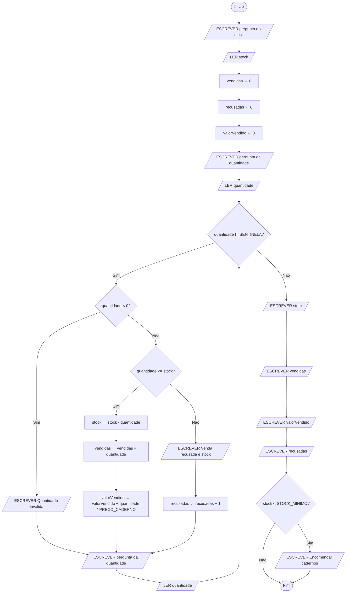

# Testar, depurar e melhorar

UC: UC00245

Blocos: ALG05

Requisitos: UC00245-R03, UC00245-R04, UC00245-R05, UC00245-A06, UC00245-A07, UC00245-A08, UC00245-C01, UC00245-C02, UC00245-C03, UC00245-P02

| Identificação | Valor |
| --- | --- |
| Material | M-ALG05, quinto e último bloco de Desenvolver algoritmos |
| Fundamento curricular | Unidade de competência UC00245, bloco ALG05 |
| Duração | 120 minutos dos 300 do bloco: 60 para a teoria e o exemplo deste guia e 60 para o checkpoint da última aula. Os outros 180 estão na [ficha de exercícios](05-testar-depurar-e-melhorar-exercicios.md) (60) e na avaliação prática individual (120) |
| Evidência a guardar | Portefólio com problema, pseudocódigo, fluxograma, testes e correções |

## Objetivos

No final deste bloco, serás capaz de:

- explicar o que é testar um algoritmo e por que razão o resultado esperado de cada caso se decide antes de o executar;
- escolher casos de teste normais, de fronteira e inválidos, e organizá-los numa tabela de casos esperados;
- depurar um algoritmo com método: observar o erro, formular uma hipótese, verificá-la com o trace, corrigir a causa e voltar a testar tudo;
- reconhecer os quatro erros mais frequentes dos blocos anteriores: a fronteira mal posta, a atualização esquecida, a inicialização no sítio errado e o ramo em falta;
- melhorar um algoritmo sem mudar o que ele faz, contando os passos antes e depois da melhoria;
- justificar uma solução completa que junta sequência, seleção e repetição, em pseudocódigo e em fluxograma.

## O que precisas de saber antes

Este é o último guia do percurso de algoritmos e usa tudo o que aprendeste nos quatro anteriores. Não traz nenhuma instrução nova: todas as palavras de pseudocódigo e todas as figuras de fluxograma deste guia já as conheces. O que traz de novo é uma forma de trabalhar com elas: como verificar que um algoritmo está certo, como encontrar um erro quando ele não está, e como o tornar mais simples sem o estragar.

Do [guia 01, Do problema ao algoritmo](01-do-problema-ao-algoritmo.md), vais usar o contrato de um problema: as respostas às quatro perguntas (entradas, saídas, restrições e condições), acompanhadas de exemplos concretos com o resultado esperado de cada um, calculado à mão. Vais usar também a ideia de estado, a fotografia dos valores num dado momento.

Do [guia 02, Pseudocódigo e fluxogramas](02-pseudocodigo-e-fluxogramas.md), vais usar as variáveis, as constantes e os tipos, a atribuição com a seta, `LER` e `ESCREVER`, `DIV` e `RESTO`, os símbolos do fluxograma e, acima de tudo, a tabela de trace, onde se executa um algoritmo à mão, instrução a instrução, com uma coluna por variável. O trace é a ferramenta principal deste guia.

Do [guia 03, Decisões e validação](03-decisoes-e-validacao.md), vais usar as comparações (`=`, `!=`, `<`, `<=`, `>`, `>=`), os operadores `E`, `OU` e `NÃO`, a seleção com `SE`, `SENÃO SE` e `SENÃO`, a regra de que numa cadeia de `SENÃO SE` a primeira condição verdadeira ganha, as ideias de intervalo, limite e validação de uma entrada, a regra de testar cada limite abaixo, em cima e acima, e as duas ferramentas desse guia: a árvore de casos e a tabela de casos esperados.

Do [guia 04, Repetição e padrões](04-repeticao-e-padroes.md), vais usar o `ENQUANTO` e o `PARA`, as três peças de um ciclo (a inicialização, a condição e a atualização), a tabela de iterações, o caso zero, em que o ciclo não chega a ter nenhuma iteração, e os quatro padrões: o contador, o totalizador, a sentinela, com a leitura antecipada e a constante `SENTINELA`, e a validação repetida, que volta a pedir um valor enquanto ele for inválido.

Se algum destes pontos te parecer pouco firme, volta ao guia onde ele está antes de continuares. Este guia não os explica outra vez desde o princípio: usa-os.

## Material e preparação

Papel e lápis, porque neste bloco vais fazer muitos traces à mão. A aplicação diagrams.net, no browser, em `https://app.diagrams.net`, que já usaste para desenhar fluxogramas. E a pasta onde guardaste o trabalho dos blocos anteriores, porque no fim deste bloco vais organizar um portefólio com ele.

## Como está organizado o tempo

Este bloco tem 5 horas, ou seja 300 minutos, como os outros quatro. É diferente num ponto: 120 desses minutos são a avaliação prática individual que fecha a unidade de algoritmos. Por isso há menos tempo de aula para estudar do que nos blocos anteriores, e este guia foi escrito para ser lido também fora da aula, com calma.

| Parte | Onde está | Tempo |
| --- | --- | ---: |
| Teoria | Neste guia | 30 min |
| Exemplo explicado | Neste guia | 30 min |
| Prática autónoma | Na [ficha](05-testar-depurar-e-melhorar-exercicios.md) | 60 min |
| Avaliação prática individual | Enunciado entregue pelo professor | 120 min |
| Checkpoint, feedback e recuperação | Na última aula, com este guia e a avaliação corrigida | 60 min |
| Desafio opcional | Na ficha, na última aula, para quem não precisar de recuperação | dentro dos 60 min anteriores |

A ordem é esta: primeiro o guia, depois a ficha, depois a avaliação e, por fim, uma aula para veres o que correu bem e o que tens de rever. A avaliação está descrita no fim deste guia, para saberes desde já o que te vai ser pedido.

## Teoria (30 min)

### Um algoritmo que parece certo ainda não está provado

Quando escreves um algoritmo, tens na cabeça um caso concreto: uma encomenda de 30 cadernos, uma nota de 14, uma fila com três clientes. Escreves os passos a pensar nesse caso, fazes o trace com ele, e o resultado bate certo. Nesse momento é muito tentador dar o trabalho por acabado.

O problema é que esse trace só prova uma coisa: que o algoritmo funciona para aquele caso. Não diz nada sobre os outros. No guia 03 viste algoritmos que davam a resposta certa para 5 e para 15 e a resposta errada para 10, só porque tinham um `>` onde deviam ter um `>=`. Quem os testou com 5 e com 15 ficou convencido de que estavam certos.

Um algoritmo com um erro destes não se queixa. Executa até ao fim e escreve um número com ar de resultado. É isso que torna os **erros de lógica** perigosos: o algoritmo faz exatamente o que está escrito, só que o que está escrito não é o que se queria. Não há mensagem de erro, não há aviso, há só uma resposta errada que parece certa.

Toda a gente que escreve algoritmos comete erros destes, incluindo os programadores com muitos anos de profissão. A diferença entre um principiante e um profissional não está em errar menos. Está em ter um método para encontrar os erros antes de eles chegarem a quem usa o algoritmo. Esse método tem três partes, e são as três partes deste guia: testar, para descobrir se há erros; depurar, para encontrar a causa de um erro e corrigi-la; e melhorar, para tornar o algoritmo mais simples sem mudar o que ele faz.

Em inglês, um erro num programa chama-se *bug*, que quer dizer inseto. A palavra já se usava em engenharia no século XIX, e ficou famosa em 1947, quando os operadores de um dos primeiros computadores, na Universidade de Harvard, encontraram uma traça presa num dos seus relés e a colaram no livro de registo. Encontrar e corrigir erros chama-se, por isso, *debugging*, e em português **depurar**.

### Testar é comparar o obtido com o esperado

Um **caso de teste** é um conjunto de entradas concretas, escolhidas de propósito, acompanhado do **resultado esperado**, isto é, do que o algoritmo deve produzir com essas entradas segundo o contrato. O que o algoritmo produz de facto quando o executas chama-se **resultado obtido**.

**Testar** é executar o algoritmo com as entradas de um caso de teste e comparar o resultado obtido com o resultado esperado. Se forem iguais, o teste passou. Se forem diferentes, o teste falhou, e há um erro em algum lado: no algoritmo, ou no resultado esperado que escreveste, se te enganaste a calculá-lo.

Um pseudocódigo não corre num computador. Por isso, neste percurso, executar um algoritmo é fazer o seu trace à mão, exatamente como aprendeste no guia 02. A este teste feito com papel e lápis chama-se **teste de mesa**. No próximo período, quando passares para Python, o computador vai executar por ti, mas a comparação entre o obtido e o esperado continua a ser tua.

Repara numa coisa: um teste que falha não é uma má notícia. É uma informação que ainda não tinhas, e que apareceu num sítio onde não faz mal nenhum, no teu caderno, e não na caixa de uma loja a cobrar mal a um cliente. Um teste que falha no teste de mesa é um erro que já não chega a ninguém.

### O resultado esperado decide-se antes de executar

Esta regra parece um pormenor e é a mais importante do guia: o resultado esperado de cada caso escreve-se antes de executar o algoritmo, a partir do enunciado e do contrato, e nunca a partir do algoritmo.

Imagina que fazes o trace primeiro e que, no fim, o algoritmo diz "Stock final: 20". Olhas para o número e pensas: "sim, faz sentido, 20". O teu cérebro acabou de aceitar o resultado porque o viu escrito. Agora imagina que, antes do trace, tinhas escrito à parte, com base no enunciado, que o stock final devia ser 15. Quando aparecer o 20, a diferença salta à vista. O mesmo número, visto com uma previsão escrita ao lado, deixa de parecer normal.

É por isso que, no guia 02, te foi pedido tantas vezes que previsses o resultado antes de fazer o trace. Não era um jogo de adivinhação. Era treino para esta regra.

Há uma segunda razão. O resultado esperado vem do enunciado, e o enunciado é a única autoridade sobre o que o algoritmo deve fazer. Se calculares o esperado olhando para o algoritmo, estás a perguntar ao algoritmo se ele concorda consigo próprio, e ele concorda sempre. Se o enunciado não disser qual é o resultado de um caso, por exemplo o que acontece quando o stock fica exatamente no limite, isso é uma ambiguidade, como as que aprendeste a encontrar no guia 01. Decide-se, escreve-se a decisão no contrato, e só depois se escreve o resultado esperado.

### Casos normais, de fronteira e inválidos

Não se testa um algoritmo com casos ao acaso. Escolhem-se casos de três tipos, porque cada tipo apanha erros diferentes.

Um **caso normal** é uma entrada típica, das que o enunciado imagina: uma venda de 5 cadernos numa loja com 20, uma encomenda de 30 unidades. Os casos normais são necessários, porque um algoritmo que falha no caso normal não serve para nada. Mas quase nunca chegam, porque o caso normal é precisamente aquele em que pensaste quando escreveste o algoritmo. Se houver um erro, raramente está aí.

Um **caso de fronteira** é uma entrada no sítio onde a resposta do algoritmo muda de comportamento. No guia 03 aprendeste a testar cada fronteira em três pontos: imediatamente abaixo, em cima dela e imediatamente acima. É nas fronteiras que se escondem os erros de `<` trocado por `<=`, porque os dois operadores só dão resultados diferentes no valor exato da fronteira.

Os ciclos também têm fronteiras, e são fáceis de esquecer. A mais importante é o caso zero, que conheces do guia 04: o ciclo que não chega a ter nenhuma iteração, porque a sentinela aparece logo na leitura antecipada, ou porque o `PARA` vai de 1 até 0. Um algoritmo em que o ciclo tem zero iterações executa só o que está antes e depois do ciclo, e revela erros que nenhum outro caso revela, como uma variável que só recebe valor dentro do ciclo e que, sem iterações, fica sem valor nenhum. As outras fronteiras de um ciclo são o caso de uma só iteração e o caso de várias iterações, porque há erros que só aparecem quando uma iteração depende do que a anterior deixou.

Um **caso inválido** é uma entrada que o contrato não aceita: uma quantidade negativa, uma nota de 25 numa escala de 0 a 20. O algoritmo tem de fazer com ela exatamente o que o contrato diz, seja escrever uma mensagem, ignorá-la ou voltar a pedi-la. Testar casos inválidos confirma que a validação existe e que está no sítio certo. Não esqueças que uma validação também tem fronteiras: se as quantidades válidas começam em 1, o 0 e o 1 são o par de valores a testar.

### Duas maneiras de escolher casos

Há duas perguntas que te ajudam a escolher casos de teste, e vale a pena fazer as duas.

A primeira olha só para o contrato, sem olhar para o algoritmo: que entradas o enunciado permite, onde estão as fronteiras, que entradas são inválidas? Os casos que saem daqui podem escrever-se antes de o algoritmo existir, e têm uma grande vantagem: como não olhaste para o algoritmo, não herdas os pontos cegos de quem o escreveu. Os profissionais chamam a isto testes de **caixa preta**, porque tratam o algoritmo como uma caixa fechada de que só se veem as entradas e as saídas.

A segunda olha para o algoritmo depois de escrito: há algum ramo de um `SE` por onde nenhum caso passa? Há algum ciclo que nunca foi testado com o caso zero? Se um ramo nunca foi executado por nenhum caso, não tens nenhuma prova de que esteja certo, e acrescentas um caso que passe por ele. A isto chama-se testes de **caixa branca**, porque se olha para dentro da caixa.

A ordem recomendada é esta: primeiro os casos do contrato, antes de haver algoritmo; depois, com o algoritmo escrito, confirmar que cada ramo e cada ciclo ficou coberto, e acrescentar o que faltar.

### A tabela de casos esperados

Os casos de teste organizam-se na tabela de casos esperados, que construíste no guia 03 para as decisões: uma linha por caso, com as entradas, o resultado esperado e a razão da escolha. Neste guia a tabela passa a servir para algoritmos completos, com ciclos, e ganha duas coisas. Ganha uma coluna com o tipo de caso (normal, fronteira ou inválido), para se ver de relance se falta algum tipo. E ganha as colunas do que acontece depois de executar: o resultado obtido e se o teste passou. As cinco primeiras colunas (número, tipo, entradas, resultado esperado e razão) preenchem-se antes de executar; as duas últimas, depois.

A árvore de casos do guia 03 continua a ajudar: cada ponta da árvore é um caminho do algoritmo, e cada caminho tem de ter pelo menos um caso na tabela. É a pergunta da caixa branca feita antes de haver algoritmo.

Um exemplo pequeno. Uma loja dá desconto em encomendas de 10 ou mais unidades. Uma encomenda tem de ter pelo menos 1 unidade: com menos do que isso, o algoritmo escreve "Quantidade inválida". Antes de haver algoritmo, a tabela fica assim:

| N.º | Tipo | Quantidade | Resultado esperado | Porque foi escolhido |
| ---: | --- | ---: | --- | --- |
| 1 | normal | 3 | Sem desconto | Encomenda pequena típica |
| 2 | normal | 25 | Tem desconto | Encomenda grande típica |
| 3 | fronteira | 9 | Sem desconto | Imediatamente abaixo do desconto |
| 4 | fronteira | 10 | Tem desconto | O próprio limite, que o enunciado diz ter desconto |
| 5 | fronteira | 11 | Tem desconto | Imediatamente acima do limite |
| 6 | inválido | 0 | Quantidade inválida | Imediatamente abaixo da primeira quantidade válida |
| 7 | inválido | -4 | Quantidade inválida | Um engano de digitação típico |

Repara que a quantidade 1, a primeira quantidade válida, também merecia um lugar na tabela: é a fronteira da validação vista do lado de dentro, e forma par com o caso 6. Podia até substituir a quantidade 3 do caso 1, e esse caso passava a testar duas coisas de uma vez, uma encomenda pequena e a fronteira da validação. Numa tabela real, um caso bem escolhido testa muitas vezes duas coisas. Nesta, ficaram separadas para se verem melhor.

Mais à frente, na secção dos quatro erros frequentes, vais ver um algoritmo para este problema e o que esta tabela descobre nele.

### Depurar com método

Quando um teste falha, sabes que há um erro, mas não sabes onde ele está. **Depurar** é encontrar a causa desse erro e corrigi-la. A tentação é olhar para o algoritmo, desconfiar de uma linha qualquer, mudá-la e ver se passa. Às vezes resulta, mas quase sempre por sorte, e muitas vezes troca um erro por outro. Depurar com método segue cinco passos, sempre pela mesma ordem.

**1. Observar e reproduzir o erro.** Escreve o caso que falhou, o resultado esperado e o resultado obtido, e diz exatamente qual das saídas está errada. Depois procura o **caso mínimo**: o caso mais pequeno que ainda mostra o mesmo erro. Se o erro aparece com três vendas, experimenta com uma só. Um caso mais pequeno dá um trace mais curto, e um trace mais curto é mais fácil de ler.

**2. Formular uma hipótese.** Uma **hipótese** é uma explicação possível para o erro, escrita numa frase que pode ser verdadeira ou falsa: "o contador volta a zero em cada iteração do ciclo", "a condição recusa a venda quando a quantidade é igual ao stock". "Está tudo mal" não é hipótese, porque não diz onde procurar nem o que verificar.

**3. Verificar a hipótese com o trace.** Faz o trace do caso mínimo, linha a linha, e procura a primeira linha onde uma variável fica com um valor diferente do que devia ter. Essa linha confirma a hipótese ou deita-a abaixo. Se a deitar abaixo, não perdeste tempo: sabes onde o erro não está, e formulas outra hipótese com o que o trace te mostrou.

**4. Corrigir a causa.** A **causa** de um erro é a instrução que o produz. O **sintoma** é o sítio onde ele se vê, normalmente uma saída errada. Corrige-se a causa, mudando o menos possível, e uma coisa de cada vez. Se mudares três linhas ao mesmo tempo e o teste passar, não sabes qual delas era o erro, nem se as outras duas estragaram outra coisa.

**5. Voltar a testar tudo.** Depois da correção, executa outra vez a tabela de casos inteira, e não só o caso que falhou. Uma correção pode estragar um caso que antes funcionava. Os profissionais chamam a isto **teste de regressão**: confirmar que o algoritmo não regrediu, isto é, não voltou atrás, em nada do que já fazia bem.

Cada depuração fica escrita num **registo de depuração**, com cinco linhas, uma por passo: o caso e o erro observado, a hipótese, o que o trace mostrou, a correção feita e o resultado do novo teste. É este registo que vai para o teu portefólio, e é ele que mostra que sabes explicar uma correção, que é uma das coisas observadas na avaliação prática.

### Quatro erros que vais encontrar muitas vezes

Nos blocos anteriores há quatro erros que aparecem vezes sem conta, em alunos e em profissionais. Conhecê-los de nome ajuda a formular hipóteses depressa.

#### Fronteira mal posta

Uma **fronteira mal posta** é uma comparação que põe o valor da fronteira do lado errado: `>` onde devia estar `>=`, ou `<` onde devia estar `<=`. É o algoritmo do desconto, escrito assim:

```text
ALGORITMO DescontoPorQuantidade
CONSTANTES
    QUANTIDADE_MINIMA ← 1
    MINIMO_DESCONTO ← 10
VARIÁVEIS
    quantidade: inteiro
INÍCIO
    ESCREVER "Quantas unidades tem a encomenda?"
    LER quantidade
    SE quantidade < QUANTIDADE_MINIMA ENTÃO
        ESCREVER "Quantidade inválida"
    SENÃO SE quantidade > MINIMO_DESCONTO ENTÃO
        ESCREVER "Tem desconto"
    SENÃO
        ESCREVER "Sem desconto"
    FIM SE
FIM
```

Executa a tabela de casos da secção anterior. Os casos 1, 2, 3, 5, 6 e 7 passam. O caso 4 falha: com 10 unidades, `10 > 10` é falso, e o algoritmo escreve "Sem desconto", quando o enunciado diz que 10 unidades já têm desconto. Só o caso 4 mostra o erro. Se a tabela não tivesse o próprio valor da fronteira, este algoritmo passava em todos os testes e continuava errado.

A correção é voltar ao enunciado: "10 ou mais" inclui o 10, e por isso a condição é `quantidade >= MINIMO_DESCONTO`.

#### Atualização esquecida

Uma **atualização esquecida** é uma variável que devia mudar e não muda, porque falta a instrução que a altera. Tem duas formas.

Na primeira, a variável esquecida é a que controla o ciclo, e o resultado é um ciclo que nunca acaba:

```text
ALGORITMO ContarPedidos
CONSTANTES
    SENTINELA ← 0
VARIÁVEIS
    unidades: inteiro
    pedidos: inteiro
INÍCIO
    pedidos ← 0
    ESCREVER "Unidades do pedido (0 para terminar)?"
    LER unidades
    ENQUANTO unidades != SENTINELA FAZER
        pedidos ← pedidos + 1
    FIM ENQUANTO
    ESCREVER "Pedidos: ", pedidos
FIM
```

Com um primeiro pedido de 5 unidades, a condição `5 != 0` é verdadeira, o ciclo soma 1 a `pedidos` e volta à condição. Como dentro do ciclo não há nenhum `LER unidades`, `unidades` continua a valer 5 para sempre, e a condição nunca chega a ser falsa. No trace vê-se logo: a coluna de `unidades` nunca muda, e é ela que a condição consulta. Falta o `LER unidades` no fim do corpo do ciclo, que é a atualização do padrão sentinela: é a leitura esquecida no fim do corpo, um dos erros frequentes do guia 04. Repara que, com o 0 logo na leitura antecipada, este algoritmo funciona: o caso zero não mostra este erro, e o caso de uma iteração mostra-o.

Na segunda forma, a variável esquecida não controla o ciclo, e por isso o ciclo acaba normalmente, mas uma parte do estado fica parada num valor antigo. É mais traiçoeira, porque o algoritmo termina e escreve resultados com ar de certos. É esse o erro do exemplo explicado deste guia.

#### Inicialização no sítio errado

Um contador ou um totalizador tem de receber o valor inicial uma só vez, antes do ciclo. Uma **inicialização no sítio errado** é pô-lo dentro do ciclo, onde volta a zero em cada iteração:

```text
ALGORITMO ContarPedidosGrandes
CONSTANTES
    PEDIDO_GRANDE ← 50
    SENTINELA ← 0
VARIÁVEIS
    unidades: inteiro
    grandes: inteiro
INÍCIO
    ESCREVER "Unidades do pedido (0 para terminar)?"
    LER unidades
    ENQUANTO unidades != SENTINELA FAZER
        grandes ← 0
        SE unidades >= PEDIDO_GRANDE ENTÃO
            grandes ← grandes + 1
        FIM SE
        ESCREVER "Unidades do pedido (0 para terminar)?"
        LER unidades
    FIM ENQUANTO
    ESCREVER "Pedidos grandes: ", grandes
FIM
```

Com os pedidos 60, 80 e 10, seguidos do 0, esperavas 2 pedidos grandes. O algoritmo escreve 0. Na primeira iteração `grandes` passa a 0 e depois a 1; na segunda volta a 0 e sobe outra vez a 1; na terceira volta a 0 e, como 10 não é um pedido grande, fica em 0. O contador só se lembra da última iteração, e por isso nunca passa de 1. Com o 0 logo à cabeça é ainda pior: é o caso zero, `grandes` nunca recebe valor, e o `ESCREVER` final tenta mostrar uma variável sem valor. A correção é mudar `grandes ← 0` para antes do ciclo, que é o sítio onde se diz quanto vale o contador antes de começar a contar.

#### Ramo em falta

Um **ramo em falta** é uma situação que o enunciado prevê e para a qual o algoritmo não tem caminho. Neste exemplo, as encomendas de 3000 cêntimos ou mais não pagam portes, e as outras pagam 400 cêntimos:

```text
ALGORITMO TotalComPortes
CONSTANTES
    LIMITE_GRATIS ← 3000
    PORTES ← 400
VARIÁVEIS
    valor: inteiro
    portes: inteiro
    total: inteiro
INÍCIO
    ESCREVER "Valor da encomenda em cêntimos?"
    LER valor
    SE valor >= LIMITE_GRATIS ENTÃO
        portes ← 0
    FIM SE
    total ← valor + portes
    ESCREVER "Total a pagar em cêntimos: ", total
FIM
```

Com 3500 cêntimos, o total é 3500, e o teste passa. Com 1200 cêntimos, a condição é falsa, o `SE` não faz nada, e `portes` chega à conta do total sem valor nenhum. O algoritmo não sabe quanto somar. Falta o ramo `SENÃO`, com `portes ← PORTES`, para o caso mais frequente de todos, que é a encomenda pequena. Um ramo em falta também pode ser uma validação que não existe, e então é a entrada inválida que segue por um caminho que não era o dela, como uma quantidade negativa tratada como se fosse uma venda.

### Corrigir a causa e não o sintoma

Quando um teste falha, o que vês é o sintoma: um número errado numa saída. A tentação é emendar o algoritmo precisamente onde o número aparece, com uma conta no fim que o acerte. Essa emenda faz passar o caso que falhou, e deixa a causa exatamente onde estava. Na maior parte das vezes, o erro volta a aparecer noutro caso, com outro aspeto.

A pergunta a fazer antes de corrigir é: "esta alteração explica por que razão o valor ficou errado, ou só o acerta no fim?". Se só o acerta no fim, é uma correção do sintoma. No exemplo explicado vais ver uma correção destas que passa em seis dos sete testes de uma tabela, e só o sétimo mostra que o erro continua lá dentro.

### Melhorar um algoritmo sem mudar o que ele faz

Um algoritmo certo ainda pode ser melhorado. Pode fazer contas desnecessárias, perguntar coisas cujo resultado já se conhece, ou repetir em todas as iterações de um ciclo um trabalho que bastava fazer uma vez. Melhorar um algoritmo para fazer o mesmo com menos trabalho chama-se **otimizar**.

A regra principal de uma melhoria é que o algoritmo novo tem de fazer exatamente o mesmo que o antigo. Dois algoritmos são **equivalentes** quando, para todas as entradas que o contrato aceita, escrevem exatamente o mesmo no ecrã. Uma "melhoria" que muda um resultado, por pequeno que seja, não é uma melhoria: é um erro novo.

Daqui saem duas consequências. A primeira é que só se melhora um algoritmo que já passa em todos os testes. Melhorar um algoritmo errado junta dois problemas num só, e depois não se sabe qual dos dois causou o que se vê. A segunda é que a equivalência se mostra de duas maneiras, e as duas são precisas. Mostra-se com os testes, executando outra vez a tabela de casos inteira na versão nova e confirmando que dá exatamente os mesmos resultados. E mostra-se com uma explicação por palavras, que diz por que razão a alteração não pode mudar nenhum resultado. Os testes provam que a versão nova funciona nos casos testados. A explicação cobre os casos que não testaste.

Há ainda uma terceira razão para melhorar, além de fazer menos passos: um algoritmo com menos instruções tem menos sítios onde errar. Uma variável que deixa de ser atualizada dentro do ciclo é uma atualização que já ninguém se pode esquecer de escrever.

### Contar passos

Para comparar duas versões de um algoritmo é preciso medir o trabalho de cada uma, e a medida mais simples é contar passos. Neste percurso usa-se esta regra:

- conta um **passo** cada `LER`, cada `ESCREVER` e cada atribuição que é executada;
- conta um passo cada vez que se avalia a condição de um `SE`, de um `SENÃO SE` ou de um `ENQUANTO`, incluindo a última avaliação de um `ENQUANTO`, a que dá falso e faz sair do ciclo;
- não contam as declarações, `INÍCIO`, `FIM`, `SENÃO`, `FIM SE` nem `FIM ENQUANTO`, porque não fazem nada: marcam onde as coisas começam e acabam.

Se reparares, esta regra dá exatamente o número de linhas de um trace linha a linha, sem contar a linha "antes de começar". Contar passos é contar as linhas do trace.

Um computador verdadeiro não gasta o mesmo tempo em todas as instruções, e há formas mais finas de medir. Para comparar duas versões do mesmo algoritmo não interessa: o que interessa é contar as duas da mesma maneira. Uma regra simples, aplicada igual às duas versões, mostra qual delas trabalha menos.

Num algoritmo com um ciclo, não é preciso escrever o trace inteiro para contar. Conta-se por partes: os passos antes do ciclo, os passos de cada tipo de iteração, o passo da última avaliação da condição, que faz sair do ciclo, e os passos depois do ciclo. Depois multiplica-se cada tipo de iteração pelo número de vezes que acontece, e soma-se tudo. É a mesma ideia que viste no guia 04: há sempre mais um teste da condição do que iterações.

O `PARA` também faz trabalho escondido em cada iteração: a condição e a atualização estão no cabeçalho, e não se veem como linhas próprias. Para não complicar, as contagens de passos deste bloco usam sempre `ENQUANTO`.

### Uma melhoria com os passos contados: trocar um ciclo por uma conta

No guia 02 calculaste caixas completas e unidades soltas com `DIV` e `RESTO`. Imagina alguém que não conhecia estes operadores e resolveu o mesmo problema tirando 12 unidades de cada vez, enquanto houvesse pelo menos 12:

```text
ALGORITMO CaixasComCiclo
CONSTANTES
    UNIDADES_POR_CAIXA ← 12
VARIÁVEIS
    unidades: inteiro
    caixas: inteiro
    soltas: inteiro
INÍCIO
    ESCREVER "Quantas unidades?"
    LER unidades
    caixas ← 0
    soltas ← unidades
    ENQUANTO soltas >= UNIDADES_POR_CAIXA FAZER
        caixas ← caixas + 1
        soltas ← soltas - UNIDADES_POR_CAIXA
    FIM ENQUANTO
    ESCREVER "Caixas completas: ", caixas
    ESCREVER "Unidades soltas: ", soltas
FIM
```

O algoritmo está certo. A versão com contas é esta:

```text
ALGORITMO CaixasComContas
CONSTANTES
    UNIDADES_POR_CAIXA ← 12
VARIÁVEIS
    unidades: inteiro
    caixas: inteiro
    soltas: inteiro
INÍCIO
    ESCREVER "Quantas unidades?"
    LER unidades
    caixas ← unidades DIV UNIDADES_POR_CAIXA
    soltas ← unidades RESTO UNIDADES_POR_CAIXA
    ESCREVER "Caixas completas: ", caixas
    ESCREVER "Unidades soltas: ", soltas
FIM
```

Conta os passos da versão com ciclo por partes. Antes do ciclo há 4 passos: o `ESCREVER`, o `LER` e as duas atribuições. Cada iteração tem 3 passos: a avaliação da condição, que dá verdadeiro, e as duas atribuições. Há ainda 1 passo para a última avaliação, a que dá falso, e 2 passos depois do ciclo, os dois `ESCREVER`. O ciclo tem uma iteração por cada caixa completa. Com 30 unidades são 2 caixas, e por isso 4 + 2 × 3 + 1 + 2 = 13 passos. A versão com contas tem sempre 6 passos: o `ESCREVER`, o `LER`, as duas contas e os dois `ESCREVER`.

| Unidades | Caixas | Soltas | Passos com ciclo | Passos com contas |
| ---: | ---: | ---: | ---: | ---: |
| 0 | 0 | 0 | 7 | 6 |
| 11 | 0 | 11 | 7 | 6 |
| 12 | 1 | 0 | 10 | 6 |
| 30 | 2 | 6 | 13 | 6 |
| 120 | 10 | 0 | 37 | 6 |
| 1200 | 100 | 0 | 307 | 6 |

As duas versões dão as mesmas caixas e as mesmas unidades soltas em todos os casos, e isso não é coincidência: tirar 12 de cada vez enquanto houver pelo menos 12, e contar quantas vezes se tirou, é exatamente a definição de `DIV`, e o que sobra no fim é exatamente o `RESTO`. É essa a explicação que acompanha os testes.

Repara agora na forma como os passos crescem. A versão com ciclo gasta 3 passos por cada caixa completa, e por isso quanto maior a encomenda, mais trabalha: com 1200 unidades já vai em 307 passos. A versão com contas faz sempre 6, quer a encomenda tenha 12 unidades quer tenha 12 mil. Não precisas de mais do que esta observação para comparar as duas: uma cresce com a encomenda, a outra não.

### Estratégias simples para fazer menos passos

Há três estratégias simples que vais usar neste bloco. Nenhuma delas é um truque: todas nascem de perguntar "este passo é mesmo preciso aqui?".

A primeira é a que acabaste de ver: **trocar um ciclo por uma conta**, quando existe uma operação que faz de uma vez o que o ciclo faz aos bocadinhos. O cuidado a ter é confirmar que a conta dá o mesmo em todos os casos, sobretudo nos de fronteira, como o 0 e os múltiplos exatos.

A segunda é **fazer uma só vez o que não precisa de ser feito em todas as iterações**. Se uma conta dentro de um ciclo dá, no fim, o mesmo resultado que daria se fosse feita uma única vez depois do ciclo, não vale a pena repeti-la em cada iteração. O cuidado a ter é pô-la no sítio certo, porque antes do ciclo os valores de que ela precisa ainda não existem. Vais ver esta estratégia no exemplo explicado.

A terceira é **não voltar a perguntar o que já se sabe**. No guia 03 viste que, numa cadeia de `SENÃO SE`, quando o algoritmo chega a uma condição já sabe que todas as anteriores foram falsas. Uma condição que volta a perguntar isso gasta um passo para nada. O mesmo acontece com vários `SE` separados, uns a seguir aos outros, para casos que não podem acontecer ao mesmo tempo: o algoritmo avalia todas as condições, mesmo depois de uma delas já ter sido verdadeira. O cuidado a ter é confirmar que os casos são mesmo exclusivos, isto é, que nenhuma entrada pode pertencer a dois deles.

Um aviso para as três: nesta fase, um algoritmo claro vale mais do que um algoritmo curto. Uma melhoria só vale a pena se a conseguires explicar e se mostrares, com os testes, que o algoritmo continua a fazer exatamente o mesmo.

### A síntese: sequência, seleção e repetição

Todos os algoritmos que escreveste neste percurso são feitos de três estruturas, combinadas de formas diferentes. Está provado matematicamente, desde um artigo de Corrado Böhm e Giuseppe Jacopini publicado em 1966, que estas três estruturas chegam para escrever qualquer algoritmo. É por isso que são as primeiras que se aprendem, em qualquer linguagem.

| Estrutura | Em pseudocódigo | No fluxograma | O que testar |
| --- | --- | --- | --- |
| Sequência | Instruções umas a seguir às outras, executadas todas, pela ordem escrita | Figuras em linha, ligadas por setas, sem bifurcações | Que cada variável recebe valor antes de ser usada, e que a ordem das instruções é a certa |
| Seleção | `SE`, `SENÃO SE`, `SENÃO`, `FIM SE` | Losango com uma saída `Sim` e uma saída `Não`; os ramos voltam a juntar-se antes de continuar | Cada ramo pelo menos uma vez; cada fronteira abaixo, em cima e acima; os casos inválidos |
| Repetição | `ENQUANTO` ou `PARA`, com o corpo indentado | Losango com uma seta que volta atrás, para a condição | O caso zero, uma iteração e várias iterações; que o ciclo acaba; que a inicialização está antes e a atualização está dentro |

As estruturas encaixam umas nas outras. Um `SE` pode estar dentro de um `ENQUANTO`, e então a decisão é tomada outra vez em cada iteração. Um `SE` pode estar dentro do `SENÃO` de outro `SE`, e então só é avaliado quando a primeira condição foi falsa. A indentação mostra no pseudocódigo o que está dentro de quê. No fluxograma, a estrutura de dentro fica desenhada num dos caminhos da estrutura de fora: o losango de um `SE` dentro de um ciclo fica no caminho do `Sim` do losango do ciclo, antes da seta que volta atrás.

A última coluna da tabela é uma lista de verificação que podes usar sempre que testares um algoritmo completo. Olha para as estruturas que ele tem e, para cada uma, confirma que a tua tabela de casos tem os testes dessa linha.

## Exemplo explicado: o inventário da papelaria (30 min)

Este exemplo junta tudo: um algoritmo com sequência, seleção e repetição, a tabela de casos escrita antes, um erro encontrado com o método, a correção da causa, o fluxograma e uma melhoria com os passos contados antes e depois.

### O enunciado

> A papelaria da escola controla o stock de cadernos ao longo do dia. De manhã, a funcionária escreve quantos cadernos há na loja. Depois, a cada venda, escreve a quantidade vendida. Quando a loja fecha, escreve 0. Uma venda só é aceite se houver cadernos suficientes; se não houver, o algoritmo escreve que a venda foi recusada e quantos cadernos restam, e o stock não muda. Uma quantidade negativa é um engano de digitação: o algoritmo escreve "Quantidade inválida" e ignora-a. Cada caderno custa 150 cêntimos. No fim do dia, o algoritmo mostra o stock final, as unidades vendidas, o valor vendido em cêntimos e o número de vendas recusadas. Se o stock final ficar abaixo de 10 cadernos, escreve também "Encomendar cadernos".

### Passo 1: o contrato

As entradas são duas. A primeira é o stock do início do dia, um inteiro igual ou maior do que zero. O algoritmo não o valida: esse número vem da contagem da loja, e o contrato diz que é sempre um inteiro não negativo. A segunda é a sequência de quantidades escritas ao longo do dia, todas inteiras. Um 0 marca o fim, e é por isso a sentinela, que no algoritmo é a constante `SENTINELA`. Um valor positivo é uma venda. Um valor negativo é inválido.

As saídas são as mensagens escritas durante o dia, uma por cada venda recusada e uma por cada quantidade inválida, e, no fim, quatro valores e, se for caso disso, o aviso de encomenda.

As restrições são três. O stock nunca pode ficar negativo, e é para isso que existe a recusa. O preço é fixo, 150 cêntimos por caderno, e o valor trabalha-se em cêntimos inteiros para não haver casas decimais. O mínimo de stock é 10.

As condições são as situações diferentes que podem acontecer: uma venda aceite, uma venda recusada, uma quantidade inválida, um dia sem nenhuma venda, e um stock final abaixo ou não abaixo do mínimo.

Há duas ambiguidades no enunciado, e o contrato decide-as por escrito. "Cadernos suficientes" decide-se assim: uma venda igual ao stock é aceite, e deixa a loja com 0 cadernos. "Abaixo de 10" decide-se assim: 10 não está abaixo de 10, e por isso um stock final de exatamente 10 não dá o aviso, e um de 9 dá.

### Passo 2: a tabela de casos esperados, antes do algoritmo

Ainda não há algoritmo nenhum. A tabela escreve-se só a partir do contrato:

| N.º | Tipo | Stock inicial | Quantidades escritas | Resultado esperado | Porque foi escolhido |
| ---: | --- | ---: | --- | --- | --- |
| 1 | normal | 20 | 5, 3, 0 | Stock 12, vendidas 8, valor 1200, recusadas 0, sem aviso | Um dia normal com duas vendas |
| 2 | fronteira | 20 | 20, 0 | Stock 0, vendidas 20, valor 3000, recusadas 0, aviso | Uma venda igual ao stock, que tem de ser aceite |
| 3 | fronteira | 20 | 15, 6, 0 | Mensagem de recusa com 5 cadernos; stock 5, vendidas 15, valor 2250, recusadas 1, aviso | Uma venda uma unidade acima do que resta |
| 4 | fronteira | 20 | 10, 0 | Stock 10, vendidas 10, valor 1500, recusadas 0, sem aviso | O stock final fica exatamente no mínimo |
| 5 | fronteira | 20 | 11, 0 | Stock 9, vendidas 11, valor 1650, recusadas 0, aviso | O stock final fica uma unidade abaixo do mínimo |
| 6 | inválido | 20 | -3, 4, 0 | "Quantidade inválida"; stock 16, vendidas 4, valor 600, recusadas 0, sem aviso | Um engano de digitação no meio do dia |
| 7 | fronteira | 8 | 0 | Stock 8, vendidas 0, valor 0, recusadas 0, aviso | Um dia sem vendas: o caso zero |

Vale a pena perceber cada escolha. O caso 1 é o dia que qualquer pessoa imagina. Os casos 2 e 3 são as duas fronteiras da decisão de aceitar uma venda: no caso 2 a venda é exatamente igual ao stock, no caso 3 a segunda venda (6) é uma unidade maior do que os 5 cadernos que restam. Repara que o caso 3 só é uma fronteira por causa da primeira venda: é preciso que o stock tenha mudado dentro do ciclo para a segunda venda cair na fronteira. Os casos 4 e 5 são as duas faces da fronteira do mínimo: 10 fica, 9 dispara o aviso. O caso 6 testa a validação, com o valor inválido no meio de valores válidos, para confirmar que o algoritmo continua a funcionar depois dele. O caso 7 é o caso zero.

### Passo 3: a primeira versão

Esta é a primeira versão do algoritmo, escrita com cuidado e a pensar no caso 1:

```text
ALGORITMO InventarioVersao1
CONSTANTES
    STOCK_MINIMO ← 10
    PRECO_CADERNO ← 150
    SENTINELA ← 0
VARIÁVEIS
    stock: inteiro
    quantidade: inteiro
    vendidas: inteiro
    recusadas: inteiro
    valorVendido: inteiro
INÍCIO
    ESCREVER "Stock de cadernos no início do dia?"
    LER stock
    vendidas ← 0
    recusadas ← 0
    valorVendido ← 0
    ESCREVER "Quantidade vendida (0 para terminar)?"
    LER quantidade
    ENQUANTO quantidade != SENTINELA FAZER
        SE quantidade < 0 ENTÃO
            ESCREVER "Quantidade inválida"
        SENÃO SE quantidade <= stock ENTÃO
            vendidas ← vendidas + quantidade
            valorVendido ← valorVendido + quantidade * PRECO_CADERNO
        SENÃO
            ESCREVER "Venda recusada: só há ", stock, " cadernos"
            recusadas ← recusadas + 1
        FIM SE
        ESCREVER "Quantidade vendida (0 para terminar)?"
        LER quantidade
    FIM ENQUANTO
    ESCREVER "Stock final: ", stock
    ESCREVER "Unidades vendidas: ", vendidas
    ESCREVER "Valor vendido em cêntimos: ", valorVendido
    ESCREVER "Vendas recusadas: ", recusadas
    SE stock < STOCK_MINIMO ENTÃO
        ESCREVER "Encomendar cadernos"
    FIM SE
FIM
```

Lê-o com atenção. Tem a leitura do stock, os três totais postos a zero antes do ciclo, o padrão da sentinela com um `LER` antes do ciclo e outro no fim do corpo, a validação em primeiro lugar na cadeia, a decisão de aceitar ou recusar, e o aviso no fim. Parece certo. Tem um erro. Antes de passares ao passo 4, faz tu o trace do caso 1 e compara com o resultado esperado.

### Passo 4: testar a primeira versão

Executar os sete casos dá isto:

| N.º | Resultado esperado | Resultado obtido | Passou? |
| ---: | --- | --- | --- |
| 1 | Stock 12, vendidas 8, valor 1200, recusadas 0, sem aviso | Stock 20, vendidas 8, valor 1200, recusadas 0, sem aviso | Não |
| 2 | Stock 0, vendidas 20, valor 3000, recusadas 0, aviso | Stock 20, vendidas 20, valor 3000, recusadas 0, sem aviso | Não |
| 3 | Recusa com 5 cadernos; stock 5, vendidas 15, valor 2250, recusadas 1, aviso | Sem recusa; stock 20, vendidas 21, valor 3150, recusadas 0, sem aviso | Não |
| 4 | Stock 10, vendidas 10, valor 1500, recusadas 0, sem aviso | Stock 20, vendidas 10, valor 1500, recusadas 0, sem aviso | Não |
| 5 | Stock 9, vendidas 11, valor 1650, recusadas 0, aviso | Stock 20, vendidas 11, valor 1650, recusadas 0, sem aviso | Não |
| 6 | "Quantidade inválida"; stock 16, vendidas 4, valor 600, recusadas 0, sem aviso | "Quantidade inválida"; stock 20, vendidas 4, valor 600, recusadas 0, sem aviso | Não |
| 7 | Stock 8, vendidas 0, valor 0, recusadas 0, aviso | Stock 8, vendidas 0, valor 0, recusadas 0, aviso | Sim |

Seis testes falham e um passa. Antes de procurar o erro, olha para o padrão das falhas, porque ele já diz muito. Em todos os casos que falham, o stock final é 20, o stock inicial, como se nada tivesse sido vendido. As unidades vendidas e o valor estão certos nos casos 1, 2, 4, 5 e 6. E o único caso que passa é o 7, o dia sem vendas, em que o ciclo não tem nenhuma iteração. Tudo aponta para dentro do ciclo.

### Passo 5: depurar com o método

**Observar e reproduzir.** O caso 1 falha no stock final: esperado 12, obtido 20. As outras saídas estão certas. O caso mínimo que mostra o mesmo erro é ainda mais pequeno: stock 20, uma só venda de 5, e depois 0. O esperado é stock 15, e a primeira versão escreve 20.

**Formular uma hipótese.** Há duas explicações possíveis para o stock não ter mudado. A primeira é que a venda foi recusada. A segunda é que a venda foi aceite e o stock não foi atualizado. A primeira cai logo com o que já se sabe: as unidades vendidas são 5 e não apareceu nenhuma mensagem de recusa, por isso a venda foi aceite. Fica a segunda hipótese: o stock não diminui quando uma venda é aceite.

**Verificar com o trace.** O trace linha a linha do caso mínimo:

| Passo | Instrução executada | stock | quantidade | vendidas | recusadas | valorVendido | Condição e resultado | Ecrã |
| ---: | --- | ---: | ---: | ---: | ---: | ---: | --- | --- |
| 0 | antes de começar | sem valor | sem valor | sem valor | sem valor | sem valor | nenhuma | nada |
| 1 | `ESCREVER "Stock de cadernos no início do dia?"` | sem valor | sem valor | sem valor | sem valor | sem valor | nenhuma | Stock de cadernos no início do dia? |
| 2 | `LER stock` | 20 | sem valor | sem valor | sem valor | sem valor | nenhuma | a funcionária escreve 20 |
| 3 | `vendidas ← 0` | 20 | sem valor | 0 | sem valor | sem valor | nenhuma | nada |
| 4 | `recusadas ← 0` | 20 | sem valor | 0 | 0 | sem valor | nenhuma | nada |
| 5 | `valorVendido ← 0` | 20 | sem valor | 0 | 0 | 0 | nenhuma | nada |
| 6 | `ESCREVER "Quantidade vendida (0 para terminar)?"` | 20 | sem valor | 0 | 0 | 0 | nenhuma | Quantidade vendida (0 para terminar)? |
| 7 | `LER quantidade` | 20 | 5 | 0 | 0 | 0 | nenhuma | a funcionária escreve 5 |
| 8 | `ENQUANTO quantidade != SENTINELA FAZER` | 20 | 5 | 0 | 0 | 0 | `5 != 0` é verdadeiro | nada |
| 9 | `SE quantidade < 0 ENTÃO` | 20 | 5 | 0 | 0 | 0 | `5 < 0` é falso | nada |
| 10 | `SENÃO SE quantidade <= stock ENTÃO` | 20 | 5 | 0 | 0 | 0 | `5 <= 20` é verdadeiro | nada |
| 11 | `vendidas ← vendidas + quantidade` | 20 | 5 | 5 | 0 | 0 | nenhuma | nada |
| 12 | `valorVendido ← valorVendido + quantidade * PRECO_CADERNO` | 20 | 5 | 5 | 0 | 750 | nenhuma | nada |
| 13 | `ESCREVER "Quantidade vendida (0 para terminar)?"` | 20 | 5 | 5 | 0 | 750 | nenhuma | Quantidade vendida (0 para terminar)? |
| 14 | `LER quantidade` | 20 | 0 | 5 | 0 | 750 | nenhuma | a funcionária escreve 0 |
| 15 | `ENQUANTO quantidade != SENTINELA FAZER` | 20 | 0 | 5 | 0 | 750 | `0 != 0` é falso | nada |
| 16 | `ESCREVER "Stock final: ", stock` | 20 | 0 | 5 | 0 | 750 | nenhuma | Stock final: 20 |
| 17 | `ESCREVER "Unidades vendidas: ", vendidas` | 20 | 0 | 5 | 0 | 750 | nenhuma | Unidades vendidas: 5 |
| 18 | `ESCREVER "Valor vendido em cêntimos: ", valorVendido` | 20 | 0 | 5 | 0 | 750 | nenhuma | Valor vendido em cêntimos: 750 |
| 19 | `ESCREVER "Vendas recusadas: ", recusadas` | 20 | 0 | 5 | 0 | 750 | nenhuma | Vendas recusadas: 0 |
| 20 | `SE stock < STOCK_MINIMO ENTÃO` | 20 | 0 | 5 | 0 | 750 | `20 < 10` é falso | nada |

Lê a coluna do `stock` de cima para baixo: vale 20 do passo 2 até ao fim, sem nunca mudar. No passo 10 a condição `5 <= 20` é verdadeira e a execução entra no ramo da venda aceite. Nesse ramo executam-se os passos 11 e 12, que atualizam `vendidas` e `valorVendido`. Não há nenhum passo que mexa no `stock`. A hipótese está confirmada, e o trace mostrou o sítio exato: o ramo da venda aceite não tem a instrução que tira ao stock os cadernos vendidos.

É uma atualização esquecida, na forma traiçoeira: o `stock` não controla o ciclo, por isso o ciclo termina normalmente e o algoritmo escreve resultados com ar de certos.

### Passo 6: corrigir a causa, e não o sintoma

A causa está no ramo da venda aceite. A correção é acrescentar, nesse ramo, a instrução que falta:

```text
            stock ← stock - quantidade
```

Antes de a escrever, vale a pena ver a correção que parece mais fácil, porque é a que muita gente faria. O sintoma é o stock final errado. Uma forma de o acertar é escrever, antes do `ESCREVER "Stock final: ", stock`, a instrução `stock ← stock - vendidas`: no fim do dia, tira-se ao stock inicial tudo o que se vendeu. No caso mínimo dá 20 menos 5, que é 15, e o teste passa.

Executada a tabela inteira, esta correção do sintoma passa nos casos 1, 2, 4, 5, 6 e 7. Falha só no caso 3:

| Caso 3 | Stock final | Vendidas | Valor | Recusadas | Mensagem durante o dia | Aviso |
| --- | ---: | ---: | ---: | ---: | --- | --- |
| Esperado | 5 | 15 | 2250 | 1 | Venda recusada: só há 5 cadernos | Sim |
| Obtido com a correção do sintoma | -1 | 21 | 3150 | 0 | nenhuma | Sim |

O stock final é -1, um número de cadernos que não pode existir, e a segunda venda foi aceite sem haver cadernos para ela. A razão é que o stock não serve só para ser escrito no fim. É usado dentro do ciclo, na condição `quantidade <= stock`, para decidir se cada venda pode ser feita. Com a correção do sintoma, essa decisão continua a ser tomada com o stock da manhã, 20, e por isso a venda de 6 é aceite. O número do fim foi acertado, e as decisões do dia continuaram erradas.

É esta a diferença entre corrigir o sintoma e corrigir a causa, e repara no que a mostrou: um caso de fronteira que foi escolhido no passo 2, antes de haver algoritmo, e que exige que o stock mude a meio do dia. Sem o caso 3 na tabela, a correção do sintoma passava em todos os testes.

### Passo 7: a versão corrigida e o teste de regressão

A versão corrigida tem a instrução que faltava, no sítio da causa:

```text
ALGORITMO InventarioVersao2
CONSTANTES
    STOCK_MINIMO ← 10
    PRECO_CADERNO ← 150
    SENTINELA ← 0
VARIÁVEIS
    stock: inteiro
    quantidade: inteiro
    vendidas: inteiro
    recusadas: inteiro
    valorVendido: inteiro
INÍCIO
    ESCREVER "Stock de cadernos no início do dia?"
    LER stock
    vendidas ← 0
    recusadas ← 0
    valorVendido ← 0
    ESCREVER "Quantidade vendida (0 para terminar)?"
    LER quantidade
    ENQUANTO quantidade != SENTINELA FAZER
        SE quantidade < 0 ENTÃO
            ESCREVER "Quantidade inválida"
        SENÃO SE quantidade <= stock ENTÃO
            stock ← stock - quantidade
            vendidas ← vendidas + quantidade
            valorVendido ← valorVendido + quantidade * PRECO_CADERNO
        SENÃO
            ESCREVER "Venda recusada: só há ", stock, " cadernos"
            recusadas ← recusadas + 1
        FIM SE
        ESCREVER "Quantidade vendida (0 para terminar)?"
        LER quantidade
    FIM ENQUANTO
    ESCREVER "Stock final: ", stock
    ESCREVER "Unidades vendidas: ", vendidas
    ESCREVER "Valor vendido em cêntimos: ", valorVendido
    ESCREVER "Vendas recusadas: ", recusadas
    SE stock < STOCK_MINIMO ENTÃO
        ESCREVER "Encomendar cadernos"
    FIM SE
FIM
```

Agora o teste de regressão: a tabela inteira outra vez, e não só o caso que falhou. Os sete casos dão exatamente o resultado esperado do passo 2. O caso 3, que separou a causa do sintoma, merece ser visto por dentro. Como já viste o trace linha a linha, este vai numa tabela de iterações, como no guia 04: uma linha por cada teste da condição do ciclo, com o estado no momento do teste, e o que acontece durante a iteração que começa a seguir.

| Teste | quantidade | stock | vendidas | recusadas | valorVendido | Condição | Durante a iteração |
| --- | ---: | ---: | ---: | ---: | ---: | --- | --- |
| 1.º | 15 | 20 | 0 | 0 | 0 | `15 != 0` é verdadeiro | `15 <= 20` é verdadeiro: venda aceite, o stock passa a 5; lê 6 |
| 2.º | 6 | 5 | 15 | 0 | 2250 | `6 != 0` é verdadeiro | `6 <= 5` é falso: escreve "Venda recusada: só há 5 cadernos" e soma 1 às recusadas; lê 0 |
| 3.º | 0 | 5 | 15 | 1 | 2250 | `0 != 0` é falso | o ciclo termina |

Depois do ciclo, o algoritmo escreve os quatro valores da última linha e, como `5 < 10` é verdadeiro, escreve também "Encomendar cadernos". Repara na coluna do `stock`: na primeira iteração desce para 5, e é esse 5 que a condição da venda usa na segunda iteração. É isso que faltava na primeira versão.

### Passo 8: o fluxograma da versão corrigida



Se não conseguires ver o desenho, o percurso é este. Do início, desce-se em linha reta pela pergunta do stock, pela leitura do stock, pelas três atribuições que põem os totais a zero, pela pergunta da quantidade e pela leitura da primeira quantidade. Chega-se ao losango do ciclo, `quantidade != SENTINELA?`. Pelo `Sim` entra-se no corpo do ciclo, que começa noutro losango, `quantidade < 0?`. Pelo `Sim` deste escreve-se "Quantidade inválida". Pelo `Não` chega-se a um terceiro losango, `quantidade <= stock?`: pelo `Sim` executam-se as três atualizações da venda aceite, começando pela do stock; pelo `Não` escreve-se a mensagem de recusa e soma-se 1 às recusadas. Os três caminhos juntam-se na pergunta da quantidade seguinte, lê-se a quantidade, e a seta volta atrás, para o losango do ciclo. Pelo `Não` do losango do ciclo sai-se para os quatro `ESCREVER` finais e para o último losango, `stock < STOCK_MINIMO?`, que escreve o aviso pelo `Sim` e segue diretamente para o fim pelo `Não`.

Compara com o pseudocódigo, figura a figura. O primeiro losango é o `ENQUANTO`, e reconhece-se por ser o único para onde volta uma seta. O segundo e o terceiro losangos são o `SE` e o `SENÃO SE` da cadeia, e ficam os dois no caminho do `Sim` do ciclo, porque estão dentro dele. O retângulo `stock ← stock - quantidade` é a correção do passo 6: no fluxograma da primeira versão, esta figura não existia, e o caminho do `Sim` do terceiro losango passava diretamente para as vendidas.

### Passo 9: melhorar sem mudar o que o algoritmo faz

A versão 2 passa em todos os testes. Agora, e só agora, pergunta-se se ela faz trabalho desnecessário.

Olha para o `valorVendido`. Em cada venda aceite, soma-se `quantidade * PRECO_CADERNO`. No caso 1 isso dá 5 × 150 + 3 × 150. Pela propriedade distributiva que conheces da matemática, isso é o mesmo que (5 + 3) × 150, ou seja, `vendidas * PRECO_CADERNO`. Isto vale para qualquer dia, com quaisquer vendas: o valor vendido é sempre igual às unidades vendidas vezes o preço. Não é preciso atualizá-lo em cada venda. Basta calculá-lo uma vez, no fim, quando `vendidas` já tem o valor final.

A melhoria tem três alterações: tira-se `valorVendido ← 0` de antes do ciclo, tira-se a atualização de `valorVendido` do ramo da venda aceite, e acrescenta-se `valorVendido ← vendidas * PRECO_CADERNO` depois do ciclo, antes dos `ESCREVER` finais:

```text
ALGORITMO InventarioVersao3
CONSTANTES
    STOCK_MINIMO ← 10
    PRECO_CADERNO ← 150
    SENTINELA ← 0
VARIÁVEIS
    stock: inteiro
    quantidade: inteiro
    vendidas: inteiro
    recusadas: inteiro
    valorVendido: inteiro
INÍCIO
    ESCREVER "Stock de cadernos no início do dia?"
    LER stock
    vendidas ← 0
    recusadas ← 0
    ESCREVER "Quantidade vendida (0 para terminar)?"
    LER quantidade
    ENQUANTO quantidade != SENTINELA FAZER
        SE quantidade < 0 ENTÃO
            ESCREVER "Quantidade inválida"
        SENÃO SE quantidade <= stock ENTÃO
            stock ← stock - quantidade
            vendidas ← vendidas + quantidade
        SENÃO
            ESCREVER "Venda recusada: só há ", stock, " cadernos"
            recusadas ← recusadas + 1
        FIM SE
        ESCREVER "Quantidade vendida (0 para terminar)?"
        LER quantidade
    FIM ENQUANTO
    valorVendido ← vendidas * PRECO_CADERNO
    ESCREVER "Stock final: ", stock
    ESCREVER "Unidades vendidas: ", vendidas
    ESCREVER "Valor vendido em cêntimos: ", valorVendido
    ESCREVER "Vendas recusadas: ", recusadas
    SE stock < STOCK_MINIMO ENTÃO
        ESCREVER "Encomendar cadernos"
    FIM SE
FIM
```

O sítio da nova instrução é importante. Depois do ciclo, `vendidas` já tem o valor final, e a conta dá o valor certo. Antes do ciclo, `vendidas` ainda vale 0, e a conta daria sempre 0, que é um erro novo que só o caso 7 não apanharia. Dentro do ciclo voltava-se ao trabalho repetido que se quis tirar.

A equivalência mostra-se das duas maneiras. Pelos testes: os sete casos da tabela, executados na versão 3, escrevem exatamente o mesmo ecrã que na versão 2, incluindo o caso 7, em que o ciclo não tem iterações, `vendidas` fica em 0 e o valor é 0 × 150, que é 0. Pela explicação: o valor vendido é sempre as unidades vendidas vezes o preço, pela propriedade distributiva, e depois do ciclo `vendidas` já não muda, por isso calcular uma vez no fim dá o mesmo que ir somando venda a venda.

### Passo 10: contar os passos antes e depois

Conta-se por partes, com a regra da teoria:

| Parte do algoritmo | Versão 2 | Versão 3 |
| --- | ---: | ---: |
| Antes do ciclo | 7 | 6 |
| Cada iteração com venda aceite | 8 | 7 |
| Cada iteração com venda recusada | 7 | 7 |
| Cada iteração com quantidade inválida | 5 | 5 |
| Última avaliação da condição, que sai do ciclo | 1 | 1 |
| Depois do ciclo, sem aviso | 5 | 6 |
| Depois do ciclo, com aviso | 6 | 7 |

Confirma algumas destas contagens. Antes do ciclo, a versão 2 tem o `ESCREVER`, o `LER stock`, três atribuições, outro `ESCREVER` e o `LER quantidade`, que são 7; a versão 3 tem menos uma atribuição. Uma iteração com venda aceite tem a avaliação do `ENQUANTO`, a do `SE`, a do `SENÃO SE`, as atribuições do ramo (três na versão 2, duas na versão 3), o `ESCREVER` e o `LER` do fim do corpo. Depois do ciclo, a versão 3 tem uma atribuição a mais, a do valor.

Para o caso 1, a versão 2 faz 7 + 2 × 8 + 1 + 5 = 29 passos, e a versão 3 faz 6 + 2 × 7 + 1 + 6 = 27. Para os sete casos:

| N.º | Vendas aceites | Passos da versão 2 | Passos da versão 3 | Diferença |
| ---: | ---: | ---: | ---: | ---: |
| 1 | 2 | 29 | 27 | 2 |
| 2 | 1 | 22 | 21 | 1 |
| 3 | 1 | 29 | 28 | 1 |
| 4 | 1 | 21 | 20 | 1 |
| 5 | 1 | 22 | 21 | 1 |
| 6 | 1 | 26 | 25 | 1 |
| 7 | 0 | 14 | 14 | 0 |

A diferença é sempre igual ao número de vendas aceites. A versão 3 poupa um passo por cada venda aceite, a atualização do valor que deixou de ser feita. Perde um passo depois do ciclo, a conta do valor, e ganha um antes do ciclo, a atribuição do zero que deixou de existir, e esses dois anulam-se. É por isso que no caso 7, sem vendas, as duas versões fazem os mesmos 14 passos.

Nos casos da tabela, a diferença parece pequena. Num dia normal da papelaria, com 120 vendas aceites, são 120 passos a menos, e a diferença cresce com o número de vendas. E há o outro ganho de que falou a teoria: na versão 3 há uma atualização a menos dentro do ciclo, e uma atualização que não existe é uma atualização que ninguém se pode esquecer de escrever. O erro que encontraste no passo 5 era exatamente desse tipo.

### Passo 11: o que fica no portefólio

Para este problema, o portefólio guarda o enunciado, o contrato, a tabela de casos esperados, a versão 1, o registo de depuração do passo 5, a versão 2 com o seu fluxograma e o teste de regressão, e a versão 3 com a explicação da equivalência e a contagem de passos. A versão com o erro não se deita fora: é a prova de que o encontraste e corrigiste. O registo de depuração deste exemplo, escrito como vais escrever os teus, é este:

| Passo do método | O que foi feito |
| --- | --- |
| Erro observado | Caso 1: stock final esperado 12, obtido 20. Caso mínimo: stock 20, venda 5, depois 0; esperado 15, obtido 20 |
| Hipótese | O stock não diminui quando uma venda é aceite |
| Verificação com o trace | A coluna do stock vale 20 em todas as linhas; o ramo da venda aceite (passos 11 e 12) não tem nenhuma instrução que mude o stock |
| Correção | Acrescentada `stock ← stock - quantidade` no ramo da venda aceite. Rejeitada a correção do sintoma `stock ← stock - vendidas` no fim, porque falha o caso 3 |
| Novo teste | Os sete casos da tabela passam |

## Erros comuns

Estes são os erros de quem está a aprender a testar e a depurar, e não os erros dos algoritmos, que viste na teoria.

| Sintoma | Como investigar | Como prevenir |
| --- | --- | --- |
| Todos os testes passam, mas o algoritmo falha com o primeiro caso que outra pessoa experimenta | Os teus casos eram todos normais? Tinham as fronteiras e os inválidos? | Escreve a tabela de casos a partir do contrato, com os três tipos de caso |
| O resultado esperado foi escrito depois de ver o obtido | Pergunta: de onde veio este número, do enunciado ou do trace? | Preenche as cinco primeiras colunas da tabela antes de executar |
| O trace concorda sempre com o que esperavas | Fizeste a conta que está escrita, ou a que achavas que o algoritmo devia fazer? | Executa literalmente cada instrução, com os valores da linha de cima |
| Mudaste várias linhas e o teste passou, mas não sabes porquê | Qual das alterações corrigiu o erro? As outras estragaram alguma coisa? | Uma hipótese, uma alteração, um teste, de cada vez |
| A correção fez passar o caso que falhava e estragou outro | Voltaste a executar a tabela inteira? | Depois de cada correção, teste de regressão com todos os casos |
| O número do fim está certo, mas as decisões do meio estão erradas | A correção explica porque é que o valor ficou errado, ou só o acerta no fim? | Corrige a instrução que produz o erro, não a que o mostra |
| A versão melhorada dá um resultado diferente num caso | Qual é a primeira linha do trace onde as duas versões divergem? | Melhora só depois de a versão original passar em tudo, e testa a nova com a mesma tabela |
| Contaste os passos das duas versões de maneiras diferentes | Usaste a mesma regra nas duas? Contaste a última avaliação do `ENQUANTO`? | Conta por partes, com a mesma tabela de partes para as duas versões |

## O teu portefólio

O **portefólio** é a pasta onde juntas o trabalho que mostra o que aprendeste em algoritmos. É a entrega mínima deste bloco, e deve ter, para pelo menos um problema completo, cinco coisas: o problema (o enunciado e o contrato), o pseudocódigo, o fluxograma desenhado no diagrams.net, os testes (a tabela de casos esperados com os resultados obtidos) e as correções (as versões com erro, os registos de depuração e as versões corrigidas). O problema completo deste bloco é o exercício 4 da ficha, e o registo de depuração é o do exercício 2.

Algumas regras simples para o organizar:

- Uma pasta chamada `portefolio-algoritmos`, com um nome de ficheiro por peça, em minúsculas, com hífenes e sem acentos nem espaços, por exemplo `pontos-do-cartao-pseudocodigo`, `pontos-do-cartao-testes` e `pontos-do-cartao-fluxograma.drawio`.
- Cada versão de um algoritmo num ficheiro próprio. Não escrevas a versão corrigida por cima da versão com erro: o portefólio mostra as duas. No diagrams.net, o menu abre-se no botão redondo com reticências, no canto superior direito. Em Ficheiro, a opção Guardar como grava o diagrama com outro nome; no campo Onde, escolhe Aparelho ou Descarregar, para o ficheiro ficar no teu computador e não numa conta na internet. Em Exportar como, a opção PNG cria a imagem que podes juntar a um documento.
- Os traces feitos em papel também contam. Fotografa-os ou passa-os a limpo, e junta-os aos testes do problema a que pertencem.

## Resumo e checkpoint

Esta parte faz-se na última aula do bloco, depois da avaliação, mas lê-a já.

Testar é executar um algoritmo com casos escolhidos de propósito, normais, de fronteira e inválidos, e comparar o resultado obtido com o resultado esperado, que se escreve antes, a partir do contrato. Quando um teste falha, depura-se com método: observa-se o erro e reduz-se ao caso mínimo, formula-se uma hipótese, verifica-se com o trace, corrige-se a causa e não o sintoma, e volta-se a testar tudo. Um algoritmo certo pode ainda ser melhorado, desde que continue equivalente, e a melhoria mede-se contando passos antes e depois, com a mesma regra. Tudo isto se faz sobre algoritmos feitos de três estruturas, sequência, seleção e repetição, que se escrevem em pseudocódigo e se desenham em fluxograma.

Confirma o que já consegues fazer:

- [ ] Consigo escrever uma tabela de casos esperados, com casos normais, de fronteira e inválidos, antes de executar o algoritmo.
- [ ] Consigo explicar por que razão o resultado esperado se escreve antes de executar.
- [ ] Consigo reduzir um erro a um caso mínimo e formular uma hipótese que se possa verificar.
- [ ] Consigo usar um trace para confirmar ou deitar abaixo uma hipótese.
- [ ] Consigo distinguir a correção da causa da correção do sintoma, e mostrar com um caso de teste que uma correção do sintoma não chega.
- [ ] Consigo reconhecer os quatro erros frequentes e dizer que caso de teste revela cada um.
- [ ] Consigo mostrar que duas versões de um algoritmo são equivalentes, com testes e com uma explicação.
- [ ] Consigo contar os passos de um algoritmo com um ciclo, por partes, e comparar duas versões.

O checkpoint do bloco é resolver um caso novo e explicar a diferença entre antes e depois. Na última aula, o professor dá-te um caso que ainda não testaste para um dos algoritmos da tua avaliação ou do teu portefólio. Tens de o executar na versão com erro e na versão corrigida, dizer o que cada uma escreve e explicar a diferença pela instrução que mudou.

Treina já com o inventário. Pega no caso em que o stock inicial é 12 e as quantidades escritas são 12, 1 e 0. Faz a tabela de iterações na versão 1 e na versão 2, escreve o ecrã completo de cada uma e explica, numa ou duas frases, por que razão são diferentes. A explicação tem de dizer que instrução muda o resultado, e em que iteração.

## A avaliação prática da unidade

A avaliação prática é individual, dura 120 minutos e tem duas partes. Na primeira recebes um problema novo e fazes o que fizeste neste guia: o contrato, a tabela de casos esperados antes do algoritmo, o pseudocódigo, o fluxograma no diagrams.net e os testes. Na segunda recebes um algoritmo que outra pessoa escreveu, com um erro que já foi observado: tens de o reproduzir, encontrar a causa, corrigi-la, voltar a testar e explicar a correção, e depois melhorar o algoritmo e comparar os passos antes e depois.

O que se observa é se o algoritmo resolve o problema, se o pseudocódigo e o fluxograma dizem a mesma coisa, se os testes foram bem escolhidos e se consegues explicar uma correção. Não se classifica a beleza do fluxograma nem a rapidez. As regras sobre o que podes consultar e sobre o uso de ferramentas de inteligência artificial vêm escritas no enunciado, e o professor mostra-te antes a grelha com os critérios. A melhor preparação é a ficha deste bloco, sobretudo os exercícios 2 e 4.

## A seguir

A [ficha de exercícios](05-testar-depurar-e-melhorar-exercicios.md) ocupa 60 minutos do bloco e é onde praticas sozinho tudo o que está neste guia.

Com este bloco termina o percurso de algoritmos. No próximo, começas a programar em Python, e os algoritmos, os fluxogramas e as tabelas de casos que escreveste aqui vão voltar: primeiro para os traduzir para uma linguagem que o computador executa, depois para os testar da mesma maneira. O método de depuração que aprendeste neste guia não muda quando o computador passa a executar por ti. Muda só quem faz o trace.

## Referências

Unidade de competência UC00245, *Desenvolver algoritmos*, do referencial de Técnico/a de Informática de Gestão (481RA117), nível 4. A ficha oficial da unidade pode ser consultada no [Catálogo Nacional de Qualificações](https://catalogo.snq.gov.pt/ucDetalhe/355272).

Corrado Böhm e Giuseppe Jacopini, "Flow diagrams, Turing machines and languages with only two formation rules", *Communications of the ACM*, volume 9, número 5, 1966, páginas 366 a 371. É o artigo que mostrou que a sequência, a seleção e a repetição chegam para escrever qualquer algoritmo.


